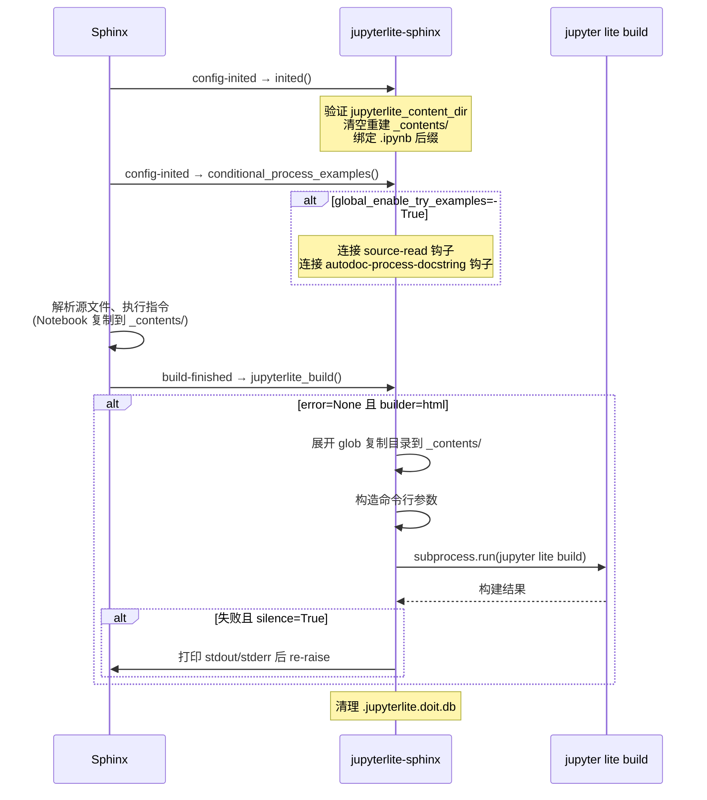

jupyterlite-sphinx 作为 Sphinx 扩展（extension），通过在 `setup()` 函数中连接（connect）Sphinx 构建生命周期的核心事件，将 JupyterLite 站点的构建过程无缝嵌入到文档构建管线中。整个流程从配置初始化阶段开始准备内容暂存目录，到构建结束阶段调用 `jupyter lite build` 命令生成完整的 JupyterLite 静态站点，形成了一套清晰的"准备—收集—构建—清理"四阶段流水线。

本文从 Sphinx 事件钩子的连接机制出发，逐步拆解每个阶段的关键逻辑，包括 `_contents` 目录管理、Notebook 文件收集、指令文件复制、`jupyter lite build` 命令行参数构造、子进程执行与错误处理，以及构建后的清理工作。

## Sphinx 事件钩子总览

扩展的 `setup()` 函数（源码第 1213-1353 行）通过 `app.connect()` 将三个事件处理函数注册到 Sphinx 的构建生命周期：

| Sphinx 事件 | 处理函数 | 触发时机 | 核心职责 |
|-------------|---------|---------|---------|
| `config-inited` | `inited(app, config)` | 配置初始化完成后 | 清空重建 `_contents` 目录、绑定 `.ipynb` 后缀、验证配置 |
| `config-inited` | `conditional_process_examples(app, config)` | 配置初始化完成后 | 条件性连接 TryExamples 的源文件处理钩子 |
| `build-finished` | `jupyterlite_build(app, error)` | 构建完成后 | 调用 `jupyter lite build` 生成 JupyterLite 站点 |

两个 `config-inited` 钩子按注册顺序依次执行：先执行 `inited` 完成目录准备和后缀绑定，再执行 `conditional_process_examples` 根据配置决定是否启用 autodoc 示例自动注入。

## 配置初始化阶段：inited()

`inited()` 函数（源码第 1013-1027 行）在 Sphinx 配置初始化后立即执行，负责构建前的环境准备工作。

### 配置验证

函数首先验证 `jupyterlite_content_dir` 配置值非空：

```python
if not app.config.jupyterlite_content_dir:
    raise ValueError("jupyterlite_content_dir must be a non-zero string")
```

若配置为空字符串或 `None`，直接抛出 `ValueError` 终止构建。

### 内容目录重建

每次构建开始时，`inited()` 会清空并重建内容暂存目录（默认为 `_contents/`）：

```python
content_dir = Path(app.srcdir) / app.config.jupyterlite_content_dir
shutil.rmtree(content_dir, ignore_errors=True)
content_dir.mkdir(exist_ok=True, parents=True)
```

使用 `shutil.rmtree(ignore_errors=True)` 确保即使目录不存在或部分文件被锁定也不会中断构建，然后通过 `mkdir(parents=True)` 递归创建目录。这种"清空—重建"策略确保每次构建都是干净的状态，避免上次构建残留的 Notebook 文件污染当前构建结果。

### .ipynb 后缀绑定

当 `jupyterlite_bind_ipynb_suffix` 配置为 `True`（默认值）时，扩展会将 `.ipynb` 文件后缀绑定到 `NotebookLiteParser` 解析器：

```python
if (
    config.jupyterlite_bind_ipynb_suffix
    and ".ipynb" not in config.source_suffix
    and ".ipynb" not in app.registry.source_suffix
):
    app.add_source_suffix(".ipynb", "jupyterlite_notebook")
```

绑定前会双重检查：配置中 `source_suffix` 和应用注册表 `source_suffix` 中均未注册 `.ipynb`，避免与其他扩展冲突。绑定后，放置在 Sphinx 源目录中的 `.ipynb` 文件会被自动识别为文档源文件，由 `NotebookLiteParser` 解析。

## TryExamples 条件连接：conditional_process_examples()

`conditional_process_examples()` 函数（源码第 1007-1010 行）根据 `global_enable_try_examples` 配置决定是否全局启用 TryExamples 自动注入：

```python
def conditional_process_examples(app, config):
    if config.global_enable_try_examples:
        app.connect("source-read", _process_docstring_examples)
        app.connect("autodoc-process-docstring", _process_autodoc_docstrings)
```

仅当配置为 `True` 时，才会连接以下两个事件：

- **`source-read` → `_process_docstring_examples()`**（源码第 987-990 行）：在源文件读取阶段处理 `.py` 文件，调用 `insert_try_examples_directive()` 将 docstring 中的示例代码包裹在 `try_examples` 指令中。该函数检查源文件后缀是否为 `.py`，对非 Python 文件不做处理。

- **`autodoc-process-docstring` → `_process_autodoc_docstrings()`**（源码第 993-1004 行）：在 autodoc 处理 docstring 时，读取全局配置的 theme、button_text、warning_text 值（过滤掉 `None` 值的选项），同样调用 `insert_try_examples_directive()` 修改文档行列表。

这种"条件连接"设计确保了在未启用 TryExamples 功能时不会引入任何额外的处理开销。

## NotebookLiteParser：.ipynb 文件解析

`NotebookLiteParser`（源码第 807-821 行）继承自 `sphinx.parsers.RSTParser`，是将 `.ipynb` 文件作为文档源的解析器。其核心方法 `parse()` 不直接解析 Notebook JSON，而是将文件名转换为一段 RST 字符串，委托给父类的 RST 解析器处理：

```python
def parse(self, inputstring, document):
    title = os.path.splitext(os.path.basename(document.current_source))[0]
    filename = "/" + os.path.relpath(document.current_source, self.env.app.srcdir)
    super().parse(
        f"{title}\n{'=' * len(title)}\n.. notebooklite:: {filename}",
        document,
    )
```

生成的 RST 内容包含两部分：以文件名（去掉扩展名）作为文档标题（使用 `=` 下划线标记一级标题），以及一个 `notebooklite` 指令引用该 Notebook 文件。这意味着放置在源目录中的 `.ipynb` 文件会被渲染为一个嵌入了 NotebookLite 视图的独立文档页面。

## 构建执行阶段：jupyterlite_build()

`jupyterlite_build()` 函数（源码第 1046-1210 行）是整个扩展最核心的函数，在 `build-finished` 事件触发时执行，负责调用 `jupyter lite build` 命令生成静态 JupyterLite 站点。

### 前置条件检查

函数首先进行两项前置检查：

1. **错误检查**：若 `error is not None`（即构建过程中已有错误发生），直接返回，不执行 JupyterLite 构建。
2. **格式检查**：仅当 `app.builder.format == "html"` 时执行构建，避免在构建 PDF、LaTeX 等非 HTML 格式时调用。

```python
if error is not None:
    return
if app.builder.format == "html":
    # ... 执行构建
```

### 命令行参数构造

构建命令的基础结构为 `python -m jupyter lite build [OPTIONS]`，各参数按以下逻辑组装：

**调试模式**：始终添加 `--debug` 标志，便于排查构建问题。

**配置文件（--config）**：若 `jupyterlite_config` 非空，添加 `--config <path>` 指定 JupyterLite 构建配置文件。

**设置覆盖（--settings-overrides）**：若 `jupyterlite_overrides` 非空，先验证文件存在性：

```python
overrides_path = Path(app.srcdir) / jupyterlite_overrides
if not Path(overrides_path).exists():
    raise FileNotFoundError(
        f"Overrides file {overrides_path} does not exist. "
        "Please check your configuration."
    )
```

JupyterLite 自身的构建命令不会验证 overrides 文件是否存在，因此扩展在此处主动检查，文件不存在时抛出 `FileNotFoundError`。验证通过后添加 `--settings-overrides <path>`。

**内容收集（--contents）**：内容来源分为两部分——`jupyterlite_contents` 配置的额外路径和各指令自动复制到 `_contents/` 的 Notebook 文件。对于 `jupyterlite_contents` 配置的路径（支持字符串或列表），扩展会展开 glob 模式：

- 匹配到**目录**时，使用 `shutil.copytree()` 将整个目录复制到 `_contents/` 下并保留目录名（若目标已存在则先 `shutil.rmtree()` 删除）。这种处理确保目录内文件在 JupyterLite 文件系统中保留原有的目录结构，而不是直接散落在文件系统根目录。
- 匹配到**文件**时，直接将文件路径作为 `--contents` 参数传递给构建命令。

无论 `jupyterlite_contents` 是否配置，`_contents/` 目录（存放各指令引用和 try_examples 生成的 Notebook）始终作为 `--contents` 参数传递。

**忽略内容（--ignore-contents）**：通过辅助函数 `jupyterlite_ignore_contents_args()`（源码第 1030-1043 行）处理。与 `--contents` 不同，忽略模式不展开 glob，直接将每个正则模式作为 `--ignore-contents` 参数传递。支持字符串或列表输入，`None` 时返回空列表。

**启用的应用（--apps）**：默认启用六个应用：

```python
for liteapp in ["notebooks", "edit", "lab", "repl", "tree", "consoles"]:
    apps_option.extend(["--apps", liteapp])
if voici is not None:
    apps_option.extend(["--apps", "voici"])
```

若 `voici` 包已安装（通过顶层 `import` 检测），追加 `voici` 应用。每个应用单独使用 `--apps` 参数传递，这是 `jupyter lite build` 命令的要求。

**输出目录（--output-dir）**：固定为 `{app.outdir}/lite/`，即 Sphinx HTML 输出目录下的 `lite/` 子目录。

**Lite 目录（--lite-dir）**：由 `jupyterlite_dir` 配置控制，默认为 `app.srcdir`。

**额外命令选项**：若 `jupyterlite_build_command_options` 为字典，遍历其键值对添加额外的 `--key value` 参数。但以下三个键被禁止覆盖，若检测到会抛出 `RuntimeError`：

- `contents`：由扩展内部管理
- `output-dir`：固定为输出目录下的 `lite/`
- `lite-dir`：由 `jupyterlite_dir` 配置控制

### 子进程执行

命令组装完成后，通过 `subprocess.run()` 在 `app.srcdir` 工作目录下执行：

```python
kwargs = {}
if app.env.config.jupyterlite_silence:
    kwargs["stdout"] = subprocess.PIPE
    kwargs["stderr"] = subprocess.PIPE

completed_process = subprocess.run(
    command, cwd=app.srcdir, check=True, **kwargs
)
```

- 当 `jupyterlite_silence=True`（默认），stdout 和 stderr 通过 PIPE 捕获，不在 Sphinx 构建输出中显示。
- `check=True` 确保子进程返回非零退出码时抛出 `CalledProcessError`。

### 错误处理

当构建失败且处于静默模式时，扩展会打印捕获的 stdout 和 stderr 内容，方便调试：

```python
except subprocess.CalledProcessError:
    if app.env.config.jupyterlite_silence:
        print("[jupyterlite-sphinx] `jupyterlite build` failed ...")
        print(f"{'-' * 15} stdout {'-' * 15}")
        print(completed_process.stdout.decode())
        print(f"{'-' * 15} stderr {'-' * 15}")
        print(completed_process.stderr.decode())
    raise
```

打印后重新抛出原始异常（不修改 traceback），确保构建以失败状态终止。

### 构建后清理

无论 JupyterLite 构建是否执行（即无论 builder 是否为 HTML 格式），函数末尾都会尝试清理 doit 数据库文件：

```python
try:
    os.remove(".jupyterlite.doit.db")
except FileNotFoundError:
    pass
```

`.jupyterlite.doit.db` 是 `jupyter lite build` 使用 doit 构建系统产生的临时数据库文件，构建完成后不再需要。使用 `try-except FileNotFoundError` 确保文件不存在时不会报错。

## 资源文件注册

在 `setup()` 函数中，除了事件钩子，扩展还负责注册静态资源和可选的运行时配置文件：

1. **CSS 和 JS 文件**：通过 `copy_asset()` 将 `jupyterlite_sphinx.css` 和 `jupyterlite_sphinx.js` 复制到输出目录的 `_static/` 文件夹，然后通过 `app.add_css_file()` 和 `app.add_js_file()` 注册到 HTML 页面。
2. **Google Fonts**：添加 Vibur 字体的 CSS 链接，用于按钮文字样式。
3. **try_examples.json**：若源目录中存在该文件，复制到输出目录供前端 JavaScript 运行时加载。

## 构建流程时序图

以下时序图展示了从 Sphinx 启动到 JupyterLite 构建完成的完整事件流：



## 相关概念

- [配置参考](09-configuration.md)
- [自定义节点类层次](11-node-hierarchy.md)
- [前端 JavaScript 交互机制](12-frontend-js.md)
- [指令系统总览](03-directive-overview.md)
- [核心模块源码](../references/main-source.md)
- [配置项完整速查表](../references/config-reference.md)
