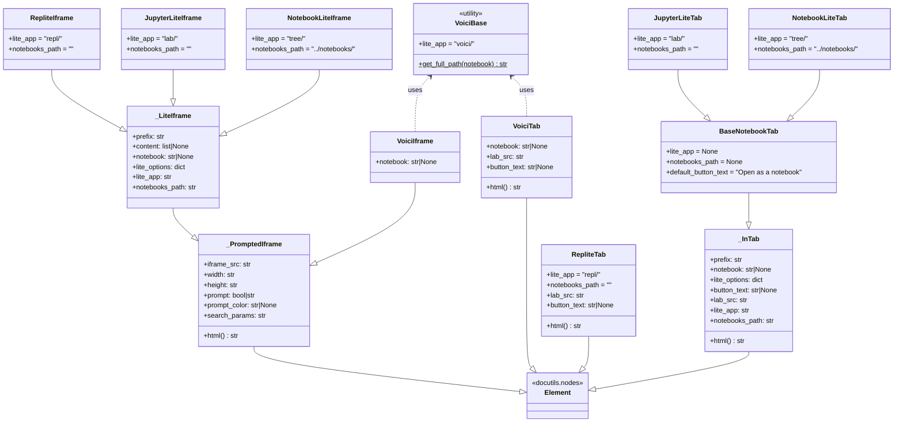

jupyterlite-sphinx 定义了一套自定义的 docutils 节点（node）类，用于在文档树（doctree）中表示可交互的 JupyterLite 嵌入元素——包括 iframe 嵌入和新标签页按钮两种渲染形态。这些节点构成了一个层次分明的继承体系，以 `docutils.nodes.Element` 为根基类，通过多层抽象共享通用逻辑（如 URL 构造、代码序列化、prompt 交互），并在具体子类中定制应用路径和渲染行为。

本文系统讲解节点类的继承关系、HTML 生成方法的分派机制、访问器（visitor）注册模式，以及各具体节点类的参数与行为差异。

## 节点访问器基础机制

docutils 使用访问者模式（Visitor Pattern）遍历文档树，每个节点类型需要注册对应的访问器函数来处理不同输出格式的渲染。jupyterlite-sphinx 定义了两个模块级的访问器函数，适用于所有自定义节点：

### skip()：非 HTML 格式跳过

```python
def skip(self, node):
    raise SkipNode
```

该函数在被调用时直接抛出 `docutils.nodes.SkipNode` 异常，告诉 docutils 访问器跳过当前节点，不在非 HTML 输出（LaTeX、Texinfo、纯文本、Man 手册页）中渲染任何内容。这确保了交互式 iframe 元素仅在 HTML 构建中出现。

### visit_element_html()：HTML 渲染入口

```python
def visit_element_html(self, node):
    self.body.append(node.html())
    raise SkipNode
```

HTML 访问器调用节点自身的 `html()` 方法获取 HTML 字符串，将其追加到输出缓冲 `self.body`，然后抛出 `SkipNode` 阻止 docutils 对该节点的子节点进行默认遍历（因为所有 HTML 内容已由 `html()` 方法完整生成）。

### 节点注册模式

在 `setup()` 函数中，每个自定义节点通过 `app.add_node()` 注册到 Sphinx，为不同输出格式指定访问器：

```python
app.add_node(
    NotebookLiteIframe,
    html=(visit_element_html, None),
    latex=(skip, None),
    textinfo=(skip, None),
    text=(skip, None),
    man=(skip, None),
)
```

元组的第一个元素是进入节点时的访问方法，第二个是离开节点时的方法（depart）。对于 jupyterlite-sphinx 的节点，所有离开方法均为 `None`（因为 `visit_element_html` 抛出 `SkipNode` 后不会触发 depart），非 HTML 格式统一使用 `skip` 跳过。

## 节点类继承体系

整个节点体系以两条平行的继承链为核心：iframe 嵌入链（以 `_PromptedIframe` 为起点）和新标签页按钮链（以 `_InTab` 为起点），外加独立的 REPL 和 Voici 分支。



## _PromptedIframe：iframe 节点基类

`_PromptedIframe`（源码第 71-131 行）是所有 iframe 嵌入节点的基类，直接继承自 `docutils.nodes.Element`。它实现了"懒加载提示按钮"机制——在 `prompt=True` 时不直接渲染 iframe，而是渲染一个可点击的按钮，用户点击后才由前端 JavaScript 动态创建 iframe。

### 构造参数

| 参数 | 类型 | 默认值 | 说明 |
|------|------|--------|------|
| `iframe_src` | `str` | `""` | iframe 的源 URL |
| `width` | `str` | `"100%"` | iframe 宽度 |
| `height` | `str` | `"100%"` | iframe 高度 |
| `prompt` | `bool \| str` | `False` | 是否显示提示按钮；字符串值用作按钮文本 |
| `prompt_color` | `str \| None` | `None` | 按钮背景色 |
| `search_params` | `str` | `"false"` | URL 搜索参数传递策略 |

### html() 方法

`html()` 方法根据 `prompt` 参数值走两条渲染分支：

**prompt=True 分支**：生成一个带有 `onclick` 事件的 `div` 容器（class=`jupyterlite_sphinx_iframe_container`），内含按钮元素。点击时调用 `window.jupyterliteShowIframe()` 函数。按钮文本默认 `"Try It Live!"`，默认颜色 `#f7dc1e`（亮黄色）。使用 `uuid4()` 生成唯一的 placeholder ID 以避免多实例冲突。onclick 中还调用 `window.jupyterliteConcatSearchParams()` 处理搜索参数合并。

**prompt=False 分支**：直接生成 `<iframe>` 元素（class=`jupyterlite_sphinx_raw_iframe`），src 设置为 `iframe_src`。这种模式下 iframe 在页面加载时立即创建，适合对交互延迟敏感的场景。

## _LiteIframe：Jupyter 应用 iframe 基类

`_LiteIframe`（源码第 171-205 行）继承自 `_PromptedIframe`，增加了代码注入和 Notebook 文件路径处理的通用逻辑，是 RepliteIframe、JupyterLiteIframe、NotebookLiteIframe 三个具体 iframe 类的直接父类。

### 构造参数扩展

| 参数 | 类型 | 说明 |
|------|------|------|
| `prefix` | `str` | JupyterLite 部署根路径前缀 |
| `content` | `list[str] \| None` | 预填代码行列表 |
| `notebook` | `str \| None` | Notebook 文件相对路径 |
| `lite_options` | `dict \| None` | URL 查询选项字典 |

### 代码序列化

当 `content` 非空时，构造函数遍历代码行列表，空行（`not line.strip()`）保留为空字符串，非空行保持原样，然后用 `"\n"` 拼接为完整代码字符串并存入 `lite_options["code"]`。空行保留的处理确保代码的原始行结构在传入 URL 后不会丢失。

### Notebook 路径处理

当 `notebook` 非空时（即指令引用了具体的 `.ipynb` 文件），将路径存入 `lite_options["path"]`，并将 `app_path` 调整为 `{lite_app}{notebooks_path}` 以指向正确的文件导航路径。

### iframe_src 一致性校验

构造函数末尾检查是否传入了与计算结果不同的 `iframe_src` 属性值。若不一致，抛出 `ValueError` 并提示升级 Sphinx 到 7.2.0 或更高版本——这是对旧版 Sphinx 节点属性传递 bug 的防御性检查。

### URL 构造

最终的 `iframe_src` 格式为：`{prefix}/{app_path}index.html?{options}`，其中 `options` 由 `_build_options()` 函数生成。

### _build_options()：选项到查询参数的转换

`_build_options()` 函数（源码第 55-68 行）是模块级工具函数，将选项字典转换为 URL 查询参数字符串：

```python
def _build_options(lite_options):
    replacements = {"showbanner": "showBanner"}
    lite_options = (
        (replacements.get(key, key), value) for key, value in lite_options.items()
    )
    return "&".join([f"{key}={quote(value)}" for key, value in lite_options])
```

该函数处理两个关键转换：
1. **大小写修正**：docutils 指令选项被统一转为小写，但 JupyterLite REPL 的 URL 参数 `showBanner` 需要驼峰命名，因此通过 `replacements` 字典修正。
2. **URL 编码**：使用 `urllib.parse.quote()` 对值进行编码，确保代码字符串中的特殊字符（换行、空格、符号等）在 URL 中安全传递。

## 具体 Iframe 子类

三个具体子类通过类属性 `lite_app` 和 `notebooks_path` 定义各自的应用路径，不添加额外方法：

| 子类 | `lite_app` | `notebooks_path` | 目标应用 |
|------|-----------|-----------------|---------|
| `RepliteIframe` | `"repl/"` | `""` | REPL 控制台（代码执行环境） |
| `JupyterLiteIframe` | `"lab/"` | `""` | JupyterLab 界面 |
| `NotebookLiteIframe` | `"tree/"` | `"../notebooks/"` | 经典 Notebook 树视图 |

`NotebookLiteIframe` 的 `notebooks_path` 设为 `"../notebooks/"` 是因为 Notebook 应用在文件树中定位 Notebook 文件需要从 `tree/` 路径向上导航到 `notebooks/` 目录。

## _InTab：新标签页按钮基类

`_InTab`（源码第 134-168 行）是新标签页按钮节点的基类，继承自 `docutils.nodes.Element`。与 iframe 节点不同，这类节点不嵌入内容，而是渲染一个按钮，点击后通过 `window.open()` 在新标签页中打开 JupyterLite 环境。

### 构造逻辑

构造函数接收 `prefix`、`notebook`、`lite_options`、`button_text` 参数，在初始化时即计算 `self.lab_src`（新标签页的目标 URL），URL 构造逻辑与 `_LiteIframe` 一致（包括 notebook 路径调整和选项编码）。`button_text` 参数用于自定义按钮显示文本。

### html() 方法

生成 `<button>` 元素（class=`try_examples_button`），`onclick` 属性调用 `window.open('{lab_src}')`。按钮文本使用 `self.button_text`。

## BaseNotebookTab 及其子类

`BaseNotebookTab`（源码第 228-234 行）继承自 `_InTab`，定义了 Notebook 类型 Tab 节点的默认属性：`default_button_text = "Open as a notebook"`。其 `lite_app` 和 `notebooks_path` 设为 `None`，由子类具体指定。

- **JupyterLiteTab**（源码第 237-244 行）：`lite_app = "lab/"`, `notebooks_path = ""`，对应 JupyterLab 新标签页按钮。
- **NotebookLiteTab**（源码第 247-254 行）：`lite_app = "tree/"`, `notebooks_path = "../notebooks/"`，对应经典 Notebook 新标签页按钮。

## RepliteTab：独立的 REPL 按钮节点

`RepliteTab`（源码第 260-335 行）**不继承** `_InTab`，而是直接继承 `Element`。源码注释明确说明原因："We do not inherit from _InTab here because Replite has a different URL structure and we need to ensure that the code is serialised to be passed to the URL."

REPL 的 URL 参数与其他 Jupyter 应用有本质差异，需要独立处理：

### REPL 特有参数处理

构造函数中对以下布尔选项进行 `"0"/"1"` 字符串转换（docutils 指令传入的是字符串 "true"/"false"）：

| 参数 | URL 参数名 | 值为 "0" 的条件 |
|------|-----------|----------------|
| `execute` | `execute` | 值为 `"0"` |
| `clearCellsOnExecute` | `clearCellsOnExecute` | 值为 `"0"` |
| `clearCodeContentOnExecute` | `clearCodeContentOnExecute` | 值为 `"0"` |
| `hideCodeInput` | `hideCodeInput` | 值为 `"0"` |
| `showBanner` | `showBanner` | 值为 `"0"` |

此外，`promptCellPosition` 参数进行四值验证，必须是 `"bottom"`、`"top"`、`"left"`、`"right"` 之一。

代码序列化逻辑（content 处理）与 `_LiteIframe` 一致。`html()` 方法与 `_InTab` 相同，生成 `window.open()` 按钮。

## Voici 节点体系

Voici 是 JupyterLite 的仪表板渲染扩展，其节点体系独立于主 Jupyter 应用链，因为 Voici 的 URL 结构完全不同。

### VoiciBase：路径工具类

`VoiciBase`（源码第 348-360 行）不继承 `Element`，而是一个普通的 Python 类（`object` 子类），提供类方法 `get_full_path()` 统一构造 Voici URL 路径：

- 提供 `notebook` 参数时：`voici/render/{name}.html`（将 `.ipynb` 扩展名替换为 `.html`）
- 未提供 notebook 时：`voici/tree`（文件树视图）

### VoiciIframe

`VoiciIframe`（源码第 363-385 行）继承自 `_PromptedIframe`（而非 `_LiteIframe`），因为 Voici 不支持代码注入（`content` 参数不适用）。它使用 `VoiciBase.get_full_path(notebook)` 构造 iframe 源路径，Voici 的 iframe URL 不包含 `index.html` 段，而是直接使用 `voici/render/...` 或 `voici/tree` 路径。

### VoiciTab

`VoiciTab`（源码第 390-425 行）同样**不继承** `BaseNotebookTab`，直接继承 `Element`。它使用 `VoiciBase.get_full_path()` 构造 `lab_src`，URL 格式为 `{prefix}/{app_path}?{options}`（注意 Voici Tab 的 URL 中不包含 `index.html`，与 `_InTab` 生成的 URL 格式有细微差异）。`html()` 方法同样生成 `window.open()` 按钮。

## 节点与指令的对应关系

每个 Sphinx 指令在 `run()` 方法中创建对应的节点实例返回给 docutils。根据 `new_tab` 选项的值，指令选择创建 iframe 节点或 tab 节点：

| 指令 | iframe 节点 | tab 节点 |
|------|------------|---------|
| `jupyterlite` | `JupyterLiteIframe` | `JupyterLiteTab` |
| `notebooklite` / `retrolite` | `NotebookLiteIframe` | `NotebookLiteTab` |
| `replite` | `RepliteIframe` | `RepliteTab` |
| `voici` | `VoiciIframe` | `VoiciTab` |

`TryExamplesDirective` 不使用自定义节点类，而是直接通过 `nodes.raw()` 生成 HTML 字符串。

## 设计模式总结

jupyterlite-sphinx 的节点体系体现了几个值得注意的设计决策：

1. **模板方法模式**：基类（`_PromptedIframe`、`_InTab`）定义 `html()` 方法的骨架，子类通过类属性（`lite_app`、`notebooks_path`）注入变化点。
2. **组合优于继承的折中**：Voici 节点使用工具类 `VoiciBase` 而非继承 `_LiteIframe`/`BaseNotebookTab`，因为 URL 结构差异过大，强行继承会导致逻辑复杂化。RepliteTab 同理。
3. **懒加载分离**：prompt 机制在基类 `_PromptedIframe` 中实现，所有 iframe 子类自动获得懒加载能力，前端交互逻辑统一在 `jupyterliteShowIframe` 全局函数中处理。
4. **格式隔离**：通过统一的 `skip()` 访问器确保非 HTML 输出干净无交互式内容，`visit_element_html()` 统一委托给节点自身的 `html()` 方法。

## 相关概念

- [构建流程详解](10-build-process.md)
- [前端 JavaScript 交互机制](12-frontend-js.md)
- [指令系统总览](03-directive-overview.md)
- [jupyterlite 指令——嵌入 JupyterLab](04-jupyterlite-directive.md)
- [notebooklite 指令——嵌入经典 Notebook](05-notebooklite-directive.md)
- [replite 指令——嵌入交互式 REPL](06-replite-directive.md)
- [voici 指令——嵌入 Voici 仪表板](07-voici-directive.md)
- [核心模块源码](../references/main-source.md)
