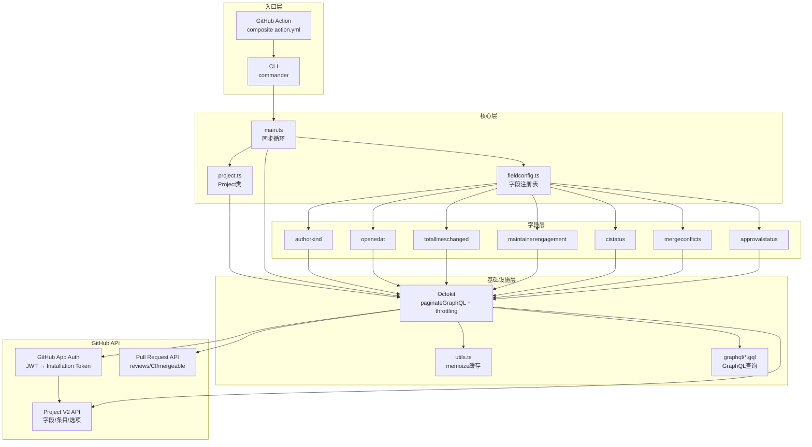

# PR Triage Board Bot 教程

> **Automatically populate and maintain a GitHub Project board with triage information about open PRs**

pr-triage-board-bot 是 Jupyter 社区开发的 GitHub PR 分类看板机器人，通过 GitHub App 认证访问 GitHub Project V2 GraphQL API，每小时自动同步开放 PR 的 7 个关键维度（作者类型、创建时间、变更规模、维护者参与度、CI状态、合并冲突、审批状态），帮助维护者快速识别需要关注的 PR。

## 快速开始

```bash
# 克隆仓库
git clone https://github.com/yuvipanda/pr-triage-board-bot.git
cd pr-triage-board-bot

# 安装依赖并构建
npm install
npm run build

# dry run 验证配置（不会修改任何内容）
node dist/src/main.js \
  --gh-app-id <APP_ID> \
  --gh-app-installation-id <INSTALLATION_ID> \
  --gh-app-pem-file ./private-key.pem \
  --dry-run \
  <organization> <project-number>
```

## 文档导航

### 概念文档（Concepts）

按顺序阅读，系统掌握 pr-triage-board-bot 的使用与原理：

| 章节 | 主题 | 核心内容 |
|------|------|----------|
| [00](concepts/00-introduction.md) | 项目介绍 | 定位、设计理念、核心能力、七个分类维度 |
| [01](concepts/01-getting-started.md) | 快速上手 | GitHub App创建、项目板设置、本地运行、Action部署 |
| [02](concepts/02-architecture-overview.md) | 架构总览 | 目录结构、模块分层、数据流、全量对账模型 |
| [03](concepts/03-auth-and-octokit.md) | 认证与Octokit | GitHub App认证、Octokit插件、限流处理、日志配置 |
| [04](concepts/04-project-class.md) | Project管理类 | Project类API、字段CRUD、动态Mutation构造、SingleSelectField |
| [05](concepts/05-field-plugin-system.md) | 字段插件体系 | 四层类型系统、条件类型映射、注册表模式、扩展机制 |
| [06](concepts/06-core-fields.md) | 七个核心字段详解 | Author Kind/CI Status/Approval等7字段的计算逻辑 |
| [07](concepts/07-sync-loop.md) | 同步循环与增量更新 | 全量对账算法、值比较、Dry Run、幂等性保证 |
| [08](concepts/08-cli-and-action.md) | CLI与GitHub Action | commander参数、composite action、私钥安全、构建系统 |

### 示例文档（Examples）

可独立运行的实用示例：

| 编号 | 示例 | 适用场景 |
|------|------|----------|
| [01](examples/01-github-app-setup.md) | GitHub App创建与配置完整流程 | 从零创建App、配置权限、获取凭证、安装验证 |
| [02](examples/02-adding-custom-field.md) | 添加自定义字段扩展 | 字段插件扩展的完整步骤（Files Changed Type实战） |
| [03](examples/03-github-action-workflow.md) | GitHub Action部署workflow配置 | 单组织/多看板/dry run等workflow模板 |

### 信源文件（References）

源码和配置文件的引用索引：

| 文件 | 内容 |
|------|------|
| [references/main-source.md](references/main-source.md) | 入口文件与CLI源码（main函数、makeOctokit、getOpenPRs） |
| [references/project-source.md](references/project-source.md) | Project管理类源码（CRUD操作、动态Mutation构造） |
| [references/field-config-source.md](references/field-config-source.md) | 字段配置体系源码（类型系统、注册表模式） |
| [references/field-implementations-source.md](references/field-implementations-source.md) | 七个核心字段实现源码 |
| [references/graphql-source.md](references/graphql-source.md) | GraphQL查询文件（prs/project/projectitems） |
| [references/utils-source.md](references/utils-source.md) | 工具函数源码（memoize、getCollaborators缓存） |

## 核心架构一览



## 七个分类字段速查

| 字段 | 类型 | 选项/格式 | 判定逻辑 |
|------|------|----------|---------|
| Author Kind | SINGLE_SELECT | Bot / Maintainer / First Time / Early / Seasoned | 协作者查询 + 历史PR计数 |
| Opened At | DATE | YYYY-MM-DD | createdAt日期清零时间 |
| Total Lines Changed | NUMBER | 整数 | additions + deletions |
| Maintainer Engagement | SINGLE_SELECT | None / Single / Multiple | 协作者与参与者交集大小 |
| CI Status | SINGLE_SELECT | Tests Passing / Tests Failing | statusCheckRollup聚合状态 |
| Merge Conflicts | SINGLE_SELECT | Merge Conflicts / No Conflicts | mergeable字段（CONFLICTING/MERGEABLE） |
| Approval Status | SINGLE_SELECT | Changes Requested / Approved | 维护者review状态（CHANGES_REQUESTED优先） |

## 技术栈速查

| 技术 | 版本/用途 |
|------|----------|
| Node.js | >23.0.0（action.yml默认23.x） |
| TypeScript | 5.9（SWC编译 + tsc类型检查） |
| Octokit | 核心GraphQL客户端 |
| @octokit/plugin-paginate-graphql | 自动分页插件 |
| @octokit/plugin-throttling | 限流/重试插件 |
| @octokit/auth-app | GitHub App认证策略 |
| commander | CLI参数解析 |
| lodash-es/memoize | 函数结果缓存 |
| SWC | TypeScript→JS快速编译 |
| GitHub Action | composite类型（构建+运行） |

## 关键文件路径

| 路径 | 说明 |
|------|------|
| `src/main.ts` | 入口：CLI解析、Octokit创建、同步循环 |
| `src/project.ts` | Project类：GitHub Project V2操作门面 |
| `src/fieldconfig.ts` | 字段配置和注册表（扩展字段入口） |
| `src/utils.ts` | 工具函数：memoize、getCollaborators、getMergedPRCount |
| `src/fields/` | 七个核心字段的getValue实现 |
| `src/graphql/` | GraphQL查询文件（.gql） |
| `action.yml` | GitHub Action composite定义 |
| `.github/workflows/run.yaml` | 定时运行workflow（每小时） |
| `.github/workflows/ci.yaml` | CI检查（typecheck + build） |

## 相关链接

- **GitHub仓库**：<https://github.com/yuvipanda/pr-triage-board-bot>
- **设计博客**：<https://medium.com/@yuvipanda/scaling-maintainer-intuition-with-pull-request-triage-boards-779f2387498b>
- **JupyterHub项目板示例**：<https://github.com/orgs/jupyterhub/projects/4>
- **JupyterLab项目板示例**：<https://github.com/orgs/jupyterlab/projects/11>
- **GeoJupyter项目板示例**：<https://github.com/orgs/geojupyter/projects/3>
- **GitHub App注册指南**：<https://docs.github.com/en/apps/creating-github-apps/registering-a-github-app/registering-a-github-app>
- **GitHub Project V2 API文档**：<https://docs.github.com/en/graphql/reference/objects#projectv2>

## 相关知识束

| 知识束 | 关系 |
|--------|------|
| [jupyter-docker-stacks](../jupyter-docker-stacks/index.md) | 同层：Jupyter Docker镜像部署方案 |
| [cookiecutter-docker-stacks](../cookiecutter-docker-stacks/index.md) | 同层：Jupyter Docker镜像模板生成器 |
| [jupyter-notebook](../jupyter-notebook/index.md) | 同层：Jupyter Notebook应用层 |
| [jupyter-client](../jupyter-client/README.md) | 同层：Jupyter内核通信协议 |
| [nbformat](../nbformat/index.md) | 同层：Notebook文件格式 |

## 许可协议

pr-triage-board-bot 使用 [BSD 3-Clause License](https://github.com/yuvipanda/pr-triage-board-bot/blob/main/LICENSE)。

```{toctree}
:hidden:

concepts/index
examples/index
references/index
facts
insights
log
```
