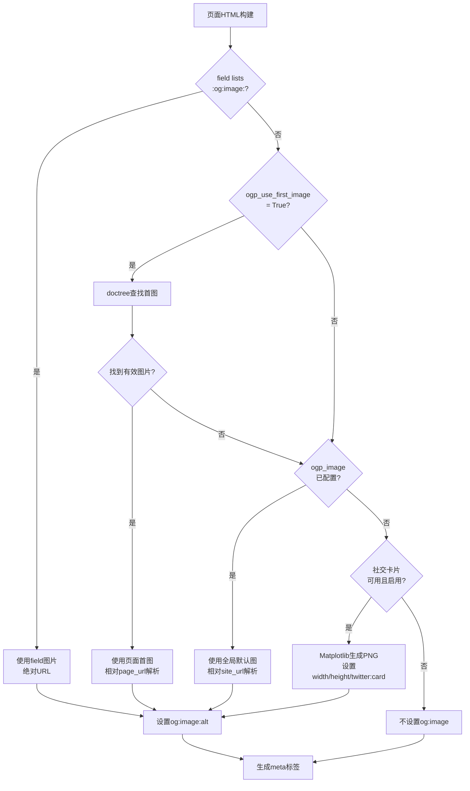

# 页面图片处理逻辑

Open Graph的 `og:image` 标签决定了社交媒体分享时显示的预览图。sphinxext-opengraph 实现了一套**四级图片来源回退机制**，从最高优先级的页面级覆盖到最低优先级的自动社交卡片生成，确保每个页面都能有合适的预览图。

## 图片来源优先级

图片选择按以下优先级从高到低依次尝试：

```
1. 页面field lists :og:image: （最高优先级）
2. 页面首图自动检测（ogp_use_first_image=True时）
3. 全局默认图片（ogp_image配置）
4. 自动生成社交卡片（matplotlib可用且未禁用时）
5. 无图片（以上都不满足时不生成og:image标签）
```

让我们逐一解析每个层级。

## 第一级：页面级图片覆盖

在RST文件顶部通过field lists指定图片，优先级最高：

```rst
:og:image: https://example.com/custom-image.png
:og:image:alt: Custom preview image

=====
My Page
=====
```

源码处理逻辑：

```python
if 'og:image' in fields:
    image_url = fields['og:image']
    ogp_use_first_image = False
    ogp_image_alt = fields.get('og:image:alt')
    fields.pop('og:image', None)
```

当field lists指定了 `:og:image:` 时：
- 直接使用该URL作为图片
- 禁用首图检测（`ogp_use_first_image = False`）
- 从fields中获取 `:og:image:alt:` 作为alt文本
- 注意：field lists的图片**不支持相对路径**，必须使用绝对URL（源码注释明确说明）

## 第二级：页面首图自动检测

当 `ogp_use_first_image = True` 且页面没有通过field lists指定图片时，扩展会自动查找页面中的第一张图片：

```python
if ogp_use_first_image:
    first_image = doctree.next_node(nodes.image)
    if (first_image
        and Path(first_image.get('uri', '')).suffix[1:].lower() in IMAGE_MIME_TYPES):
        image_url = first_image['uri']
        ogp_image_alt = first_image.get('alt', None)
    else:
        first_image = None
```

处理逻辑：
1. 使用 `doctree.next_node(nodes.image)` 在文档树中查找第一个图片节点
2. 检查图片文件扩展名是否在支持的MIME类型列表中
3. 如果找到有效图片，使用其 `uri` 属性作为图片URL，`alt` 属性作为alt文本
4. 如果未找到有效图片（无图片或格式不支持），`first_image` 设为None，继续回退

### 支持的图片格式

`IMAGE_MIME_TYPES` 字典定义了支持的图片扩展名：

| 扩展名 | MIME类型 |
|--------|----------|
| gif | image/gif |
| apng | image/apng |
| webp | image/webp |
| jpeg/jpg | image/jpeg |
| png | image/png |
| bmp | image/bmp |
| heic | image/heic |
| heif | image/heif |
| tiff | image/tiff |

不支持的格式（如SVG）会被忽略，继续回退到下一级。

## 第三级：全局默认图片

如果前两级都没有提供图片，使用 `ogp_image` 配置值：

```python
image_url = config.ogp_image  # 在else分支中
```

这通常是站点logo或统一的品牌图片。

## 第四级：自动社交卡片生成

如果前三组都没有图片，且社交卡片功能可用，自动生成PNG预览卡片：

```python
config_social = DEFAULT_SOCIAL_CONFIG.copy()
social_card_user_options = config.ogp_social_cards or {}
config_social.update(social_card_user_options)
if (not (image_url or ogp_use_first_image)
    and config_social.get('enable') is not False
    and create_social_card is not None):
    image_url = social_card_for_page(...)
    # 设置社交卡片专用标签
    tags['og:image:width'] = '1146'
    tags['og:image:height'] = '600'
    meta_tags['twitter:card'] = 'summary_large_image'
```

社交卡片生成的条件（全部满足）：
- 没有通过任何方式设置图片（`image_url`为空，`ogp_use_first_image`为False）
- 社交卡片未被禁用（`enable` 不为False）
- matplotlib已安装（`create_social_card` 不为None）

社交卡片生成时会额外设置：
- `og:image:width` = 1146 像素
- `og:image:height` = 600 像素
- `twitter:card` = `summary_large_image`（大卡片模式）

社交卡片的alt文本优先使用field lists的 `:og:image:alt:`，否则使用页面描述。

详见[社交卡片生成](08-social-cards.md)章节。

## 相对路径解析

当图片URL是相对路径时（无scheme），扩展会自动转换为绝对URL：

```python
if image_url:
    if 'og:image' not in fields:  # field lists的图片跳过相对路径处理
        image_url_parsed = urlparse(image_url)
        if not image_url_parsed.scheme:
            if first_image:
                root = page_url  # 首图相对于当前页面URL
            else:
                root = ogp_site_url  # 全局图片相对于站点根URL
            image_url = urljoin(root, image_url_parsed.path)
        tags['og:image'] = image_url
```

关键点：
- 使用 `urlparse()` 解析URL，如果 `scheme` 为空则判定为相对路径
- 首图（`first_image`）的相对路径基于**当前页面URL**解析
- 全局配置图片（`ogp_image`）的相对路径基于**站点根URL**解析
- field lists指定的图片**不进行**相对路径转换（必须用绝对URL）

### 相对路径示例

假设 `ogp_site_url = "https://docs.example.org/en/latest/"`：

```python
# ogp_image = "_static/logo.png"
# 转换为: "https://docs.example.org/en/latest/_static/logo.png"

# 页面 subdir/page.html 中的首图 uri = "../images/screenshot.png"
# page_url = "https://docs.example.org/en/latest/subdir/page.html"
# urljoin 转换为: "https://docs.example.org/en/latest/images/screenshot.png"
```

## Alt文本回退链

`og:image:alt` 的设置遵循四级回退：

```python
if isinstance(ogp_image_alt, str):
    tags['og:image:alt'] = ogp_image_alt
elif ogp_image_alt is None and site_name:
    tags['og:image:alt'] = site_name
elif ogp_image_alt is None and title:
    tags['og:image:alt'] = title
```

1. 如果 `ogp_image_alt` 是字符串（来自field lists或config），直接使用
2. 如果为None且 `site_name` 存在，使用站点名称
3. 如果为None且页面 `title` 存在，使用页面标题
4. 如果都不满足，不设置alt标签

如果 `ogp_image_alt` 设置为 `False`，跳过alt标签生成。

对于社交卡片，alt文本逻辑稍有不同：
- 如果field lists指定了 `:og:image:alt:`，使用该值
- 否则使用页面 `description` 作为alt文本

## 图片处理流程总图



## 相关概念

- [核心标签生成流程](03-tag-generation.md)
- [配置选项全解](02-configuration.md)
- [社交卡片生成](08-social-cards.md)
- [页面级覆盖机制](06-per-page-overrides.md)
- [基础配置示例](../examples/basic-setup.md)
- [社交卡片配置示例](../examples/social-cards-example.md)
- [sphinxext-opengraph 源码信源登记](../references/sphinxext-opengraph-source.md)
