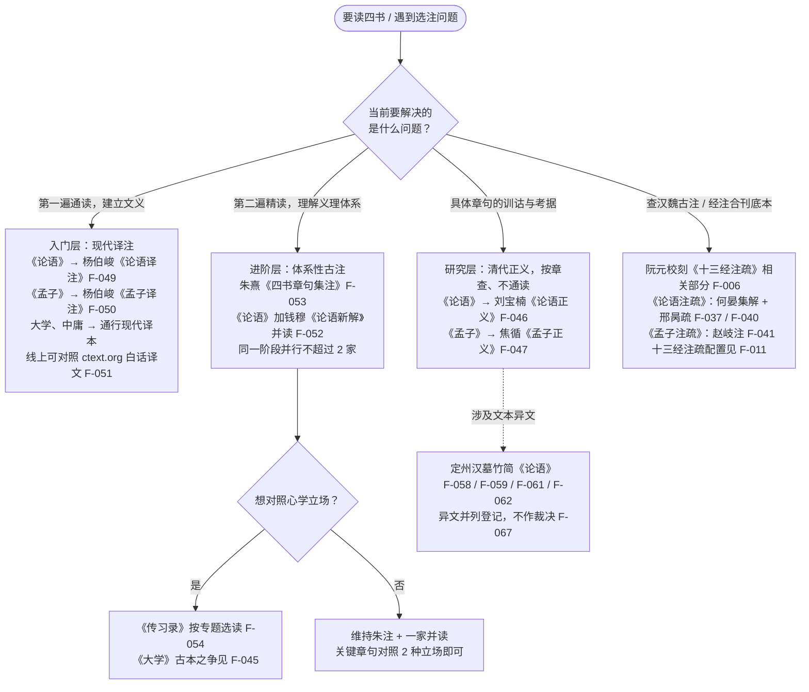

# 四书通读计划

> 本计划是[注家分层选用法](../insights.md)的落地示例：三阶段（入门 → 进阶 → 研究）各配一层注本，同一阶段并行不超过 2 家。本文事实性陈述均标注 F-xxx 编号，对应[四书事实清单](../facts.md)；所用注本的立场标注见[历代注疏登记](../references/commentaries.md)。

## 设计原则

1. **按阶段分层选注本，不通读注疏**。四书积有两千年注疏层积（F-037 ~ F-054），各代注疏服务于不同问题：入门解决文义，进阶解决义理体系，研究解决训诂考据。正确用法是按阶段与问题选用，而非从汉到清依次通读（[洞察2](../insights.md)）。
2. **遵循朱熹读书次序**。朱熹定读四书之序："先读《大学》，以定其规模；次读《论语》，以立其根本；次读《孟子》，以观其发越；次读《中庸》，以求古人之微妙处"（《朱子语类》卷十四，F-023）。三个阶段的每一遍通读均按 **《大学》→《论语》→《孟子》→《中庸》** 展开。
3. **规模意识**。四书字数：《大学》约 1,751 字（F-035）、《中庸》约 3,568 字（F-036）、《论语》约 15,900 字（F-030）、《孟子》约 34,685 字（F-032），合计约 5.6 万字。入门一遍约需 55 ~ 84 小时——这是一门"学期课"，不是"周末读物"。

## 阶段一：入门——现代译注建立文义

### 目标

读完四书第一遍，建立白话文义层面的理解：知道每章"说了什么"，能复述核心概念（仁、礼、义、中庸、性善、修齐治平）的大意。

### 注本配置

| 书 | 入门注本 | 说明 |
|----|---------|------|
| 《大学》 | 任一通行现代译注本 | 篇幅最短，用作"定规模"的入口（F-023） |
| 《论语》 | 杨伯峻《论语译注》 | 中华书局 1958 年初版、1980 年第二版（F-049） |
| 《孟子》 | 杨伯峻《孟子译注》 | 中华书局 1960 年初版（F-050） |
| 《中庸》 | 任一通行现代译注本 | 义理最密，读慢一点 |

无纸质书时可在线对照：ctext.org 提供杨伯峻《论语》《孟子》现代汉语译文（/lunyu/zhs、/mengzi/zhs，F-051）；大学中庸可配合本知识包精读示例（[《孟子》《大学》《中庸》精读](02-four-books-selected-readings.md)）。

### 阅读顺序与时长

按朱熹次序（F-023）：

| 次序 | 书 | 字数规模 | 入门读法 | 预计精读时长 |
|------|----|---------|---------|------------|
| 1 | 《大学》 | 约 1,751 字（F-035） | 连注解一次读完，画出三纲领八条目 | 1 ~ 3 小时 |
| 2 | 《论语》 | 约 15,900 字（F-030） | 每日 2 ~ 3 篇，二十篇（F-030）分 8 ~ 10 日 | 20 ~ 30 小时 |
| 3 | 《孟子》 | 约 34,685 字（F-032） | 每日半篇（七篇各分上下，F-032），留复盘日 | 30 ~ 45 小时 |
| 4 | 《中庸》 | 约 3,568 字（F-036） | 按朱熹分三十三章（F-022），每日 3 ~ 4 章 | 4 ~ 6 小时 |

小计：约 55 ~ 84 小时。

### 时间分档

| 每日阅读时长 | 阶段一预计耗时 |
|------------|--------------|
| 30 分钟 | 约 4 ~ 6 个月 |
| 1 小时 | 约 2 ~ 3 个月 |
| 2 小时 | 约 4 ~ 6 周 |

### 阅读要点

- **不查古注**：第一遍只解决文义，遇到注家分歧先跳过——分歧章句的对照已备好（[论语核心章句精读](01-analects-close-reading.md)、[《孟子》《大学》《中庸》精读](02-four-books-selected-readings.md)）。
- **杨伯峻译注的立场**：其取向偏重训诂语法与历史语境，近汉学一系（[洞察3](../insights.md)）——把它当"文义基准"，不当"标准答案"。
- **标记不懂处**：留下章号清单，进阶阶段带着问题重读。

### 验收标准

- [ ] 四书通读一遍，能各用 3 句话概括主旨
- [ ] 能复述朱熹四书次序及其理由（F-023）
- [ ] 积累一份"读不懂 / 有分歧"的章句清单（≥ 10 条）

## 阶段二：进阶——朱熹集注与钱穆并读

### 目标

第二遍读四书，进入注疏层：以朱熹《四书章句集注》为轴心理解理学义理体系，《论语》并读钱穆《论语新解》作现代衔接，关键章句对照心学立场（王阳明）。

### 注本配置

| 书 | 进阶注本 | 说明 |
|----|---------|------|
| 四书（通体） | 朱熹《四书章句集注》 | 中华书局 1983 年点校本（F-053）；共十九卷：大学章句一卷、中庸章句一卷、论语集注十卷、孟子集注七卷（F-020）；大学中庸作"章句"、论孟作"集注"（F-043），集注汇集二程、张载及程门诸弟子之说（F-044） |
| 《论语》（并读） | 钱穆《论语新解》 | 1963 年初版，以朱注为本、兼采众说（F-052），与集注形成"古注—今注"呼应 |
| 选读 | 王阳明《传习录》 | 心学对照立场（F-054）；阳明主张恢复《大学》古本、反对朱熹分经补传（F-045） |

并读纪律：**同一阶段并行不超过 2 家**（[洞察2](../insights.md)）——《论语》读集注 + 新解即可，不再加第三家。

### 阅读顺序与时长

仍按朱熹次序（F-023），但"观发越"（孟子）与"求微妙"（中庸）两步比重大增：

| 次序 | 书 | 进阶读法 | 预计时长 |
|------|----|---------|---------|
| 1 | 《大学》章句 | 对照阶段一的疑问读朱注；重点读朱熹补"格物致知"传（F-021），并意识到补传文字为朱熹自写 | 3 ~ 5 小时 |
| 2 | 《论语》集注 + 新解并读 | 每日 1 ~ 2 篇；每章先经文、次集注、次新解 | 35 ~ 50 小时 |
| 3 | 《孟子》集注 | 每日半篇；重点章（四端、浩然之气、义利之辨、民贵君轻）细读 | 30 ~ 40 小时 |
| 4 | 《中庸》章句 | 按朱熹三十三章（F-022）逐章读注 | 5 ~ 8 小时 |
| 选读 | 《传习录》 | 按专题（格物、亲民、知行合一）选读 | 10 ~ 15 小时 |

小计：核心四项约 73 ~ 103 小时；含选读约 83 ~ 118 小时。

### 时间分档

| 每日阅读时长 | 阶段二预计耗时（核心四项） |
|------------|--------------|
| 30 分钟 | 约 5 ~ 7 个月 |
| 1 小时 | 约 2.5 ~ 3.5 个月 |
| 2 小时 | 约 5 ~ 7 周 |

### 阅读要点

- **集注是文言**：读得慢是正常状态，重在体会义理，不赶进度。
- **分清经与注**：朱熹补传（F-021）与《中庸》分章（F-022）是注疏层的建构，不要混入经文层（[洞察4](../insights.md)）。
- **关键章句至少 2 种立场**：克己复礼、格物致知、浩然之气等，至少对照朱熹与阳明（或汉注与宋注）两家并注明出处，立场标注见[历代注疏登记](../references/commentaries.md)。
- **钱穆不是中立翻译**：《论语新解》以朱注为本（F-052），偏宋学一系——并读时把它当"朱注的现代回声"，不是"客观第三方"（[洞察3](../insights.md)）。

### 验收标准

- [ ] 读完《四书章句集注》四部主体（章句两种 + 集注两种）
- [ ] 《论语》至少 10 章完成"集注 + 新解"双读并写下异同
- [ ] 能复述"格物致知"的朱熹解与阳明解（F-021 对 F-045）
- [ ] （若选读）完成《传习录》所选专题并写出对照笔记

## 阶段三：研究——正义与注疏系统

### 目标

不再通读，转为**按问题检索**：具体章句的训诂疑难、文本异文、汉唐古注原貌，进入清代考据与经注合刊系统。

### 注本配置

| 问题类型 | 检索用书 | 说明 |
|---------|---------|------|
| 《论语》章句训诂、名物考据 | 刘宝楠《论语正义》 | 道光八年（1828）始撰，身后由其子刘恭冕续成（F-046）；按章查，不通读 |
| 《孟子》章句训诂考据 | 焦循《孟子正义》 | 三十卷，清代《孟子》新疏代表作（F-047） |
| 汉魏古注原貌 / 经注合刊底本 | 阮元校刻《十三经注疏》相关部分 | 清嘉庆年间于江西南昌府学开雕，附《校勘记》（F-006）；《论语》用何晏集解、邢昺疏，《孟子》用赵岐注、旧题孙奭疏（F-011） |
| 概念史考辨 | 戴震《孟子字义疏证》 | 以训诂方法疏证"理""天道""性""才"诸概念（F-048） |
| 文本异文 | 定州汉墓竹简《论语》 | 今见最早《论语》文本实物，释文约为今本之半（F-058、F-059） |

十三经注疏系统内的对应关系：何晏《论语集解》为现存最早完整《论语》注本（F-037），邢昺疏与集解合为注疏本所收（F-040）；赵岐《孟子章句》为现存最早完整《孟子》注本（F-041）；旧题孙奭《孟子注疏》朱熹及清代学者已疑其非孙奭原作（F-042）——引用时留意归属。

### 阅读顺序

研究阶段无固定次序，按问题驱动。示例路径：

1. 从阶段二留下的问题清单选一个专题（如"仁"的训诂史、"格物"的解释史）；
2. 先查正义（刘宝楠 / 焦循）看清代考据如何裁决；
3. 再回《十三经注疏》（F-006、F-011）看汉唐古注原貌；
4. 涉及异文时对照定州简本登记（F-061、F-062），并列"某本作某"而不作裁决（F-067 口径）。

### 时间估算（按专题计）

正义类动辄数十卷，**不通读、按章句查**（[洞察2](../insights.md)）。以每专题 10 ~ 20 小时计：

| 每日阅读时长 | 每专题预计耗时 |
|------------|--------------|
| 30 分钟 | 约 3 ~ 6 周 |
| 1 小时 | 约 2 ~ 3 周 |
| 2 小时 | 约 1 ~ 1.5 周 |

### 验收标准

- [ ] 完成 ≥ 2 个专题的考据梳理（含正义与注疏两侧）
- [ ] 每个专题形成一张"章句—注家—立场—出处"对照表（格式见[历代注疏登记](../references/commentaries.md)）
- [ ] 涉及异文的章句能并列呈现而不强行裁决（F-067 口径）

## 注本选用决策树

### 决策树使用说明

1. **先判问题，再选层**：文义 → 入门层；义理 → 进阶层；训诂考据 → 研究层。三层对应"现代解读层 / 注疏层（体系）/ 注疏层（考据）"的文本分层（[洞察4](../insights.md)）。
2. **并行上限 2 家**：任何阶段同时打开的注本不超过 2 部，否则陷入"公说公有理"的混乱（[洞察2](../insights.md)）。
3. **立场先行**：选用前先查该注家的立场标签（汉学 / 宋学 / 心学 / 考据 / 现代），对照表见[历代注疏登记](../references/commentaries.md)。
4. **叶节点编号可回溯**：每个叶节点标注 F-xxx，可回[四书事实清单](../facts.md)核对注本归属与版本信息。

## 总时间估算

| 阶段 | 工作量 | 30 分钟/日 | 1 小时/日 | 2 小时/日 |
|------|--------|-----------|----------|----------|
| 阶段一：入门 | 约 55 ~ 84 小时 | 约 4 ~ 6 个月 | 约 2 ~ 3 个月 | 约 4 ~ 6 周 |
| 阶段二：进阶（核心四项） | 约 73 ~ 103 小时 | 约 5 ~ 7 个月 | 约 2.5 ~ 3.5 个月 | 约 5 ~ 7 周 |
| 阶段三：研究（2 ~ 3 个专题） | 约 20 ~ 60 小时 | 约 1.5 ~ 4 个月 | 约 3 周 ~ 2 个月 | 约 2 ~ 4.5 周 |
| **三阶段合计** | **约 150 ~ 250 小时** | **约 10 ~ 16 个月** | **约 5 ~ 8 个月** | **约 2.5 ~ 4 个月** |

> 三遍读法（入门一遍、进阶一遍、研究按专题）是本计划的默认形态；若只求"读过四书"，完成阶段一即已达标。

## 之后做什么

1. **扩至儒家全 corpus**：四书之外读五经，体系脉络见[儒家经典体系总览](../concepts/00-classics-system.md)；
2. **读《荀子》**：与孟子性善论对照，见[性善论与心性之学](../concepts/06-xing-shan.md)；
3. **通读《传习录》**：从阶段二选读转为通读（F-054）；
4. **对照道家阅读法**：把"双源核对""注家分层"迁移到《老子》帛书阅读（think/laozi/boshu-reading，见[交叉引用](../references/cross-refs.md)）。

## 常见问题

**Q：入门可以直接读朱熹集注吗？**
A：不推荐。集注是文言且义理密，零基础直接读容易把"注的困难"误认为"经的困难"。先用杨伯峻建立文义，再进集注。

**Q：钱穆《论语新解》和杨伯峻《论语译注》选哪个？**
A：不是二选一：阶段一用杨伯峻（文义优先），阶段二读钱穆（义理衔接）。选译注即选立场（[洞察3](../insights.md)）。

**Q：正义类（刘宝楠 / 焦循）可以通读吗？**
A：可以但不必要。清人正义按章句组织、动辄数十卷，其价值在"遇到疑难时查得到"，通读的时间成本远超收益（[洞察2](../insights.md)）。

**Q：没有纸质书怎么办？**
A：《大学》《中庸》《论语》《孟子》原文可查 ctext.org 与 zh.wikisource（F-063 ~ F-065）；《论语》《孟子》另有 ctext.org 杨伯峻白话译文（F-051）。《十三经注疏》亦有公开扫描版本（F-006、F-010）。

## 相关文档

- [四书事实清单](../facts.md)——全部 F-xxx 编号事实的信源登记
- [架构洞察](../insights.md)——洞察2（注家分层选用）与"注家分层选用法"模式为本计划的方法论依据
- [历代注疏登记](../references/commentaries.md)——六家注疏的立场标注表
- [论语核心章句精读](01-analects-close-reading.md)——阶段一/二的章句级双注对照示范
- [《孟子》《大学》《中庸》精读](02-four-books-selected-readings.md)——大学中庸全文与孟子核心章精读
