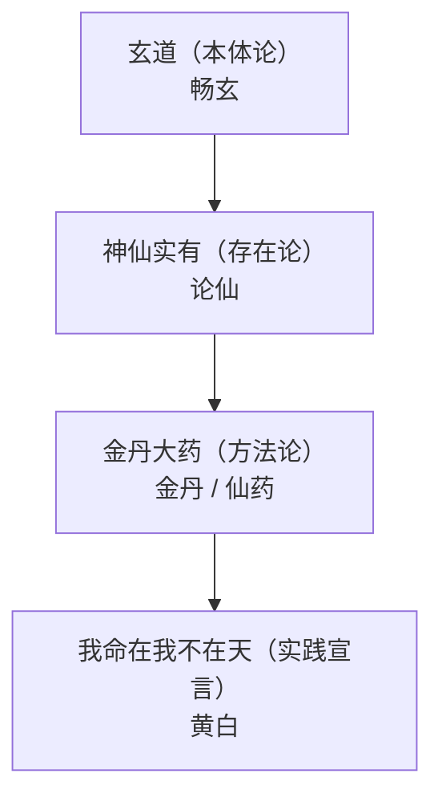

# 核心概念

《抱朴子内篇》的思想体系可归纳为四个核心概念，层层递进：玄道（本体论）→ 神仙实有（存在论）→ 金丹大药（方法论）→ 我命在我不在天（实践宣言）。

## 一、玄道：最高范畴

《畅玄》开宗明义以"玄"为最高范畴（facts F15）：

> 抱朴子曰："玄者，自然之始祖，而万殊之大宗也。眇眛乎其深也，故称微焉。绵邈乎其远也，故称妙焉。其高则冠盖乎九霄，其旷则笼罩乎八隅。光乎日月，迅乎电驰。"

"玄"承扬雄《太玄》以"玄"名道的传统，是生成万物的本体。葛洪将得道者分层（facts F16）：

- 上者："得之乎内，守之者外，用之者神，忘之者器"；
- 其次："真知足"而"肥遁勿用，颐光山林"。

> 结句"其唯玄道，可与为永"——玄道是长生的终极依据。

## 二、神仙实有：存在论论证

《论仙》以设问对答论证神仙实有（facts F17）：

> 或问曰："神仙不死，信可得乎？"抱朴子答曰："虽有至明，而有形者不可毕见焉。虽禀极聪，而有声者不可尽闻焉……万物云云，何所不有，况列仙之人，盈乎竹素矣。不死之道，曷为无之？"

论证策略有二（facts F14）：

1. **经验局限论证**：以感官与认识的有限性，将神仙置于经验认识之外的超验领域；
2. **变化之术论证**：以万物变化的普遍性论证长生可致。

## 三、金丹大药：方法论核心

《金丹》确立还丹金液为"仙道之极"（facts F18）：

> 余考览养性之书，鸠集久视之方，曾所披涉篇卷，以千计矣，莫不皆以还丹金液为大要者焉。然则此二事，盖仙道之极也。服此而不仙，则古来无仙矣。

方法论依据（facts F20）：

- "黄金入火，百炼不消，埋之，毕天不朽。服此二物，炼人身体，故能令人不老不死。此盖假求于外物以自坚固"；
- "凡草木烧之即烬，而丹砂烧之成水银，积变又还成丹砂，其去凡草木亦远矣"。

《仙药》则建立仙药品级体系（facts F21）：丹砂为上，次黄金、白银、诸芝、五玉、云母、明珠、雄黄、太乙禹馀粮等；引《玉经》"服金者寿如金，服玉者寿如玉"（facts F22）。

## 四、我命在我不在天：实践宣言

《黄白》引《龟甲文》（facts F23）：

> 龟甲文曰：我命在我不在天，还丹成金亿万年。

这是道教生命自主观的标志性命题，意为个人生命由自我决定、不由天地掌握——通过炼丹成金、夺造化之工的实践，人可以改变常规的自然事物和现象（facts F24）。

> **出处正本**：该句实出卷十六《黄白》引《龟甲文》，网络常误标《论仙》，本包已依五源一致更正（facts F24）。同句另见《老子西升经·我命章》"我命在我，不属天地"、张伯端《悟真篇》"始知我命不由天"。

## 概念关系图

## 下一步

- 读双源核对原文 → [名篇选读](04-selected-chapters.md)
- 按日程通读 → [四周通读计划](../examples/01-reading-plan.md)
