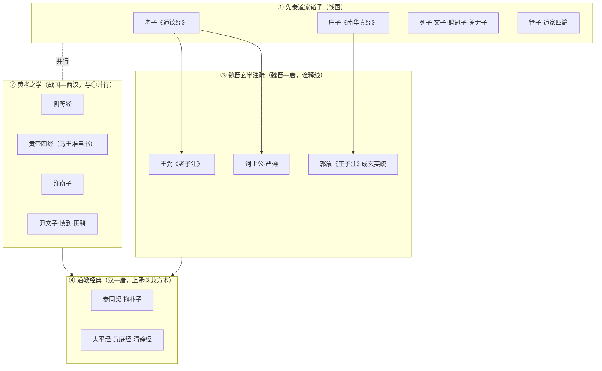

# 道家（Daojia）知识包总纲

本分组是道家著作**全谱系**的伞形导航，按「段—家—著」三级组织四段谱系：① 先秦道家诸子、② 黄老之学、③ 魏晋玄学注疏、④ 道教经典。

> **判读口径**（贯穿全分组）：
> 1. **托名层/文本层分判**——署名（托名层）与学术推定的实际成书情况（文本层）不混为一谈；争议处并列 ≥2 种学说。
> 2. **权威性分级**——A＝出土＋传世双重印证且整理本权威；B＝传世本为主、整理本权威或文本有争议；C＝辑佚／残本／托名争议大。
> 3. **双源逐字核对**——入库原文须经至少两个独立权威信源核对。

## 谱系图



> 四段非线性的时间先后：黄老之学与先秦诸子并行，道教经典上承玄学又兼神仙方术（谱系是流变网络，非单向继承链）。

## 四段分组导航

| 分组 | 一句话简介 |
|------|-----------|
| [先秦道家诸子](zhuzi/index.md) | 老庄列文鹖关管——先秦道家原著谱系（老子、庄子既有独立分组，此处为导航与补遗） |
| [黄老之学](huanglao/index.md) | 阴符经、黄帝四经、淮南子、尹文子、慎到田骈——道法结合的黄老系统 |
| [魏晋玄学注疏](xuanxue/index.md) | 王弼、河上公、严遵、郭象、成玄英——经典诠释谱系的独立主线 |
| [道教经典](daojiao/index.md) | 参同契、抱朴子、太平经、黄庭经、清静经——义理/丹道经典（不含善书科仪） |

## 既有独立分组（cross-ref）

道家谱系中以下著作已有独立分组，本总纲以交叉引用方式纳入导航，不重复建设：

| 著作 | 既有分组 | 说明 |
|------|---------|------|
| 老子 | [📜 老子（Laozi）](../laozi/index.md) | 帛书《老子》阅读教程 + 老子著作原文与解读（出土文献基准） |
| 庄子 | [📜 庄子（Zhuangzi）](../zhuangzi/index.md) | 三十三篇全文阅读教程（内篇自著 / 外杂篇后学分层） |
| 阴符经 | [📜 黄帝经典（Huangdi）](../huangdi/index.md) | 《黄帝阴符经》权威原文双源核对与历代解读 |

```{toctree}
:hidden:
:maxdepth: 7

zhuzi/index
huanglao/index
xuanxue/index
daojiao/index
```