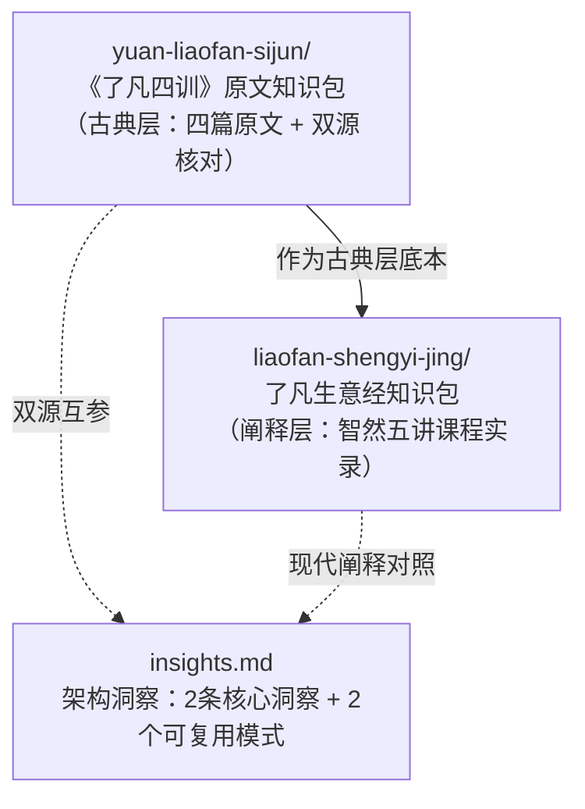

# 了凡（Liaofan）知识包

本分组收录**《了凡四训》**相关全部知识包，按「三层文本」框架组织：古典层（明代原典）、阐释层（现代解读），以及贯穿两层的架构洞察。

> **三层文本分层说明**：
> - **古典层**（原文）——明末袁黄（1533–1606）《了凡四训》四篇原文，以佛弟子文汇 + 中华书库双源数字化核对底本
> - **经典层**（引用）——原文中征引的《周易》《尚书》等更早经典，在阐释层中逐条标注出处
> - **阐释层**（解读）——智然《了凡生意经》2013年北京企业家研修班课堂实录，以《了凡四训》为底本进行现代企业经营阐释

```{warning}
本分组所有内容均属[国学域](../index.md)收录范围；《了凡四训》作为明代理学与民间善书交汇处的修身实践文本，对东亚民间伦理影响深远，**非宗教典籍**。
```

## 谱系图



> 两束呈**古典层↔阐释层**对照关系：前者锚定原文忠实面貌，后者提供现代实践语境的延伸。阅读顺序建议先读原文，再读阐释，最后在洞察中建立全局理解。

## 分组导航

| 知识包 | 分层 | 一句话简介 |
|--------|------|-----------|
| [📜 《了凡四训》原文知识包](yuan-liaofan-sijun/index.md) | 古典层 | 明·袁黄四篇原文的全本双源核对阅读教程——立命之学、改过之法、积善之方、谦德之效四篇逐字对照 |
| [💼 了凡生意经知识包](liaofan-shengyi-jing/index.md) | 阐释层 | 智然老师2013年企业家研修班课堂实录——五讲内容全量结构化，含立命九法、改过三心三法、谦德五案现代解读 |

## 既有独立分组（cross-ref）

本分组中的两束与国学域其他分组形成交叉参考：

| 知识包 | 交叉参考分组 | 说明 |
|--------|------------|------|
| 《了凡四训》原文 | [📜 孔子（Confucius）](../confucius/index.md) | 同为儒家修身实践传统；了凡四训融合儒释道三教思想（F-030） |
| 了凡生意经 | [🧑‍🏫 王阳明心学（Yangming）](../yangming/index.md) | 明代心学流派间的修身实践延续；了凡与阳明同处晚明，共享"致良知"的实践路径 |
| 两束共参 | [📜 儒家（Confucianism）](../confucian/index.md) | 四书体系是《了凡四训》的经典层底本之一 |

## 推荐阅读路径

```
第一次接触了凡四训：
  yuan-liaofan-sijun/concepts/00-overview → 01（立命）→ 02（改过）→ 03（积善）→ 04（谦德）
  → liaofan-shengyi-jing 五讲核心内容（对应四篇原文）
  → insights.md（全局架构洞察）

企业经营者读者：
  liaofan-shengyi-jing 五讲核心内容 → yuan-liaofan-sijun 对应原文篇目
  → insights.md（方法论沉淀）

学术研究读者：
  两束 facts.md 逐条核对 → references/sources.md 信源查证 → insights.md
```

## 工作文档

- [架构洞察](insights.md) — 2条核心洞察与2个可复用模式（基于 facts.md F-001~F-070 分析）

```{toctree}
:hidden:
:maxdepth: 7

yuan-liaofan-sijun/index
liaofan-shengyi-jing/index
insights
zhihu-article
```
