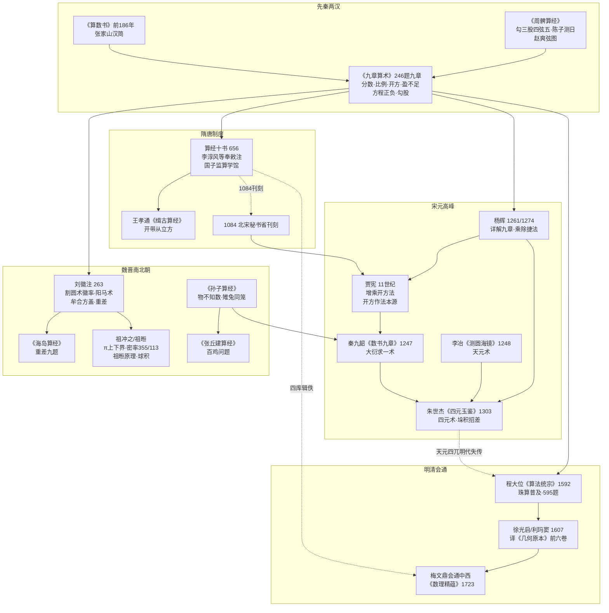

# 架构洞察（Insights）

> 基于事实清单（[facts.md](facts.md)）R 阶段采集的 96 条事实得出；每条洞察遵循四元组结构（现象描述/根因分析/影响评估/改进建议），证据以 F-xxx 回指 facts.md。

---

## 洞察 1：中算是"算法传统"而非"演绎传统"，阅读钥匙是程序而非公理

| 四元组 | 内容 |
|--------|------|
| **现象描述** | 《九章算术》246 题（F-024）中没有定义、公理与定理证明，只有"问—答—术"：每题给出数据、答案与可照做的计算程序；方程术用算筹在布列的矩阵上"遍乘直除"（F-033），盈不足术给出固定的乘除步骤（F-032）。但刘徽注又确实包含严格论证，如割圆术的极限陈述（F-044）、阳马体积的极限分解（F-045）。 |
| **根因分析** | 中算的知识载体是算筹：算筹在算板上的位置即编码（F-009、F-011），算法天然表现为"布筹—变换—读数"的操作程序；同时数学的服务对象是田亩丈量、粮食换算、赋役摊派、工程土方、历法推算（F-025~F-031），知识以"可复用程序"而非"演绎链条"组织。刘徽的证明也围绕"程序为何正确"展开（出入相补、极限分割），而非建立公理体系。 |
| **影响评估** | 这一传统使中算在算法领域长期领先：开方程序（F-029）、线性方程组消元（F-033）、正负数运算（F-034）、同余求解（F-054、F-076）、高次方程数值解（F-066、F-079、F-083）均以可执行程序的形态最早出现。但代价是：知识隐含在术文与筹式位置中，没有符号化表达，离开师授极易失传（明代天元术、四元术无人能读即为例证，见洞察 3）；近代读者以欧氏几何眼光审视，易得出"中算只有应用、没有理论"的误判。 |
| **改进建议** | 阅读算经采用"程序视角"：把每条"术"转写为现代伪代码或数学公式，标注筹式位置对应的变量（本包 examples/ 即按此设计四段式）；读刘徽注时寻找"程序不变量"式论证（如割圆中"所失弥少"的误差估计）；与古希腊传统比较时用"算法公理化 vs 演绎公理化"框架，避免简单比高下。 |

## 洞察 2：《算经十书》是制度产物，文本传承链条由官学与刊刻维系

| 四元组 | 内容 |
|--------|------|
| **现象描述** | 十部算经在唐显庆元年（656 年）由国子监算学馆颁行、李淳风等奉敕作注（F-001、F-002）；明算科列入科举，《九章》《海岛》限习三年（F-005）；北宋元丰七年（1084 年）秘书省官方刊刻（F-003），南宋鲍澣之翻刻（F-004）；清乾隆修《四库全书》时又从《永乐大典》辑出校订（F-092、F-093）。今见《海岛算经》等文本即经此链条存续。 |
| **根因分析** | 大一统官僚国家对计算人才有持续需求：户籍赋税、仓储、工程、历法均需批量训练掌握算术的官吏，唐代科举与宋代刻书分别提供了人才制度与复制技术两个条件。算经的定型不是单一天才著述的结果，而是官学课程选定教材、统一注释、官方刊印的制度过程。 |
| **影响评估** | 制度支撑使中算核心文本历经千年仍有传本（ctext 所据《四部丛刊》《四库》底本皆此链条末端，F-021、F-037），且 1084 年官方刊刻远早于欧洲印刷数学教科书。但官学定型也意味着教材固化：十书之后的突破性成果——贾宪增乘开方（F-079）、秦九韶大衍求一（F-075）、朱世杰四元术（F-083）——全部出现在官学体系之外的私人著述中。 |
| **改进建议** | 读算经时把"著作史"与"制度史"并置：先记四个制度节点（656 颁行、1084 刊刻、明代珠算转向、1773–1787 四库辑佚），再安放各书位置；理解某书为何存、为何佚（《缀术》F-065）时，优先考察其在官学课程与刊刻链条中的位置，而非仅归因为战乱。 |

## 洞察 3：宋元高峰之后的"中断"是符号载体断裂，不是数学能力退化

| 四元组 | 内容 |
|--------|------|
| **现象描述** | 13–14 世纪天元术、四元术、大衍求一术达到高峰（F-073~F-085）；到明代，程大位《算法统宗》（1592）虽集算题之大成（595 题，F-087），但其时天元术已无人通晓，朱世杰的方法要到清中叶四库辑佚后才被重新读懂（F-092）。与此同时珠算全面替代筹算（F-087）。 |
| **根因分析** | 天元术、四元术的表达高度依赖算筹在算板上的二维位置（天/地/人/物四元按方位布列，F-083），这种"位置符号"无法被线性刻印的书本完整复制，知识保存在师徒口手相传的操作中；元末战乱与明代官学课程调整中断了师承；珠算盘成为主流计算工具后，筹算布列这一物质载体消失，高阶筹算程序随之失去运行环境。 |
| **影响评估** | 这一断裂发生在西方符号代数（韦达、笛卡儿）成型的同一时期，构成中西数学"大分流"的技术史侧面：清代数学家梅文鼎等以"会通中西"方式接续（F-091），《数理精蕴》系统引入西算（F-090），中国数学从此纳入世界数学的符号化主流。它也提示：算法知识若只编码在特定工具的操作中而无独立符号记录，传承风险极高。 |
| **改进建议** | 读宋元算书时先补"符号转译"：把天元术理解为"设 x 列方程"、四元术理解为"四元多项式消元"、大衍求一术理解为"扩展欧几里得算法求模逆元"（F-076、F-081）；读明代著作时关注其"传播价值"而非"理论前沿"；把徐光启译《几何原本》（F-089）当作符号化思维引入的标志事件来读。 |

## 洞察 4：古今转译的最大陷阱是"同名异实"——对照必须标出边界

| 四元组 | 内容 |
|--------|------|
| **现象描述** | 古术与现代数学对照时常见过度等同：盈不足术被直接说成"线性插值公式"，大衍求一术被说成"中国剩余定理"，割圆术被说成"积分思想"。这些对照方向正确但边界模糊：盈不足术对非线性问题只给一次近似；大衍总数术的核心难点在模数非互素时的化约（F-075），而教科书 CRT 常直接假设模数两两互素；割圆术给出的是迭代逼近与误差界论述（F-044），并非积分学。 |
| **根因分析** | 古术以比率、出入相补、盈朒、齐同等操作语言表达（F-032、F-049），现代数学以符号公式与定理条件表达；转译时若只抄结论不核对适用条件，就会抹平差异。古代算题的数字答案正确，并不意味着其算法覆盖了现代定理的全部情形。 |
| **影响评估** | 粗糙对照会双向误导：要么把中算贬低为"西方定理的朴素特例"，要么用现代术语过度包装、制造优先权夸大（r-martzloff-1997 与 r-chemla-2004 的审慎表述正是对治此病）。准确标注边界后，中算的独特贡献反而更清晰：例如大衍求一术对非互素模数的程序化处理，在世界数学史上确属独立创获（F-076）。 |
| **改进建议** | 每个古今对照执行三步：先给出严格的现代命题陈述（含条件），再逐句转译术文，最后专设"差异与边界"说明适用范围不一致处；优先权表述只采用 r-martzloff-1997、r-chemla-2004 等学术文献的审慎措辞（见 [references/modern-studies.md](references/modern-studies.md) 引用约定）。 |

## 洞察 5：算经是"问题驱动"的教材体系，今天的最优读法仍是"做题"

| 四元组 | 内容 |
|--------|------|
| **现象描述** | 从《算数书》（约 70 条算题，F-095）到《九章》246 题（F-024）、《数书九章》81 题（F-074）、《算法统宗》595 题（F-087），中算经典无一不是问题集；《算学启蒙》259 问分二十门由浅入深（F-085），《海岛》九题从一望到四望逐级加难（F-050）。 |
| **根因分析** | 问题集体例与算法传统互为表里：算法的正确性通过"做"来验证与传授，题目既是练习也是算法存在的正当性来源；官学与民间教育都以"会做题"为培养目标（F-005）。 |
| **影响评估** | 只读术文不动手复算，几乎必然误读——例如盈不足术的"维乘"、方程术的"直除"，文字看似明白，不布算一次无法理解其筹式设计；反过来，亲手用算筹位置或现代表格复现一遍，术语难点大多自行消解。 |
| **改进建议** | 本包 examples/ 七篇算题实战即按"做题"设计：每篇先引原文题目，再用白话讲清题意，然后用现代数学复算并对照古术程序；读者应备纸笔（或 SymPy，见 [references/cross-ref.md](references/cross-ref.md)）逐题演算，再进入 concepts/ 的体系化梳理。推荐顺序：examples/01~07 做题 → concepts/01~13 建立框架 → examples/08 按阅读计划通读原典。 |

---

## 知识地图

地图读法：实线表示方法/文本的直接继承（如《孙子》物不知数 → 秦九韶大衍求一术），虚线表示制度性事件关联（1084 刊刻、明代失传、四库辑佚）。横向阅读可见两条主线：一条是"问题集—算法程序"的技术主线（《算数书》→《九章》→ 刘徽 → 宋元四家），一条是"官学—刊刻—辑佚"的制度主线（656 → 1084 → 1773–1787）。