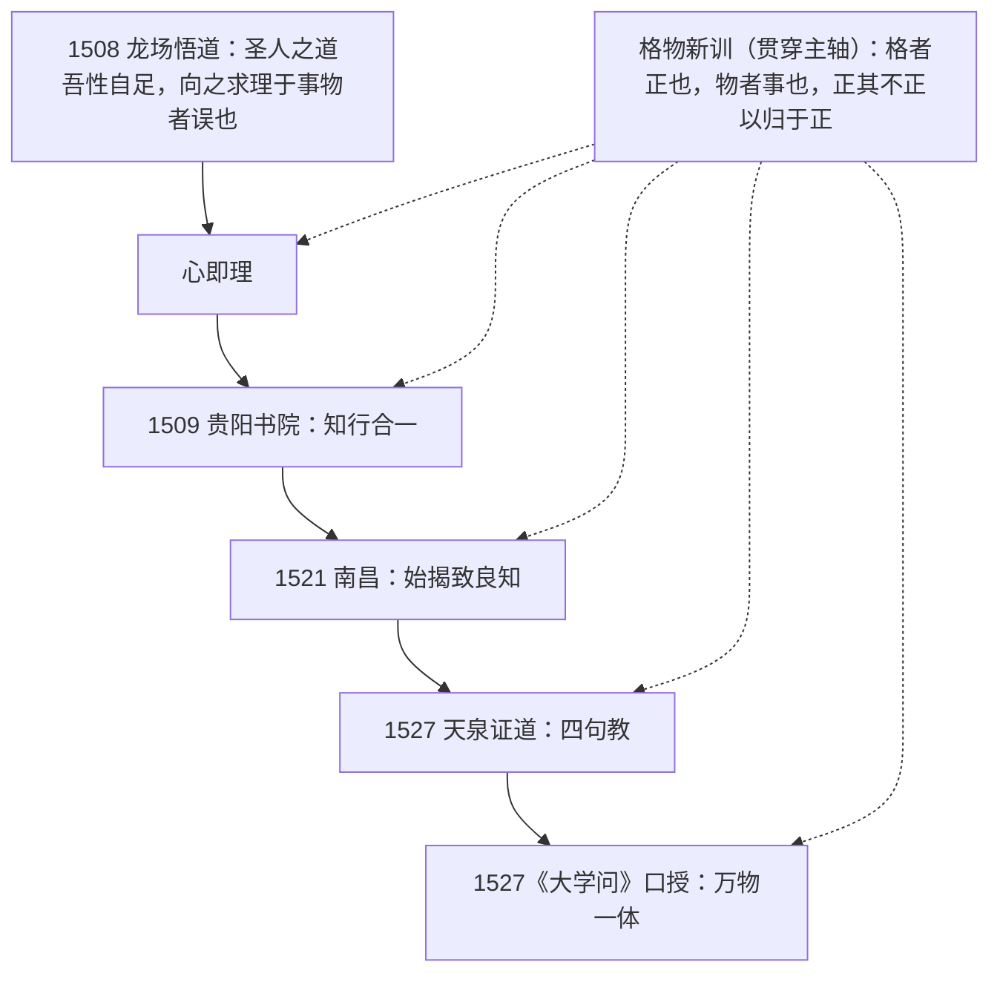

# 阳明教义义理地图

阳明教义不是五句并列的名言，而是同一体系在四个年代节点上的渐次展开（insight I1）：1508 龙场悟道立"心即理"立足点，1509 贵阳始论知行合一，1521 南昌始揭致良知，1527 天泉证道定本四句教、口授《大学问》（facts F6–F9、F3）。而把四个节点贯穿起来的方法论主轴，是龙场所悟的"格物致知之旨"——格者正也、物者事也（facts F22–F23、F33）。本图以一图、一表收束全束命题，并给出文本分层研读次序与日用功夫指要。

## 一、义理总图

读法：实线为命题提出的年代推进；虚线为格物新训的贯穿——它在 1508 龙场悟得（F6），1518 年以《大学古本》与《大学古本序》公开面世（F35–F36），1527 年在《大学问》中成为格致训定本（F22、F33），并凝结为四句教末句"为善去恶是格物"（F9）。

## 二、命题对照表（命题—年代—出处—经据—时弊—工夫落位）

| 命题 | 提出年代 | 出处卷次 | 《大学》/《孟子》经典依据 | 针对时弊 | 工夫落位 |
|------|----------|----------|---------------------------|----------|----------|
| 心即理 | 1508 龙场悟道确立（F6） | 卷上徐爱/陆澄录、卷中答顾东桥书（F10、F12、F14） | 承陆象山"心即理"一脉（F5） | 朱子学"求理于事物"之误："向之求理于事物者误也"（F6） | 此心去私欲之蔽即是天理，"不须外面添一分"（F10） |
| 知行合一 | 1509 贵阳书院始论（F7） | 卷上徐爱/陆澄录、卷中答顾东桥书（F15–F17） | 《大学》八条目本体一贯、"体之惟一，无先后次序之可分"（F33） | "待知得真了方去行"之病："终身不行，亦遂终身不知"（F16） | 即知即行：知之真切笃实处即是行，行之明觉精察处即是知（F17） |
| 致良知 | 1521 南昌始揭（F8） | 卷上陆澄录、卷下、卷中答顾东桥书、《大学问》（F18–F22） | 《孟子·尽心上》良知良能（F4）；"是非之心，人皆有之"（F22） | 滁上静坐教法"喜静厌动，流入枯槁"之病，"故迩来只说致良知"（F29） | 致吾心之良知于事事物物，不欺瞒自家准则（F20–F21） |
| 四句教 | 1527 天泉证道定本（F9） | 《传习录下》、《年谱三》（F9、F3） | 《大学》身心意知物结构（F11）；孟子性善"从源头上说来"（F27） | 王畿四无（单提本体）与钱德洪四有（只在念头）两边："二君相取为用"（F9） | 利根人一悟本体即是功夫；其次意念上实落为善去恶（F9） |
| 万物一体 | 1527《大学问》口授（F3、F31） | 《大学问》、卷上（F26、F31） | 《大学》三纲领：明明德—亲民—止于至善（F31–F32）；《孟子》"亲亲仁民"（F25） | "只说明明德而不说亲民，便似老、佛"（F26） | 明明德必在于亲民：立体必达用，亲民以明其明德（F31） |
| 格物新训（贯穿主轴） | 1508 悟得→1518《大学古本》刊行→1527《大学问》定本（F6、F35、F22） | 卷上徐爱/陆澄录、薛侃录、《大学古本序》、《大学问》（F22–F23、F33、F36–F38） | 《孟子》"大人格君心"之格（F38）；《尚书》"格于上下""格于文祖""格其非心"（F33） | 新本"先去穷格事物之理，即茫茫荡荡，都无着落处，须用添个敬字"（F37） | 事上磨炼：意之所在之物，善则实有以为之、恶则实有以去之（F29、F33） |

## 三、格物新训的贯穿线

| 年代 | 文本事件 | 格物新训的形态 | 信源 |
|------|----------|----------------|------|
| 1508 | 龙场悟道 | "忽中夜大悟格物致知之旨……向之求理于事物者误也" | F6 |
| 1512 | 徐爱录学 | "先生于《大学》'格物'诸说，悉以旧本为正" | F25、F35 |
| 1518 | 刊行《大学古本》（傍释），七月作《大学古本序》 | "《大学》之要，诚意而已矣。诚意之功，格物而已矣"；"去分章而复旧本" | F35、F36 |
| 1521/1523? | 《大学古本序》改序（年代异说并登记） | 增"致知"宗旨；"新民"改"亲民" | F36 |
| 1527 | 《大学问》口授、天泉证道 | "物者事也，格者正也"格致训定本；"为善去恶是格物" | F22、F33、F9 |

## 四、文本分层与研读次序

原典三层级（fact F2）：卷上/卷下为门人记录（接引语，随机点拨），卷中为阳明亲笔书信（论辩语，辨析精严），《大学问》为口授教典（系统语，《大学》义理全幅展开）。同命题在三层文本中互参，不宜混同。

以命题为纲的研读次序（命题—卷次对照）：

1. **卷上立根**：徐爱录《大学》古本、亲民新民之辨（F25）→心即理（F10）→身心意知物与"大人格君心"（F11、F38）→陆澄录"格者正也"（F23）、良知不假外求（F18）→知行合一诸条（F15–F16）；
2. **卷中明辨**：答顾东桥书——知行工夫（F17）、"万事万物之理不外于吾心"（F14）、致知格物"合心与理而为一"（F21）；
3. **卷下悟宗旨**：良知是非之心、造化精灵（F19）→自家准则"格物的真诀"（F20）→岩中花树（F13）→满街圣人（F24）→事上磨炼与教法转变（F29）→天泉证道四句教（F9）、性无定体（F27）；
4. **《大学问》收束**：万物一体四段感应与明德亲民体用（F26、F31–F32）→亲民新民本末问答（F32）→致知格物训定本与八条目一贯（F22–F23、F33）→钱德洪跋口授背景（F3）。

> 分卷逐周的研读日程属《传习录》专书研读范畴，归 [chuanxilu 束](../../chuanxilu/index.md)（传习录束）承接待办；本束只提供义理地图层面的命题—卷次对照。

## 五、日用功夫指要

义理地图的"工夫落位"列落到日用，即四条功夫指要（均以《传习录》原文为据；系统日课归 [gongfu 束](../../gongfu/index.md)（功夫束）承接）：

| 功夫 | 指要 | 原文依据 |
|------|------|----------|
| 立志为头脑 | "汝辈学问不得长进，只是未立志"；良知上不留"别念挂带" | F30 |
| 事上磨炼 | 功夫场在日用事为上，烦难不回避、不好静逃世 | F29、F11 |
| 省察克治 | 意念发动处（临财、临怒、临安逸）以良知为自家准则，是便行、非便去 | F20、F15 |
| 即知即行 | 已知当为之事立即行，不以"再想想、再学学"拖延 | F16–F17 |

事上磨炼一条须连带其全句语境（fact F29，卷下陈九川录）：

> 人须在事上磨炼，做功夫乃有益。若只好静，遇事便乱，终无长进。那静时功夫亦差，似收敛，而实放溺也。

即：厌动求静的"静时功夫"看似收敛，实则放溺——格物之物是"意之所在"的日用事为，离事无为格物、离物无以致知（F11、F33）。

## 延伸阅读

- 格物与《大学》（格物新训专页）：[../concepts/05-investigation-of-things.md](../concepts/05-investigation-of-things.md)
- 教义体系总览（年代线表）：[../concepts/00-overview.md](../concepts/00-overview.md)
- 四句教与万物一体：[../concepts/04-four-sentence-teaching.md](../concepts/04-four-sentence-teaching.md)
- 信源登记（底本与双源核对）：[../references/sources.md](../references/sources.md)
