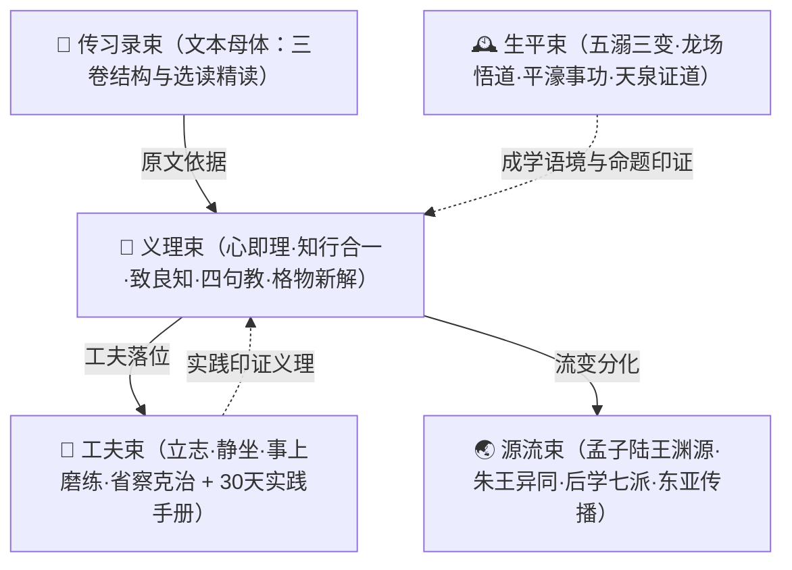

# 🧑‍🏫 王阳明心学（Yangming）知识包总纲

本分组是王阳明（王守仁，字伯安，号阳明，1472—1529）心学体系的伞形导航，按「文本—义理—工夫—生平—源流」五束组织：以《传习录》为文本母体，以心即理、知行合一、致良知、四句教为义理纲领，以立志、静坐、事上磨练、省察克治为修养工夫，以龙场悟道至"此心光明"的生平为成学印证，以孟子—陆王渊源、后学七派与东亚传播为流变脉络。

> **判读口径**（贯穿全分组）：
> 1. **原文双源核对**——入库古文原文均经至少两个独立信源（维基文库、ctext.org、中华文库、权威学术站点等）逐字核对。
> 2. **争议并列不裁决**——条数异说、年代异辞、学派评价、《朱子晚年定论》真伪、日本阳明学与明治维新关系强度等，均并列 ≥2 说并各挂信源。
> 3. **异文登记不改字**——原文照录，异文出注；OCR 讹字标注为讹而非版本异文。
> 4. **古典/现代分层**——工夫实践的现代转化（如 30 天实践手册）显式标注为现代实践设计，不伪装为古文原意。

## 谱系图



> 五束非线性关系：生平束是义理的生成语境（悟道-事功-立教三线互证），源流束是义理的后世展开；进修者可由文本入、由工夫入、由生平入，三条入口殊途同归。

## 五束分组导航

| 束 | 一句话简介 |
|------|-----------|
| [📖《传习录》阅读教程](chuanxilu/index.md) | 心学第一文献——成书版本（薛侃初刻/南大吉增刻/钱德洪续下卷/隆庆《全书》定型）、三卷结构、核心条目地图、11 组关键原文双源核对选读、零基础/进阶/研读三轨阅读计划（14 文件） |
| [🧭 心学义理体系](doctrine/index.md) | 四大纲领——心即理（心外无理/岩中花树）、知行合一（1509 贵阳首讲）、致良知（1521 南昌揭示）、四句教（1527 天泉证道）与格物新解、《大学》古本亲民新民之辨、万物一体《大学问》，附义理地图（15 文件） |
| [💪 修养工夫与现代实践](gongfu/index.md) | 工夫论——头脑-工夫-效验总纲、立志、静坐澄心与枯坐之警、事上磨练、省察克治；含现代人 30 天心学工夫实践手册（立志句/省察日记/16 个事上磨任务/知行微挑战/周复盘）（14 文件） |
| [🕰️ 生平与成学历程](biography/index.md) | 五溺三变——1472 余姚生、1506 忤刘瑾廷杖、1508 龙场悟道、1517 抚南赣、1519 四十三天平宸濠、1521 致良知、1527 天泉证道、1529"此心光明"、1584 从祀孔庙；年表与地理研读地图（14 文件） |
| [🌏 源流·后学·东亚影响](lineage/index.md) | 谱系全图——孟子/陆九渊/陈献章湛若水渊源、朱王分歧与《朱子晚年定论》争议、浙中/江右/泰州/止修后学各派、明清批判与近代复兴、日本（中江藤树→幕末志士）与韩国江华学派传播、稻盛和夫与现代新儒家；三级书单与五阶段进学路径（15 文件） |

## 推荐学习路径

- **入门轨（由趣入理，约 6 周）**：生平束年表 →《传习录》束零基础阅读计划 → 义理束 00 总览 → 工夫束 30 天手册第 1 周。
- **实践轨（由行入理）**：工夫束 30 天手册（每日省察 + 事上磨练任务）→《传习录》选读"知行合一""事上磨"诸条 → 义理束致良知与四句教。
- **研读轨（由理入史）**：《传习录》三轨之研读轨（配邓艾民《传习录注疏》、陈荣捷《传习录详注集评》）→ 义理束五篇 → 源流束朱王异同与后学各派 →《明儒学案·姚江学案》。

## 与既有分组的关系（cross-ref）

| 关联对象 | 既有分组 | 关系 |
|------|---------|------|
| 《大学》《孟子》 | [📜 儒家（Confucianism）](../confucian/four-books/index.md) | 心学义理的经典依据——"致知""格物""亲民"出《大学》，"良知""良能""万物皆备"出《孟子》；阳明尊《大学》古本与朱子改本之争见义理束格物篇 |
| 禅宗 | [🪷 佛家核心经典](../buddhism/index.md) | 阳明早岁"出入佛老三十年"，心学与禅宗明心见性有交涉而终归儒家人伦日用；静坐工夫与禅定的分际见工夫束静坐篇 |
| 道家道教 | [☯ 道家（Daojia）](../daojia/index.md) | 阳明曾泛滥词章、出入佛老；龙场悟道前的道家养生阅历与心学转向的关系见生平束与源流束 |

```{toctree}
:hidden:
:maxdepth: 7

chuanxilu/index
doctrine/index
gongfu/index
biography/index
lineage/index
```
