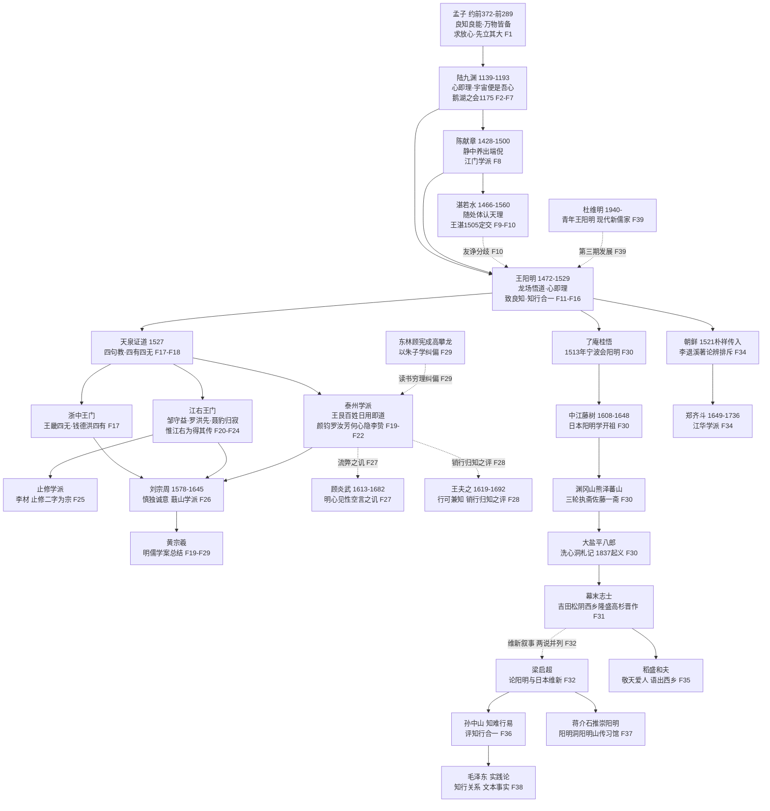

# 谱系总图与阅读路线

本页是全束的地图。阳明心学的谱系可分五段：**远源**（孟子—陆九渊—白沙甘泉，facts F1–F10）、**朱王之辨**（格竹、心即理与性即理、《朱子晚年定论》，F11–F16）、**天泉证道与后学分派**（浙中、江右、泰州、止修，F17–F25）、**明清反思**（刘宗周、黄宗羲、顾炎武、王夫之、东林，F26–F29）、**东亚传播与近代复兴**（日本、朝鲜、近代人物、现代新儒家，F30–F39）。

## 谱系总图

> 图中虚线表示争议性或非师承关系：王湛之间为友诤分歧（F10）；顾炎武、王夫之对王学的批评与东林的纠偏（F27–F29）；"阳明学为明治维新精神动力"说两说并列、不裁决（F32）；杜维明为现代新儒家对阳明的再阐释，非师承（F39）。

## 五段提要

| 段 | 时段 | 核心节点 | 事实区 |
|----|------|----------|--------|
| 远源 | 战国—明中期 | 孟子四条 → 陆九渊心即理 → 陈献章静中养端倪 → 湛若水随处体认天理 | F1–F10 |
| 朱王之辨 | 阳明早年至 1518 | 格竹、出入佛老、龙场悟道；心即理 vs 性即理；《大学》古本；《朱子晚年定论》与《学蔀通辨》 | F11–F16 |
| 后学分派 | 1527—明末 | 天泉证道四句教；浙中、江右、泰州、止修四派 | F17–F25 |
| 明清反思 | 明末清初 | 刘宗周慎独、黄宗羲《明儒学案》、顾炎武实学、王夫之知行说、东林纠偏 | F26–F29 |
| 东亚与近代 | 1513—当代 | 了庵—藤树—蕃山—大盐—幕末志士；朝鲜江华学派；梁启超、孙中山、蒋介石；稻盛和夫、杜维明 | F30–F39 |

## 阅读路线

三条路线对应三类读者（与束根"推荐学习路径"一致）：

1. **零基础路线**：本页总图 → [思想远源](01-sources-mengzi-luxiang.md) → [三级书单与五阶段进学路径](../examples/01-study-path.md) → [朱王之辨](02-zhu-wang-divergence.md) → [后学分派](03-disciples-schools.md)。先建立地图，再从《传习录》白文入手。
2. **有中国哲学基础路线**：[朱王之辨](02-zhu-wang-divergence.md) → [后学分派](03-disciples-schools.md) → [明清反思与近代复兴](04-critique-revival.md) → [东亚传播与现代影响](05-east-asia-modern.md) → [信源登记](../references/sources.md)。重点抓命题差异与争议并列结构。
3. **研究型路线**：全部概念页 → [facts.md](../facts.md) 逐条核对信源 → [信源登记](../references/sources.md) 底本对勘 → [insights.md](../insights.md) 模式层 → [log.md](../log.md) 双源核对记录。

> 跨束衔接：王阳明心学知识包的**束1（阅读计划束）**与**束3（实践手册束）**尚未建设，本束仅以文字提及，不设链接。

## 延伸阅读

- 思想远源：[01-sources-mengzi-luxiang.md](01-sources-mengzi-luxiang.md)
- 朱王之辨：[02-zhu-wang-divergence.md](02-zhu-wang-divergence.md)
- 后学分派：[03-disciples-schools.md](03-disciples-schools.md)
- 明清反思与近代复兴：[04-critique-revival.md](04-critique-revival.md)
- 东亚传播与现代影响：[05-east-asia-modern.md](05-east-asia-modern.md)
