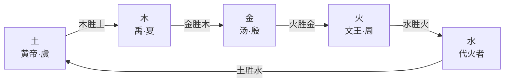

## 一、《吕氏春秋·应同》五德推移全文

【归属层级：C 层 — 受影响传世文献（作者归属吕氏门客，非邹衍亲著；详见下文"归属说明"）】

《吕氏春秋·有始览·应同》（约公元前 239 年成书）载五德推移之文，是今存最完整表述五德终始说的先秦文献。以下据 ctext.org（底本《四部丛刊初编》本）逐段引用，文字以 F-027 对抗审查复核后为准（F-027、F-029）：

> 凡帝王者之将兴也，天必先见祥乎下民。黄帝之时，天先见大蚓大蝼。黄帝曰："土气胜。"土气胜，故其色尚黄，其事则土。

> 及禹之时，天先见草木秋冬不杀。禹曰："木气胜。"木气胜，故其色尚青，其事则木。

> 及汤之时，天先见金刃生于水。汤曰："金气胜。"金气胜，故其色尚白，其事则金。

> 及文王之时，天先见火，赤乌衔丹书集于周社。文王曰："火气胜。"火气胜，故其色尚赤，其事则火。

> 代火者必将水，天且先见水气胜。水气胜，故其色尚黑，其事则水。水气至而不知，数备，将徙于土。

——出处：《吕氏春秋·有始览·应同》，信源：[ctext.org](https://ctext.org/lv-shi-chun-qiu/ying-tong/zhs)

> **异文修正标注**（Y-13）：末句"将**徙**于土"，ctext 页（2026-08-30 对抗审查复核确认）实作"徙"；初采集底稿曾误录为"徒"，经实访判定系误录，F-027 正文已照页面改作"徙"。（Y-21）"天先见大**蚓**大蝼"，ctext 页作"蚓"；初采集底稿曾误录为"螾"（螾为蚓之古字），已照页面改作"蚓"。又，初采集底稿脱"者"字（"凡帝王之将兴也"），ctext 页实作"凡帝王者之将兴也"，已补正。
> **核对说明**：维基文库《吕氏春秋/应同》页本次访问未返回有效内容（U-04），本段为 ctext.org 单源核对。

## 二、五行相胜序列

五德终始说的核心逻辑是**五行相胜**（即五行相克）：每一德被其所不胜之德取代，循环往复。《淮南子·坠形训》载相胜序列为"木胜土，土胜水，水胜火，火胜金，金胜木"（F-048）。《应同》所述五德推移正依此序列：

黄帝（土）→禹（木）→汤（金）→文王（火）→代火者（水）→将徙于土，构成闭环。每一德兴时，天降相应祥瑞（如土德见大蚓大蝼、木德见草木秋冬不杀、金德见金刃生于水、火德见赤乌衔丹书），"故其色尚某，其事则某"——服色、政事皆从德运。

## 三、邹衍佚文："五德从所不胜"

【归属层级：A 层 — 确证佚文（辑佚书所录、注明原始引书出处、经双源核对）】

> 五德从所不胜，虞土、夏木、殷金、周火也。

——出处：南朝梁·萧统《文选》卷六，唐·李善注引《邹子》（F-031）

此条佚文经 ctext.org《文选》与多篇学术论文交叉核对，文字一致。其以"虞土、夏木、殷金、周火"明确四代德运，与《应同》"黄帝土→禹木→汤金→文王火"序列吻合（虞即尧舜之代，对应黄帝土德系统）。"从所不胜"即依相胜次序——虞（土）为木所胜，夏（木）为金所胜，殷（金）为火所胜，周（火）将为水所胜。

> **归属存疑标注**（B 层）：此条内容与《应同》五德推移说高度一致，多定为邹衍文字；亦有学者认为系邹氏学派后学综述，非邹衍手笔（F-036）。

## 四、《应同》篇归属说明

【归属层级：C 层 — 受影响传世文献】

学界通说认为《吕氏春秋·应同》五德推移文字即邹衍五德终始学说之遗留载体，或直接采自邹衍著作（F-028）。马国翰判定此段为邹衍学说遗文，收入《玉函山房辑佚书》辑本（F-030）。但须明确：

- 《应同》的**作者归属**为吕氏门客（吕不韦门下集体编纂），非邹衍亲著。
- 该篇是**公认最完整表述五德终始的传世文献**，但属 C 层材料——体现阴阳家思想、非阴阳家著作本身。
- 邹衍原著《邹子》四十九篇、《邹子终始》五十六篇均已亡佚（F-034），《应同》文字可作学说面貌之参照，不可等同于邹衍原文。

## 五、解读对照

### 古代评述

司马谈《论六家要旨》肯定阴阳家"序四时之大顺，不可失也"，以"春生夏长，秋收冬藏，此天道之大经也"为阴阳家合理内核（F-008）。班固《汉书·艺文志》则批评末流"牵于禁忌，泥于小数，舍人事而任鬼神"（F-006）。二人所见略同：五德终始说的合理内核在于天文历法与四时之序，流弊在于禁忌迷信。

### 顾颉刚《五德终始说下的政治和历史》

> "五行，是中国人的思想律，是中国人对于宇宙系统的信仰；二千余年来，它有极强固的势力。"
>
> "驺衍的时代，正是帝制运动的时代。驺衍的居地，正是东帝齐和拟议中的北帝燕的国家。驺衍的思想，则是讲仁义礼乐的鲁文化和夸诞不经的齐文化的混合物。有了这三种环境，于是五德终始说就产生了！五德终始说没有别的作用，只在说明如何才可有真命天子出来……"

——出处：[点藏网全文页](https://www.diancang.xyz/lishizhuanji/16517/320751.html)（F-058）

顾颉刚认为五行说非古圣所传，其起源当在战国后期；赞同刘节《〈洪范〉疏证》"《洪范》出于战国之末、其中五行之说即驺衍一辈人的学说"之结论，以商代甲骨、东西周文籍、早期诸子书中均无五行痕迹为旁证。其核心观点：五德终始说是帝制运动时代的产物，旨在说明"真命天子"的合法性。

### 冯友兰 / 吕思勉观点

冯友兰《中国哲学简史》第十二章：

> "阴阳家出于方士。""当然，术数的本身是以迷信为基础的，但是也往往是科学的起源。术数与科学有一个共同的愿望，就是以积极的态度解释自然，通过征服自然使之为人类服务。"

——出处：[文库转载页](http://m.download.cucdc.com/wenku/3f5b6598830b44cb8399c5835768a0f9.html)（F-060，第一手核对须查纸本，见 U-13）

冯友兰要点：阴阳家与《易传》是先秦解释宇宙的两条各自独立的思想路线（《洪范》《月令》重五行而少言阴阳，《易传》重阴阳而不提五行），汉以后两线渐融会；术数虽以迷信为基础，却含有以自然力解释自然的科学萌芽。

吕思勉《先秦学术概论》第九章：

> "邹子之学，非徒穷理，其意亦欲以致治也。……则五德终始之说，原以明政教变易之宜，实犹儒家之通三统，其说必有可观矣。"

——出处：[点藏网全文页](https://www.diancang.xyz/xueshuzaji/17277/329345.html)（F-061）

吕思勉认为五德终始说意在说明政教变易之宜，犹儒家"通三统"之义；又肯定邹衍"先验细物，推而大之"的方法本身不误。

## 相关概念

- [什么是阴阳家](00-what-is-yinyangjia.md) — 九流十家定位与学派评述
- [著作源流与存佚](01-bibliography-and-survival.md) — 二十一家著录与 A/B/C 三层框架
- [邹衍生平与学说](02-zou-yan.md) — 《史记》本传分段解读
- [事实清单](../facts.md) — 全部编号事实与异文登记

## 信源

- 《吕氏春秋·有始览·应同》：[ctext.org](https://ctext.org/lv-shi-chun-qiu/ying-tong/zhs)（单源核对，维基文库该页未返回内容，见 U-04）
- 《文选》卷六李善注引《邹子》：[ctext.org](https://ctext.org/wen-xuan)
- 《淮南子·坠形训》五行相胜段：[点藏网](https://www.diancang.xyz/rulizhexue/17348/330054.html)
- 顾颉刚《五德终始说下的政治和历史》：[点藏网全文页](https://www.diancang.xyz/lishizhuanji/16517/320751.html)
- 冯友兰《中国哲学简史》第十二章：[文库转载页](http://m.download.cucdc.com/wenku/3f5b6598830b44cb8399c5835768a0f9.html)（第一手核对须查纸本，见 U-13）
- 吕思勉《先秦学术概论》第九章：[点藏网全文页](https://www.diancang.xyz/xueshuzaji/17277/329345.html)
- 司马谈《论六家要旨》：[维基文库](https://zh.wikisource.org/wiki/史記/卷130)、[汉程网](https://www.guoxuedashi.com/a/1ldjx/131359o.html)
- 班固《汉书·艺文志》：[维基文库](https://zh.wikisource.org/wiki/漢書/卷030)、[汉程网](https://www.guoxuedashi.com/a/2tbfg/111046a.html)

（访问日期均为 2026-08-30；ctext.org 间歇性不可用，详见 [事实清单](../facts.md) F-064）
