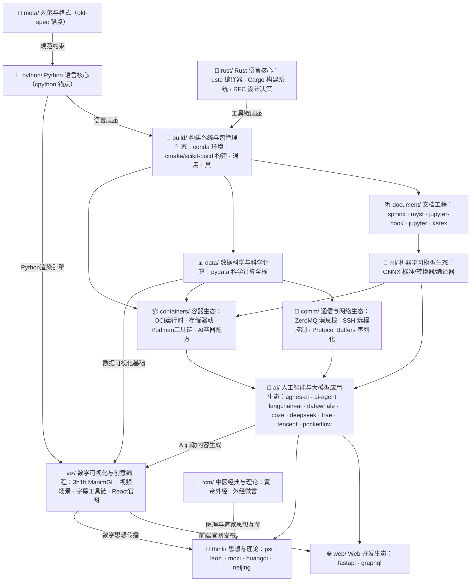

# 知识包总索引（Bundles Index）

> **OKF (Open Knowledge Format)** 知识包是面向开源项目源码与AI平台的系统化中文教程，遵循 [OKF v0.2 规范](meta/okf-spec/index.md)，每个知识包包含概念文档（concepts/）、实战示例（examples/）、信源参考（references/）三层结构。
>
> 当前共 **296 个知识包**，按技术生态分为 **14 个技术域、39 个分组**。

***

## 生态关系概览



***

## 推荐入门路径

从零开始系统学习开源项目源码，推荐按以下顺序：

```mermaid
flowchart LR
    meta["📐 meta/okf-spec：了解 OKF 知识包格式规范（30分钟）"]
    py["🐍 python/cpython：理解 Python 解释器底层（选读核心章节）"]
    rust["🦀 rust/：Rust 语言核心（rustc 编译器流水线 · Cargo 构建系统 · RFC 设计演进，选读）"]
    build["🔨 build/：掌握构建与包管理（copier 脚手架 - pyinvoke 自动化 - conda 环境 - cmake 构建）"]
    doc["📚 document/：掌握文档工程能力（sphinx 文档写作 - jupyter-book/myst 新一代工具链 - jupyter 交互计算）"]
    data["📊 data/：pydata 科学计算全栈（NumPy-pandas-matplotlib/plotly-Dash-PyTables）"]
    ml["🧠 ml/：ONNX 机器学习模型生态（模型交换格式·转换器·编译器·推理后端）"]
    containers["📦 containers/：容器生态（OCI运行时 · Podman工具链 · 存储驱动 · AI容器）"]
    ai["🤖 ai/：人工智能与大模型应用（agnes-ai 大模型API - ai-agent Agent框架 - langchain-ai LLM应用框架 - datawhale 学习社区）"]
    viz["📐 viz/：数学可视化与创意编程（ManimGL动画引擎 - 视频场景 - 字幕工具链 - React官网）"]
    web["🌐 web/：Web 开发生态（fastapi · graphql）"]
    comm["📡 comm/：通信与网络生态（ZeroMQ 消息 · SSH 远程控制 · Protocol Buffers 序列化）"]
    think["💭 think/：思想与理论（psi · laozi · mozi · yinyangjia · legalism · huangdi · neijing 选读）"]
    tcm["🌿 tcm/：中医经典研读（黄帝外经/外经微言——典籍原文核对与思想解读，人文选读）"]
    meta --> py --> rust --> build --> doc --> data --> ml --> containers --> ai --> viz --> web --> comm --> think --> tcm
```



***

## 十四域分组导航

### 📐 [规范与格式](meta/index.md) · 1 束 · 1 组

| 分组                                     | 束数 | 说明                                                 |
| -------------------------------------- | -- | -------------------------------------------------- |
| [📐 规范与格式（okf-spec 锚点）](meta/index.md) | 1  | OKF v0.2 规范本体——目录结构、文档类型、交叉引用、术语、版本、信任与验证；阅读知识包前必读 |

### 🐍 [Python 语言核心](python/index.md) · 1 束 · 1 组

| 分组                                            | 束数 | 说明                                                             |
| --------------------------------------------- | -- | -------------------------------------------------------------- |
| [🐍 Python 语言核心（cpython 锚点）](python/index.md) | 1  | CPython 解释器核心架构——对象模型、引用计数、GC、字节码、编译器管线、模块导入系统；所有 Python 知识的底座 |

### 🦀 [Rust 语言核心](rust/index.md) · 3 束 · 1 组

| 分组                                  | 束数 | 说明                                                                                       |
| ----------------------------------- | -- | -------------------------------------------------------------------------------------- |
| [🦀 Rust 语言核心（rustc · cargo · rfcs）](rust/index.md) | 3  | rustc 编译器流水线（bootstrap 自举→解析→HIR→类型检查→MIR→代码生成）、core/alloc/std 三层标准库、Cargo 包管理与构建系统、RFC 语言设计决策与治理流程 |

### 🔨 [构建系统与包管理生态](build/index.md) · 14 束 · 4 组

| 分组                                                  | 束数 | 说明                                                                                     |
| --------------------------------------------------- | -- | -------------------------------------------------------------------------------------- |
| [📦 Conda 包管理生态](build/conda/index.md)              | 6  | Conda 核心、conda-lock/pack/constructor 工具链、Rattler Rust 实现、conda-docs 文档门户               |
| [📦 scikit-build 构建后端](build/scikit-build/index.md) | 1  | scikit-build-core——基于 CMake 的 PEP 517 独立构建后端（锚点组）                                      |
| [🏗️ CMake 构建系统生态](build/cmake/index.md)            | 1  | CMake 跨平台构建生成器——门面模式、状态快照、多生成器工厂、CTest/CPack 集成                                        |
| [🔧 通用开发工具](build/tooling/index.md)                 | 6  | Ninja 极速构建、Copier 项目模板、PyInvoke 任务自动化、invocations 任务集、GitHub Problem Matcher、Nuitka 编译 |

### 📚 [文档工程与交互式计算生态](document/index.md) · 105 束 · 5 组

| 分组                                                               | 束数 | 说明                                                 |
| ---------------------------------------------------------------- | -- | -------------------------------------------------- |
| [📄 Sphinx 文档工程生态](document/sphinx/index.md)                     | 10 | Sphinx 核心、默认主题、功能扩展、输出渲染扩展、Docker 部署               |
| [📖 MyST Markdown 与 Executable Books 生态](document/myst/index.md) | 19 | MyST 解析器、Sphinx 集成、UI 组件扩展等 Executable Books 组织项目  |
| [📖 Jupyter Book v2 / MySTmd 生态](document/jupyter-book/index.md) | 8  | TypeScript 新一代技术文档工具链——MyST 引擎、CLI、多格式导出、主题系统      |
| [🔣 KaTeX 数学排版](document/katex/index.md)                         | 1  | KaTeX 快速 Web 数学排版库——LaTeX 表达式渲染为 HTML+MathML（锚点组）  |
| [📓 Jupyter 数据科学生态](document/jupyter/index.md)                   | 67 | Jupyter 交互式计算生态——内核协议、Notebook 格式、JupyterLab、扩展、部署 |

### 📊 [数据科学与科学计算生态](data/index.md) · 7 束 · 1 组

| 分组                                       | 束数 | 说明                                                                               |
| ---------------------------------------- | -- | -------------------------------------------------------------------------------- |
| [📊 PyData 科学计算生态](data/pydata/index.md) | 7  | NumPy/pandas/matplotlib/Plotly/Dash/PyTables/SymPy——数值计算、数据分析、可视化、Web 应用、HDF5 存储 |

### 🧠 [机器学习模型生态](ml/index.md) · 8 束 · 1 组

| 分组                                 | 束数 | 说明                                                                                                   |
| ---------------------------------- | -- | ---------------------------------------------------------------------------------------------------- |
| [🧠 ONNX 机器学习生态](ml/onnx/index.md) | 8  | ONNX 标准/IR-Python/优化器/onnxmltools/sklearn-onnx/tf2onnx/onnx-mlir/onnx-tensorrt——跨框架模型交换、转换器、编译器、推理后端 |

### 📦 [容器生态](containers/index.md) · 11 束 · 1 组

| 分组                                       | 束数 | 说明                                                                 |
| ---------------------------------------- | -- | ------------------------------------------------------------------ |
| [📦 容器运行时与工具链](containers/index.md) | 11 | conmon/conmon-rs OCI 监控 · fuse-overlayfs 存储驱动 · libocispec 规范库 · podman-py/compose Python/Compose 绑定 · olot/omlmd OCI 模型打包 · qm 虚拟机管理 · toolbox 开发环境 · ai-lab-recipes AI 容器配方 |

### 🤖 [人工智能与大模型应用生态](ai/index.md) · 113 束 · 9 组

| 分组                                                     | 束数 | 说明                                                          |
| ------------------------------------------------------ | -- | ----------------------------------------------------------- |
| [🤖 AgnesAI 大模型生态](ai/agnes-ai/index.md)               | 2  | AgnesAI 全模态 AI 平台——OpenAI 兼容 API、对话/图像/视频生成、Agent 工具调用      |
| [🤖 AI Agent 框架](ai/ai-agent/index.md)                 | 34 | AI Agent 运行时框架与架构模式——工具调用循环、多代理编排、记忆系统、Coding Agent 源码解读、技能规范、产品资讯、技术评测、协议治理、产品实测、战略分析、行业分析、工具教程、工业Agent、语音智能体厂商动态、AI治理法学论文、Tongyi-MAI GUI Agent 生态源码精读    |
| [🦜🔗 LangChain-AI LLM 应用框架](ai/langchain-ai/index.md) | 19 | LangChain/LangGraph 核心框架（Python+JS）、深度研究 Agent、可观测性、评测与基础设施 |
| [🐳 Datawhale 开源 AI 学习社区](ai/datawhale/index.md)       | 18 | 国内最大开源 AI 学习社区——LLM 全栈/RAG/Agent/向量数据库/推荐系统/ML 理论           |
| [🧩 Coze 扣子开发平台生态](ai/coze/index.md)                   | 3  | 字节跳动一站式 AI Agent 开发平台——Python SDK、开源平台、LLM 可观测性             |
| [🧠 DeepSeek-AI 基础设施](ai/deepseek/index.md)            | 13 | DeepSeek 开源大模型基础设施——MoE 通信、GPU kernel 优化、注意力、流水线并行、负载均衡     |
| [🚀 TRAE Community 生态](ai/trae/index.md)               | 15 | 字节跳动 AI 编程 IDE 社区——平台应用、技能/模板/MCP 扩展、学习资源、社区治理、战略资讯、开源工具              |
| [🐧 腾讯开源生态](ai/tencent/index.md)                       | 4  | 腾讯系开源与商业项目——CodeBuddy 产品矩阵、AI 红队平台、ncnn 推理框架                |
| [⚡ PocketFlow 极简 LLM 应用框架](ai/pocketflow/index.md)     | 5  | 极简 LLM Agent 框架——节点+流程抽象、设计模式、实战教程                          |

### 📡 [通信与网络生态](comm/index.md) · 12 束 · 3 组

| 分组                                       | 束数 | 说明                                                                  |
| ---------------------------------------- | -- | ------------------------------------------------------------------- |
| [📨 消息通信生态](comm/messaging/index.md)     | 4  | ZeroMQ 消息通信与分布式任务队列——libzmq 核心库、C++/Python 绑定、dramatiq 任务队列         |
| [🌐 SSH 与远程控制](comm/networking/index.md) | 6  | Python SSH/远程控制生态——paramiko/fabric/netmiko/asyncssh/pexpect/scrapli |
| [📦 数据序列化生态](comm/serialization/index.md) | 2  | Protocol Buffers 序列化生态——protobuf 主仓（双内核/protoc/Editions/九语言绑定）与 protobuf-ci（CI 动作与五层缓存） |

### 🌐 [Web 开发生态](web/index.md) · 2 束 · 2 组

| 分组                                         | 束数 | 说明                                                 |
| ------------------------------------------ | -- | -------------------------------------------------- |
| [⚡ FastAPI Web 框架生态](web/fastapi/index.md) | 1  | FastAPI 高性能 ASGI Web 框架——类型注解驱动、依赖注入树、OpenAPI 自动生成 |
| [📡 GraphQL 核心规范与生态](web/graphql/index.md) | 1  | GraphQL 查询语言系统化中文教程——语法、Schema 类型系统、验证执行管线、内省系统    |

### 💭 [思想与理论](think/index.md) · 19 束 · 9 组

| 分组                                      | 束数 | 说明                                     |
| --------------------------------------- | -- | -------------------------------------- |
| [Ψhē 理论体系](think/psi/index.md)          | 4  | ψ=ψ(ψ) 自指递归理论体系——哲学、数学、宇宙学、意识研究与 AI 应用 |
| [📜 老子（Laozi）知识包](think/laozi/index.md) | 1  | 《老子》（《道德经》）相关知识包——帛书《老子》阅读教程           |
| [📜 庄子（Zhuangzi）知识包](think/zhuangzi/index.md) | 1 | 《庄子》（《南华经》）相关知识包——内篇七篇全文阅读教程 |
| [📜 墨子（Mozi）知识包](think/mozi/index.md) | 1  | 《墨子》研读教程——十论、墨经、城守与三篇原文精读 |
| [☯ 阴阳家（Yinyangjia）知识包](think/yinyangjia/index.md) | 1 | 先秦阴阳家学派（邹衍、五德终始、大九州）——书志著录、辑佚残篇与传世材料的存佚分层阅读 |
| [⚖️ 法家（Legalism）知识包](think/legalism/index.md) | 4 | 先秦法家经典——《韩非子》《商君书》《管子》及申不害·慎到辑佚的实抓原文核对、概念谱系与校本信源 |
| [📜 黄帝经典（Huangdi）知识包](think/huangdi/index.md) | 1 | 《黄帝阴符经》知识包——权威原文双源核对版阅读教程 |
| [佛家核心经典](think/buddhism/index.md) | 5 | 《心经》《金刚经》《六祖坛经》《阿弥陀经》《法华经》选读——般若、禅宗、净土、天台诸宗核心经典阅读知识包 |
| [📕 黄帝内经（Huangdi Neijing）知识包](think/huangdi-neijing/index.md) | 1 | 《黄帝内经》（《素问》《灵枢》）阅读教程——权威底本逐字原文、异文双录、三层解读与八篇精读 |

### 🌿 [中医经典与理论](tcm/index.md) · 1 束 · 1 组

| 分组                                      | 束数 | 说明                                                                                                  |
| --------------------------------------- | -- | --------------------------------------------------------------------------------------------------- |
| [📜 中医经典（Classics）](tcm/classics/index.md) | 1  | 《黄帝外经》（今本《外经微言》，清·陈士铎述）权威研读教程——九卷八十一篇双源核对原文、命门水火与颠倒顺逆思想、文献学三层分离与真伪考辨 |
### 📐 [数学可视化与创意编程](viz/index.md) · 4 束 · 1 组

| 分组 | 束数 | 说明 |
|------|------|------|
| [🔵 3Blue1Brown 生态](viz/3b1b/index.md) | 4 | ManimGL数学动画引擎、视频场景源码、字幕自动化工具链、React Router v7官网前端架构 |


```{toctree}
:hidden:
:maxdepth: 7

ai/index
build/index
comm/index
containers/index
data/index
document/index
meta/index
ml/index
python/index
rust/index
tcm/index
think/index
viz/index
web/index
```
