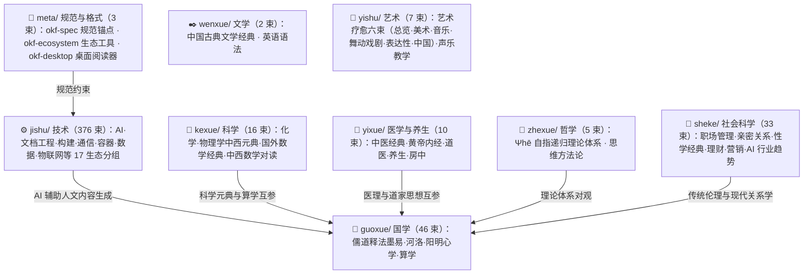

# 知识包总索引（Bundles Index）

> **OKF (Open Knowledge Format)** 知识包是面向开源项目源码与人文经典的系统化中文教程，遵循 [OKF v0.2 规范](meta/okf-spec/index.md)，每个知识包包含概念文档（concepts/）、实战示例（examples/）、信源参考（references/）三层结构。
>
> 当前共 **498 个知识包**，按学科逻辑分为 **9 个技术域、56 个分组**（8 个学科域 + 1 个规范锚点）。

***

## 学科生态概览



***

## 推荐入门路径

- **人文读者**：[国学](guoxue/index.md)（儒家四书 → 老庄 → 周易 → 阳明心学）→ [医学与养生](yixue/index.md) → [科学](kexue/index.md) 元典选读
- **技术读者**：[meta/okf-spec](meta/okf-spec/index.md)（格式规范）→ [jishu/python](jishu/python/index.md) → [jishu/build](jishu/build/index.md) → [jishu/document](jishu/document/index.md) → [jishu/ai](jishu/ai/index.md)
- **跨学科读者**：[国学/算学](guoxue/suanxue/index.md) ↔ [科学/数学](kexue/math/index.md) 中西数学对读；[国学/道家](guoxue/daojia/index.md) ↔ [医学与养生/道医](yixue/daoyi/index.md) 医道互参

***

## 九域分组导航

### 📐 [规范与格式](meta/index.md) · 3 束 · 3 组

| 分组                                              | 束数 | 说明                                                 |
| ----------------------------------------------- | -- | -------------------------------------------------- |
| [📐 规范与格式（okf-spec 锚点）](meta/okf-spec/index.md) | 1  | OKF v0.2 规范本体——目录结构、文档类型、交叉引用、术语、版本、信任与验证；阅读知识包前必读 |
| [🔧 OKF 生态系统（okf-ecosystem）](meta/okf-ecosystem/index.md) | 1  | okf-kit Python CLI 核心与 okf-desktop 桌面阅读器——Bundle 数据模型、爬取构建流水线、增量同步、MCP/Chat/HTTP 三模服务架构 |
| [🖥️ OKF 桌面应用（okf-desktop）](meta/okf-desktop/index.md) | 1  | OKF Desktop 桌面阅读器完整教程——架构总览、快速开始、UI 界面、API 与数据流、打包分发、FAQ |

### 📜 [国学](guoxue/index.md) · 46 束 · 15 组

| 分组                                                  | 束数 | 说明                                                             |
| --------------------------------------------------- | -- | -------------------------------------------------------------- |
| [📜 儒家（Confucianism）](guoxue/confucian/index.md)    | 1  | 四书（大学·中庸·论语·孟子）权威阅读教程：原文双源核对、五条注疏脉络、三层解读                       |
| [📜 孔子（Confucius）](guoxue/confucius/index.md)       | 1  | 孔子本人相关著作（六经与《论语》）权威阅读教程——归属辨析、双源核对原文、注本分级                      |
| [📜 老子（Laozi）](guoxue/laozi/index.md)               | 3  | 《老子》（《道德经》）——帛书《老子》阅读教程、老子著作原文与解读（出土文献基准、历代注本三线并收）             |
| [📜 庄子（Zhuangzi）](guoxue/zhuangzi/index.md)         | 1  | 《庄子》（《南华经》）三十三篇全文阅读教程（内篇自著 / 外杂篇后学分层）                          |
| [📜 墨子（Mozi）](guoxue/mozi/index.md)                 | 1  | 《墨子》研读教程——十论、墨经、城守与三篇原文精读                                      |
| [☯ 阴阳家（Yinyangjia）](guoxue/yinyangjia/index.md)     | 1  | 先秦阴阳家学派（邹衍、五德终始、大九州）——书志著录、辑佚残篇与传世材料的存佚分层阅读                    |
| [☰ 周易（Zhouyi）](guoxue/zhouyi/index.md)              | 1  | 《周易》经传原文与权威解读——今本六十四卦经文全本（384 爻）、十翼选读、四大出土文本系统异文、历代注本与现代注本三线并收 |
| [🔢 河图洛书（Hetu-Luoshu）](guoxue/hetu-luoshu/index.md) | 1  | 河图洛书与宋代图书学——名实三层框架、先秦原典双源核对、汉易数理零件、宋清图式考辨、出土文献与西传证据链           |
| [⚖️ 法家（Legalism）](guoxue/legalism/index.md)         | 4  | 先秦法家经典——《韩非子》《商君书》《管子》及申不害·慎到辑佚的实抓原文核对、概念谱系与校本信源               |
| [📜 黄帝经典（Huangdi）](guoxue/huangdi/index.md)         | 1  | 《黄帝阴符经》知识包——权威原文双源核对版阅读教程                                      |
| [🪷 佛家核心经典](guoxue/buddhism/index.md)               | 5  | 《心经》《金刚经》《六祖坛经》《阿弥陀经》《法华经》选读——般若、禅宗、净土、天台诸宗核心经典（中国化汉传佛教）       |
| [🗡️ 鬼谷子（Guiguzi）](guoxue/guiguzi/index.md)         | 1  | 《鬼谷子》——先秦纵横家经典原文与解读教程                                          |
| [☯ 道家（Daojia）](guoxue/daojia/index.md)              | 19 | 道家著作全谱系——先秦诸子/黄老之学/魏晋玄学注疏/道教经典四段谱系，段—家—著三级分层，段下十九束             |
| [🧑‍🏫 王阳明心学（Yangming）](guoxue/yangming/index.md)   | 5  | 《传习录》精读、心即理·知行合一·致良知·四句教教义、功夫论实践、生平年谱与弟子流派及东亚传播                |
| [🧮 算学（Suanxue）](guoxue/suanxue/index.md)           | 1  | 中国传统数学典籍——中国算经阅读教程（《九章算术》《周髀算经》、刘徽、宋元四大家）                      |

### 💭 [哲学](zhexue/index.md) · 5 束 · 2 组

| 分组                              | 束数 | 说明                                  |
| ------------------------------- | -- | ----------------------------------- |
| [Ψhē 理论体系](zhexue/psi/index.md) | 4  | ψ=ψ(ψ) 自指递归理论体系——哲学、数学形式化、宇宙本论、意识研究 |
| [🧭 思维方法论（Methodology）](zhexue/methodology/index.md) | 1  | 可迁移的思维方法与理性实践工具——第一性原理系统化知识档案（哲学起源·物理学应用·商业创新案例·方法论框架·六步练习手册） |

### 🔬 [科学](kexue/index.md) · 16 束 · 3 组

| 分组                                  | 束数 | 说明                                                   |
| ----------------------------------- | -- | ---------------------------------------------------- |
| [⚗️ 化学经典](kexue/chemistry/index.md) | 7  | 中西化学经典双线索——西方（波义耳、拉瓦锡、道尔顿、门捷列夫）与中国（参同契、抱朴子、天工开物）     |
| [🔭 物理学经典](kexue/physics/index.md)  | 6  | 中西物理学经典多线索——阅读指南（21 部元典）、原文逐段精读、量子/相对论/热统专题精读与中国九部典籍 |
| [📐 数学（Math）](kexue/math/index.md)  | 3  | 国外数学经典阅读（欧几里得到布尔巴基，五时段经典谱系）与中西数学对读（六大对读主题、双源精读示范）    |

### ✒️ [文学](wenxue/index.md) · 2 束 · 2 组

| 分组                                            | 束数 | 说明                                         |
| --------------------------------------------- | -- | ------------------------------------------ |
| [📜 经典阅读（Classics）](wenxue/classics/index.md) | 1  | 中国古典文学经典阅读教程——沈复《浮生六记》阅读教程（版本源流·伪书考辨·闲情美学） |
| [🔤 英语（English）](wenxue/english/index.md) | 1  | 英语语言学习知识包——语法著作精读、广读方法论与术语对照 |

### 🌿 [医学与养生](yixue/index.md) · 10 束 · 6 组

| 分组                                                         | 束数 | 说明                                                  |
| ---------------------------------------------------------- | -- | --------------------------------------------------- |
| [📜 中医经典（Classics）](yixue/tcm/index.md)                    | 5  | 中医典籍谱系总览与经典精读——难经、伤寒杂病论、神农本草经、黄帝外经；原文双源核对、托名/辑复分层呈现 |
| [📕 黄帝内经（Huangdi Neijing）](yixue/huangdi-neijing/index.md) | 1  | 《黄帝内经》（《素问》《灵枢》）阅读教程——权威底本逐字原文、异文双录、三层解读与八篇精读       |
| [🏥 医学经典（Medicine）](yixue/medicine/index.md)               | 1  | 东亚医学经典阅读教程——《医心方》成书结构、亡佚引书辑佚、写本刊本流传与选读方法            |
| [💊 道医（Daoyi）](yixue/daoyi/index.md)                       | 1  | 道医经典权威阅读教程——医道同源、道门医家、道藏医书、出土方技、医道流派与辨伪信源           |
| [🌿 养生经典（Yangsheng）](yixue/yangsheng/index.md)             | 1  | 养生经典阅读教程——《黄帝内经》至《老老恒言》六部核心经典与食养/导引/道教扩展脉络          |
| [🛏️ 房中（Fangzhong）](yixue/fangzhong/index.md)              | 1  | 中国古代性文化（房中）典籍阅读教程——目录著录、马王堆出土文献、《医心方》辑佚链与学术史研究      |

### 👥 [社会科学](sheke/index.md) · 33 束 · 6 组

| 分组                                              | 束数 | 说明                                        |
| ----------------------------------------------- | -- | ----------------------------------------- |
| [🏢 职场与管理（Workplace）](sheke/workplace/index.md) | 7  | 人力资源（职业地图·六大模块·劳动法合规）与行政办公（行政运营·公文写作·OKR 目标管理·论文写作）     |
| [💕 亲密关系与两性情感](sheke/relationships/index.md)    | 6  | 两性关系经典著作——学术实证、哲学经典与通俗实践三层谱系              |
| [🧭 性学经典（Sexology）](sheke/sexology/index.md)    | 3  | 性学/性文化经典著作阅读教程、《汉书·艺文志》房中八家专题研读与马王堆房中简帛深读 |
| [💰 个人理财与投资（Finance）](sheke/finance/index.md) | 1  | 个人投资实操通识——收益数学、资产类别、配置与行为纪律、中国市场制度，附配置算例与防骗自查清单 |
| [📣 市场营销（Marketing）](sheke/marketing/index.md) | 1  | 营销实操通识——营销本质、STP 战略、定位与品牌、4P/4C 战术、顾客旅程、AARRR 增长、内容私域与合规底线，附工作坊与算例清单 |
| [🏭 AI 行业与商业趋势（Industry）](sheke/industry/index.md) | 15 | AI 行业快照分析——AI 变现指南、Copilot 成本、国产大模型对比、EMS 能源、硬件设计工具、印度制造业、监管治理与平台生态 |

### 🎤 [艺术](yishu/index.md) · 7 束 · 2 组

| 分组                                       | 束数 | 说明                                                                     |
| ---------------------------------------- | -- | ---------------------------------------------------------------------- |
| [🎨 艺术疗愈（Liaoyu）](yishu/liaoyu/index.md) | 6  | 艺术疗愈总览与五分支——术语分层、双信源史实核对、WHO/Cochrane 循证锚定、中西对读（美术·音乐·舞动戏剧·表达性艺术·中国脉络） |
| [🎤 声乐教学（Vocal）](yishu/vocal/index.md)   | 1  | 美通唱法与咽音体系——林俊卿咽音练声八步骤、嗓音科学、常见毛病纠正与每日练声清单                               |

### ⚙️ [技术](jishu/index.md) · 376 束 · 17 组

| 分组                                               | 束数  | 说明                                                                                                         |
| ------------------------------------------------ | --- | ---------------------------------------------------------------------------------------------------------- |
| [🤖 人工智能与大模型（ai）](jishu/ai/index.md)             | 170 | agnes-ai · ai-agent · langchain-ai · datawhale · coze · deepseek · trae · tencent · pocketflow · anthropic · mobile-use · tiktoken · ai-security 及行业研究与工程方法论等直挂束 |
| [📚 文档工程（document）](jishu/document/index.md)     | 110 | Sphinx · MyST · Jupyter Book · Jupyter · KaTeX 文档工程与交互式计算生态                                                |
| [🔨 构建与包管理（build）](jishu/build/index.md)         | 15  | Conda 生态 · scikit-build · CMake · 通用开发工具（Ninja/Copier/PyInvoke/Nuitka 等）                                   |
| [📡 通信与网络（comm）](jishu/comm/index.md)            | 16  | ZeroMQ 消息栈 · SSH 远程控制 · Protocol Buffers 序列化 · FFI/IDL/TVM FFI 与接口概念辨析                                                               |
| [📦 容器生态（containers）](jishu/containers/index.md) | 11  | OCI 运行时 · 存储驱动 · Podman 工具链 · AI 容器配方                                                                      |
| [🧠 机器学习（ml）](jishu/ml/index.md)                 | 10   | ONNX 标准/转换器/编译器/推理后端 · Apache TVM 深度学习编译器                                                                  |
| [📊 数据科学（data）](jishu/data/index.md)             | 9   | PyData 科学计算全栈——NumPy/pandas/matplotlib/NetworkX/Pillow/Plotly/Dash/PyTables/SymPy                         |
| [📐 可视化与创意编程（viz）](jishu/viz/index.md)           | 5   | 3Blue1Brown 生态——ManimGL 动画引擎 · 视频场景 · 字幕工具链 · React 官网 · Anime.js×Three.js 适配器                                                     |
| [🦀 Rust 语言核心（rust）](jishu/rust/index.md)        | 3   | rustc 编译器流水线 · Cargo 构建系统 · RFC 设计决策                                                                       |
| [🌐 Web 开发（web）](jishu/web/index.md)             | 3   | FastAPI · GraphQL · HTML 声明式局部更新                                                                                          |
| [🐍 Python 语言核心（python）](jishu/python/index.md)  | 2   | CPython 解释器核心架构 · Python 3.14 标准库新特性                                                                                            |
| [💻 终端渲染（terminal）](jishu/terminal/index.md)     | 1   | Textualize 终端生态——rich/textual 源码中文教程                                                                       |
| [🔧 开发与协作（dev）](jishu/dev/index.md)            | 5   | Git 版本控制 · GitHub 平台（Gist/Actions）· 开源实践（参与/项目准备/README 模板）                                        |
| [🚗 智能驾驶与无人驾驶（autonomous）](jishu/autonomous/index.md) | 4 | Autoware 安装与基础 · ROS2 概念 · DDS 与 QoS · 数据集/术语/资源生态                                            |
| [🖥️ GUI 桌面开发（gui）](jishu/gui/index.md) | 5 | Qt/PyQt 桌面开发（Qt for Python 官方机制 · PyQt5 实战）· tkinter 标准库生态（GUI 设计 · 手册 · tkinterx 扩展库） |
| [🏠 物联网（IoT）](jishu/iot/index.md) | 5 | Home Assistant 源码解读 · TuyaOpen IoT SDK · 向日葵远控产品矩阵 · 贝锐生态 · 厂商与工具横向对比 |
| [🖥️ 系统与基础设施（systems）](jishu/systems/index.md) | 2 | WSL 子系统中文教程 · PowerShell 5 困境防御 |

```{toctree}
:hidden:
:maxdepth: 7

meta/index
guoxue/index
zhexue/index
kexue/index
wenxue/index
yixue/index
sheke/index
yishu/index
jishu/index
```

