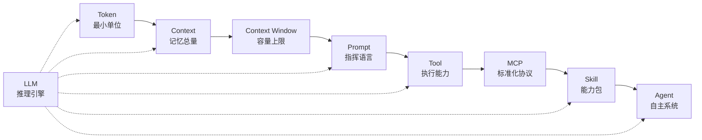

# 从 Token 到 Agent 的完整认知地图

> **原文作者**：K_WU
> **原始发布**：2026-04-19 | **CSDN 镜像**：2026-08-03
> **P0 核验**：8 项，7 ✅ 确认 / 1 ⚠️ 部分确认 / 0 ❌ 错误
> **事实基数**：80 条（F-001~F-080）
> **信源距离**：S1/S2 = 一手原创；S3-S6 = 二手参考

## 知识包一句话

这是一张从**最小语言单位 Token** 到**自主执行系统 Agent** 的完整认知地图 [F-001]，系统梳理 LLM 生态中 Token、Context、Prompt、Tool、MCP、Skill、Agent 九大核心概念的定义、关系与协作机制 [F-002]，帮助 AI 学习者建立清晰的概念层级认知体系 [F-003]。

## 核心价值



**核心论点**：
1. Token 是基石——决定成本和性能 [F-004]
2. Context Window 是记忆边界——溢出后 FIFO 遗忘 [F-005]
3. Tool 是 AI 从"会说"到"会做"的分水岭 [F-006]
4. MCP 解决工具接入标准化 [F-007]
5. Skill 是渐进式加载的能力包 [F-008]
6. Agent 是感知-决策-执行-反思的闭环系统 [F-009]
7. LLM 是所有能力的推理引擎基底 [F-010]

## 知识结构

```
agent-fundamentals/
├── index.md                          ← 你在这里
├── log.md                            ← 工作流日志
├── concepts/                         ← 概念层（8 篇）
│   ├── index.md
│   ├── 00-overview.md               ← 概念全景与总结
│   ├── 01-token.md                  ← Token 层
│   ├── 02-context.md                ← Context & Context Window 层
│   ├── 03-prompt.md                 ← Prompt 层
│   ├── 04-tool.md                   ← Tool 层
│   ├── 05-mcp.md                    ← MCP 层
│   ├── 06-skill.md                  ← Skill 层
│   ├── 07-agent.md                  ← Agent 层
│   └── 08-llm.md                    ← LLM 层
└── references/                       ← 参考层（3 篇）
    ├── index.md                      ← 参考资料索引
    ├── source.md                     ← 信源登记
    └── insights.md                   ← 知识地图与核心论点
```

> **说明**：本文为概念地图类文章，无操作可复现性，不设 examples/ 目录。

## 分层导航

### 概念层（8 篇）

| 文档 | 核心内容 | 知识层级 |
|------|----------|----------|
| [00 概念全景与总结](concepts/00-overview.md) | 概念关系速查表、核心论点、学习路径、端到端请求旅程 | 抽象层 |
| [01 Token（词元）](concepts/01-token.md) | 分词原理、中英文估算、计费与性能影响 | 事实层 |
| [02 Context 与 Context Window](concepts/02-context.md) | Context 组成、容量定义、溢出行为 | 事实层 |
| [03 Prompt（提示词）](concepts/03-prompt.md) | User/Agent Prompt 类型、Prompt Engineering 本质 | 机制层 |
| [04 Tool（工具）](concepts/04-tool.md) | Tool 类型、工作流程、JSON 定义格式 | 机制层 |
| [05 MCP（模型上下文协议）](concepts/05-mcp.md) | 三种原语、vs 直接 API、生态价值 | 机制层 |
| [06 Skill（技能）](concepts/06-skill.md) | 组成结构、渐进式加载、vs Tool/Agent | 机制层 |
| [07 Agent（智能体）](concepts/07-agent.md) | 四大能力、工作循环、SubAgent 模式 | 机制层 |
| [08 LLM（大语言模型）](concepts/08-llm.md) | 代表性模型、架构位置、层间关系 | 事实层 |

### 参考层（3 篇）

| 文档 | 内容 |
|------|------|
| [信源登记](references/source.md) | 原文信源元数据、参考信源列表、信源距离评估 |
| [知识地图与核心论点](references/insights.md) | 核心论点、概念关系辨析、学习路径、端到端旅程 |
| [参考资料索引](references/index.md) | 外部信源导航 |

## 信任与生命周期

| 项目 | 状态 |
|------|------|
| **事实基数** | 80 条（F-001~F-080） |
| **P0 核验** | 8 项：7 ✅ 确认 / 1 ⚠️ 部分确认 / 0 ❌ 错误 |
| **勘误项** | 0 条 |
| **厂商自述** | 约 5 项（Context Window 容量数据，为厂商规格声明） |
| **信源** | S1-S6 共 6 条信源，S1/S2 为原文一手信源 |
| **status** | verified |
| **stale_after** | 2027-09-09 |

## 时效性提示

⏰ 本知识包信息具有时效性，以下内容可能随时间变化：

- **模型规格**：Context Window 容量（GPT-4 128K、Claude 3.5 200K、Claude 3.1 Pro 100W）为文章发布时数据，当前最新模型可能有更新 [P0-001]
- **Token 估算比例**：不同模型 Tokenizer 实现不同，实际比例可能有偏差 [P0-002]
- **MCP 生态**：现成 Server 数量（5000+）为厂商宣传数据，持续变化中 [P0-003]
- **代表性模型**：DeepSeek V3 等模型版本持续迭代

**建议**：关键数据以各厂商官方最新公告为准。

## 已知边界

1. Context Window 容量数据为文章发布时点（2026-04）的参考值，当前 GPT-4/Claude 系列可能已有更大窗口版本 [P0-001]
2. Token 中英文估算比例为经验值，不同模型实际分词行为可能有差异 [P0-002]
3. MCP Server 生态规模（5000+）为作者引用数据，非独立统计 [P0-003]
4. 文章为科普性质概念地图，未深入技术实现细节（如 BPE 算法、MCP 协议握手流程等）[P0-004]

---

```{toctree}
:hidden:
:maxdepth: 2

concepts/index
references/index
log
```
