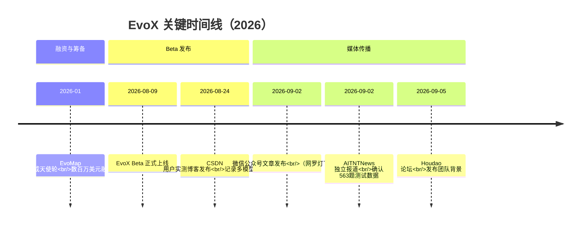

# EvoX 事件时间线与团队背景

> 截至 2026年9月数据 | 约 900 字

---

## 1. 关键时间节点

| 时间 | 事件 | F编号 | 信源 |
|------|------|-------|------|
| 2026年1月 | EvoMap 完成天使轮融资，金额数百万美元 | [F-015](../references/article-source.md#f-015) | Houdao论坛（⚠️ 单源） |
| 2026年8月9日 | EvoX Beta 版本上线 | [F-008](../references/article-source.md#f-008) | CSDN 用户实测博客确认 |
| 2026年8月24日 | CSDN 用户发布实测体验博客，记录多模型使用感受 | [F-011](../references/article-source.md#f-011) | CSDN 博客 |
| 2026年9月2日 | 微信公众号文章《国产Agent又杀出一匹黑马》公开发布 | [F-001](../references/article-source.md#f-001) | 网罗灯下黑 |
| 2026年9月2日 | AITNTNews 发布独立报道《Scaling 的不只是模型：EvoX 想做下一个入口》 | [F-021](../references/article-source.md#f-021) | AITNTNews |
| 2026年9月5日 | Houdao论坛发布团队背景信息 | [F-013](../references/article-source.md#f-013) | Houdao论坛 |

---

## 2. 团队背景

**EvoMap** 是 EvoX 平台的开发团队，核心信息如下：

- **创始人**：张昊阳，1997年生，14岁时即获得 Unity 认证开发者资格 [F-013](../references/article-source.md#f-013)
- **团队规模**：不到20人 [F-014](../references/article-source.md#f-014)
- **融资历程**：2026年1月完成天使轮融资，金额为数百万美元 [F-015](../references/article-source.md#f-015)
- **官网**：[evomap.ai](https://evomap.ai)，Beta 分支为 `evox/beta` [F-004](../references/article-source.md#f-004)

> ⚠️ 团队背景信息（F-013 ~ F-015）目前仅有 Houdao 论坛单一信源，引用时需注意交叉验证。

---

## 3. 产品定位

EvoX 是一款**国产通用 Agent 平台** [F-005](../references/article-source.md#f-005)，核心差异化定位体现在两大能力：

1. **蜂群（Swarm）**：多 Agent 并行协作架构，突破单 Agent 处理能力瓶颈
2. **自进化（Self-Evolution）**：通过用户互动（点赞/评论）沉淀长期记忆，实现 Agent 自我迭代优化

基座模型采用 **Claude Haiku 4.5** [F-007](../references/article-source.md#f-007)，同时支持 DeepSeek V4 Flash、GLM-5.2、Qwen3.8 Max、GPT-5.6 Sol 等多模型切换 [F-011](../references/article-source.md#f-011)。

---

## 4. 核心效能验证（P0 数据）

EvoX 在 **563道逻辑题测试** 中表现如下 [F-006](../references/article-source.md#f-006)：

| 模式 | 得分 | 说明 |
|------|------|------|
| 单线程 Agent | 26.29%（原文近似为 26%） | 单个 Agent 独立完成 |
| 蜂群模式 | 70.69%-70.87%（原文近似为 71%） | 多 Agent 并行协作 |
| Sub-Agent 保留率 | 55.5%（373 → 217） | 蜂群筛选后留存比例 |

> ⚠️ **厂商/客户自述数据**：以上测试由 EvoX 团队主导实验设计，AITNTNews 等独立资讯站交叉确认数值准确性，但实验框架本身属厂商主导。引用时需标注来源性质。

---

## 5. 与既有 Agent 平台的对比线索

EvoX 与同属"多 Agent 协作"赛道的**明略科技 Octo 平台** [octo-platform](../agent-platform-notes/concepts/octo-platform.md) 形成对照：

| 维度 | EvoX | Octo（明略科技） |
|------|------|----------------|
| 核心范式 | 蜂群并行 + 自进化记忆 | Matter 事项承载 + Taste 偏好沉淀 |
| 进化机制 | 用户点赞/评论行为驱动 | 实战经验沉淀为品味 |
| 适用场景 | 复杂逻辑推理、内容生成 | Private AI 企业级协作 |
| 团队规模 | <20人（初创） | 明略科技（成熟企业） |

两平台均聚焦多 Agent 协作，但进化路径不同：EvoX 偏向"群体智能涌现"，Octo 偏向"组织化记忆管理"。
