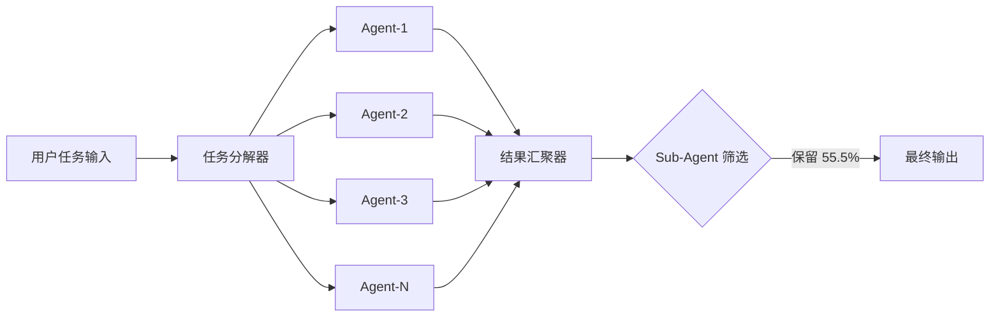
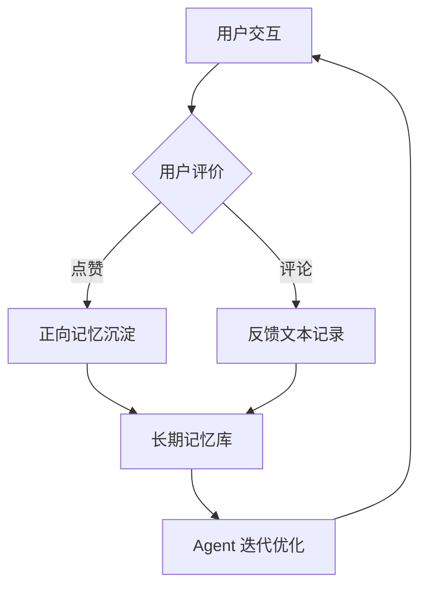

# 蜂群架构与自进化机制原理

> 约 1000 字

---

## 1. 蜂群（Swarm）架构原理

### 1.1 核心设计

蜂群架构是 EvoX 的第一大差异化能力 [F-009](../references/article-source.md#f-009)：

> **一个任务同时由多个 Agent 独立处理，各自探索最优解，最终汇聚综合结果。**

这与传统单 Agent 顺序执行形成鲜明对比。传统模式下，单个 Agent 受限于自身能力边界和随机性，在复杂逻辑任务上容易陷入局部最优；蜂群模式通过并行搜索大幅提升了探索空间覆盖度。

### 1.2 效能提升机制

563道逻辑题测试结果 [F-006](../references/article-source.md#f-006) 清晰展示了蜂群优势：

```
单线程 Agent：26.29%  →  蜂群模式：70.69%-70.87%
相对提升：约 2.7 倍
```

**效能提升的三个可能机制**：

1. **并行探索**：多个 Agent 同时从不同路径尝试解题，降低单个 Agent 随机失败的影响
2. **结果聚合**：汇总多个 Agent 的输出，通过投票或择优策略选取最佳结果
3. **Sub-Agent 筛选**：初始 373 个 Agent 经筛选保留 217 个（保留率 55.5%）[F-012](../references/article-source.md#f-012)，说明蜂群并非简单堆量，而是包含质量筛选机制

### 1.3 架构示意



> 注：上图为基于博文描述的推断性架构图，非官方架构文档。

---

## 2. 自进化（Self-Evolution）机制原理

### 2.1 核心设计

自进化是 EvoX 的第二大差异化能力 [F-010](../references/article-source.md#f-010)：

> **用户的点赞、评论等互动行为被沉淀为长期记忆，Agent 据此进行自我迭代优化。**

这突破了传统 Agent"会话即遗忘"的局限——每次对话结束后，经验不留存，下一次交互需从头开始。自进化机制将用户反馈转化为可持续积累的知识资产。

### 2.2 反馈学习循环



**关键特征**：

- **记忆可沉淀**：点赞/评论行为形成结构化记忆，而非即时消耗
- **跨会话持续**：记忆在后续交互中持续生效，实现"越用越好用"
- **用户驱动进化**：进化方向由真实用户反馈决定，而非预设规则

### 2.3 与 Octo"品味"机制的对比

EvoX 的自进化机制与明略科技 Octo 平台的"Taste（品味）"概念 [octo-platform](../agent-platform-notes/concepts/octo-platform.md) 存在概念相似性，但实现路径不同：

| 维度 | EvoX 自进化 | Octo Taste |
|------|------------|-----------|
| 触发信号 | 点赞/评论 | 实战中的偏好选择 |
| 记忆形态 | 用户反馈驱动的长期记忆 | 任务完成后的品味沉淀 |
| 进化方向 | 用户显式评价驱动 | 任务结果隐式反馈驱动 |
| 适用场景 | C端用户体验优化 | 企业级 Private AI 协作 |

---

## 3. 蜂群 + 自进化的协同效应

EvoX 的独特之处在于两大能力并非孤立存在，而是形成闭环：

```
蜂群并行探索 → 产生多种结果
      ↓
用户点赞/评论筛选最优方案
      ↓
自进化机制将有效反馈沉淀为记忆
      ↓
下次蜂群探索时引用历史记忆
      ↓
（循环迭代，持续优化）
```

**协同价值**：

1. **蜂群解决"广度"问题**：并行探索扩大解空间覆盖
2. **自进化解决"深度"问题**：历史记忆提升后续探索质量
3. **两者结合**：既有探索效率，又有持续学习能力

---

## 4. 作者观点与事实分层

| 类别 | 内容 | F编号 |
|------|------|-------|
| 事实 | 蜂群架构原理（多Agent并行，各自探索最优解） | [F-009](../references/article-source.md#f-009) |
| 事实 | 自进化机制（点赞/评论→长期记忆→自我迭代） | [F-010](../references/article-source.md#f-010) |
| 事实 | 563题测试数据及效能提升 | [F-006](../references/article-source.md#f-006) |
| 观点 | "EvoX 代表国产 Agent 从'单兵作战'走向'协同进化'" | [F-019](../references/article-source.md#f-019)（作者观点） |
| 观点 | "国产 Agent 平台已开始具备原创定义能力" | [F-020](../references/article-source.md#f-020)（作者观点） |
