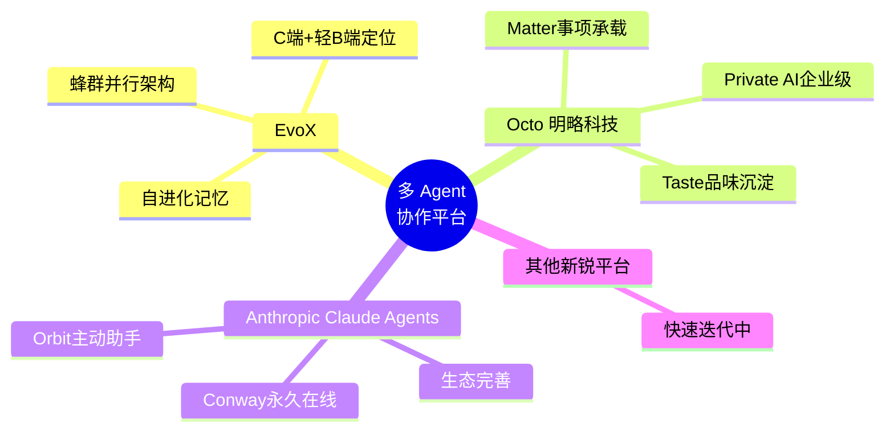

# 竞争格局定位与案例实践分析

> 约 900 字

---

## 1. 多 Agent 平台竞争格局

### 1.1 赛道全景

2026年，国产多 Agent 协作平台呈现多元化竞争格局：

### 1.2 EvoX 差异化定位

与既有平台相比，EvoX 的核心差异化定位：

| 对比维度 | EvoX | Octo（明略） | Anthropic Claude Agents |
|---------|------|-------------|----------------------|
| 核心卖点 | 蜂群+自进化 | 事项+品味 | 生态+工具链 |
| 技术路线 | 群体智能涌现 | 组织化记忆 | 单Agent深化+Orbit扩展 |
| 目标用户 | C端+轻量B端 | 企业级 Private AI | OpenAI 生态用户 |
| 团队规模 | <20人（初创） | 明略科技（成熟） | Anthropic（大厂） |
| 融资阶段 | 天使轮 | 已盈利 | 未公开（OpenAI系） |

> 与 Octo 的详细对比见 [Agent 平台散篇笔记](../agent-platform-notes/index.md)。

---

## 2. 案例实践分析

EvoX 在博文中展示了三个典型应用案例 [F-016~F-018](../references/article-source.md#f-016)：

### 2.1 案例一：自动筛岗 + 定制简历

**场景**：招聘流程自动化

**蜂群机制体现**：
- 多个 Agent 并行处理不同岗位的 JD 分析
- 各 Agent 独立生成适配简历草稿
- 汇聚后由主 Agent 整合优化，输出最终版本

**价值**：将传统需人工逐份处理的简历筛选，转化为并行自动化流程，大幅缩短招聘响应时间。

---

### 2.2 案例二：香港怀旧打卡手册

**场景**：个性化旅游规划

**蜂群 + 自进化协同体现**：
- 多个 Agent 并行搜索香港景点、交通、怀旧元素
- 根据用户历史偏好（自进化记忆）调整推荐策略
- 生成个性化路线并安排交通细节

**价值**：旅游规划涉及多约束条件（时间、交通、兴趣），蜂群并行可快速探索多种路线组合，自进化记忆确保后续推荐更符合用户风格。

---

### 2.3 案例三：反诈测试游戏《退休金保卫战》

**场景**：电信诈骗防范意识教育

**产品创新点**：
- 以游戏化方式让用户"体验"诈骗套路
- 多 Agent 扮演不同角色（诈骗分子、受害者、预警系统）
- 在模拟对抗中传递反诈知识

**社会价值**：将严肃的安全教育主题转化为互动体验，提升老年群体的反诈意识和应对能力。

---

## 3. 案例共同特征与启示

三个案例虽场景各异，但体现了 EvoX 平台的一致性设计哲学：

| 案例 | 核心任务 | 蜂群贡献 | 自进化贡献 |
|------|---------|---------|-----------|
| 筛岗+简历 | 多约束优化 | 并行处理多岗位 | 沉淀用户偏好 |
| 香港打卡手册 | 个性化规划 | 多路线并行探索 | 记忆用户风格 |
| 反诈游戏 | 角色扮演模拟 | 多角色并行演绎 | 优化对话策略 |

**共同启示**：EvoX 适合**多约束、多角色、需个性化**的任务场景，这正是单 Agent 模式的天然短板。

---

## 4. 作者观点

> "EvoX 代表国产 Agent 从'单兵作战'走向'协同进化'的下一步。" [F-019](../references/article-source.md#f-019)
>
> "国产 Agent 平台已不再是追赶者，开始具备原创定义能力。" [F-020](../references/article-source.md#f-020)

以上为作者观点，反映了对 EvoX 平台战略意义的积极判断，读者应结合独立信源（如 AITNTNews 的技术分析）进行交叉评估。

---

## 5. 时效性说明

本文发布于 2026年9月2日 [F-003](../references/article-source.md#f-003)，EvoX 处于 Beta 阶段（2026年8月9日上线）[F-008](../references/article-source.md#f-008)。产品功能、团队规模、融资状态等可能随时间变化，建议在引用时注意数据时点。
