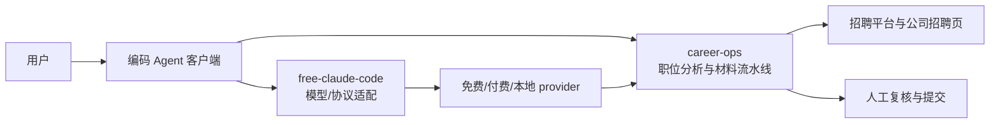

# 从模型接入到求职工作流的组合闭环

文章的组合逻辑可以抽象为三层，而不是“两个工具叠加后自动变免费”。[F-026][F-028]

## 代理层：降低接入摩擦

free-claude-code 统一不同编码 Agent 和 provider 的接入，并提供故障切换、终端输出优化及多端连接。[F-006][F-008][F-009][F-010] 这类能力降低的是“配置和访问摩擦”，不保证后端模型与 Claude 的能力等价。

## 任务层：把 CLI 变成工作流

career-ops 在编码 CLI 上组织职位扫描、评分、定制 PDF、批处理和追踪。[F-014][F-015] 其价值来自流程结构和人类在环，而不只是调用一个模型。

## 闭环成立的条件

1. provider 的免费层仍可用，且允许当前用法。[F-013]
2. 后端模型能稳定完成工具调用、长上下文和文档生成。
3. 本地文件与 AI API 的数据边界被用户理解并接受。[F-022]
4. 关键职位判断和最终申请由人确认，而不是无监督自动提交。[F-021]

## 相关概念

- [两个项目分别解决什么问题](00-project-facts.md)
- [访问与风险边界](02-access-and-risk-boundaries.md)
