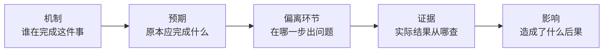

# 判断优先：从一个 HTTP 500 误判到问题槽位结构

> 本篇对应博文引子与第 01 节（F-005 ~ F-020）。核心命题：**知识库的第一设计问题不是"资料怎么被找到"，而是"Agent 要支持什么判断"。**

## 1. 一个会骗过 Agent 的故障

建 Agent 知识库的起点通常不错：架构文档、接口说明、历史复盘都在，代码也在仓库中；把资料整理好、做索引，Agent 遇到问题就去查（F-005、F-006）。

但检索只解决了"资料从哪里找"。考虑博文设定的案例（F-008）：

- 删除接口返回 **HTTP 500**，Agent 据此判断"删除失败"；
- 检查数据却发现：**删除实际上已经完成**。

HTTP 500 按 RFC 9110/MDN 的语义只表示"服务器遇到意外条件，未能完成请求"，是一个通用的 catch-all 错误，**并不说明之前已执行的动作是否生效**。所以博文指出：只凭状态码决定重试、或把结果改回去，都可能处理错（F-009；核验见 [verification.md](../references/verification.md)）。

接口说明、错误码解释一样不缺，缺的是判断这次故障所需的三类过程知识（F-010）：

1. 删除过程**经过哪些环节**；
2. 错误发生前**哪些步骤已经完成**；
3. **从哪里能查到实际结果**。

## 2. 先确定知识库要支持什么判断

博文的方法论起点（F-011、F-012）：

> 建设知识库之前，先确定它要帮 Agent 做什么；目标决定资料要整理到什么程度。

博文锚定的目标是：**定位生产问题，并为"是否修改、修改哪里"提供依据**。

### 2.1 判断需要"预期"作参照

判断一个行为有没有问题，必须先有预期（F-013）：

- 接口原本要完成什么；
- 允许哪些中间状态；
- 出现错误后保证到哪一步。

否则"当前状态是什么"只是一条记录，不足以判断它是否异常（F-014）。

### 2.2 判断需要"过程"作支撑

同一个结果可能经过多个服务和后台任务；用户看到的错误在后面环节，原因却可能在前面（F-015）。只列组件名称解释不了这种关系——需要把过程连起来，写清每一步的输入、结果，以及失败后会发生什么（F-016）。

## 3. 问题描述的槽位结构

博文把待分析问题归纳为一句四槽位的描述（F-017）：

> **哪个机制**原本应该**完成什么**；实际行为在**哪个环节**偏离了预期；有**什么证据**，造成了**什么影响**。

其中"机制"是作者定义的术语：系统完成一件事所依靠的过程，可能在一个服务内，也可能跨多个组件（F-018）。

### 3.1 槽位不是排查步骤

"槽位"同样是作者定义（F-020）：

- 槽位是**做出判断时需要补齐的信息位置**，不是固定的排查步骤顺序；
- 刚拿到故障时，可以只知道现象，其余槽位暂时留空；
- 后续调查的任务，就是逐步缩小这些未知。

这一区分很关键：把槽位当 checklist 会诱导 Agent 机械走流程；把槽位当"待补齐的未知"，调查方向才由证据决定。

### 3.2 槽位给出了资料整理方向

槽位结构不涉及具体实现，却能反向指导现有资料的整理目标（F-019）：

| 槽位 | 主要由谁回答 |
|---|---|
| 机制涉及谁 | 架构文档 |
| 正常行为/预期是什么 | 设计文档 |
| 实际执行到了哪里 | 代码 + 观测资料 |

## 4. 可迁移模式：判断优先的知识设计

- **触发场景**：为陌生项目设计供 Agent 使用的知识库/RAG 体系，且目标包含故障定位、异常判断而非单纯问答。
- **核心步骤**：①写明要支持的判断 → ②为判断建立预期（契约/状态/保证）→ ③把跨组件过程连成链（输入/结果/失败行为）→ ④用槽位结构登记待补齐信息。
- **反模式**：
  - *只做检索索引、不设计判断结构*——Agent 能找到错误码解释，仍会把 500 等同于"动作未生效"；
  - *只罗列组件、不连接过程*——无法解释"后面环节报错、根因在前面"；
  - *把槽位当固定排查步骤*——用流程顺序替代证据驱动的调查。

## 5. 小结

检索能力回答"资料在哪里"，槽位结构回答"判断需要什么"。先确定要支持的判断，知识库的整理深度和资料归位才有客观标准——这是博文全部方法论的入口，下一篇解决"项目事实从哪里来"。
