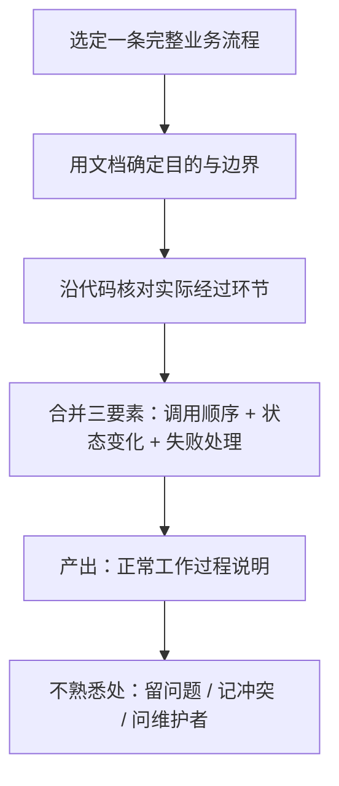

# 陌生项目先梳理正常过程：流程核对法与专家认知公式

> 本篇对应博文第 02 节（F-021 ~ F-030）。核心命题：**第一性原理只能告诉你"需要了解什么"，项目事实必须从一条完整业务流程中查出来。**

## 1. 结构推不出事实

有了[槽位结构](00-judgment-first-slot-structure.md)，仍然不能凭空知道某个模块有哪些状态，也不能推导出线上用了什么配置（F-021）。博文在此划清一条界限：

- **第一性原理**：帮助确定"需要了解什么"——哪些槽位必须填；
- **项目事实**：无法推导，只能去查。

这条界限防止 Agent 用自洽的推理替代查证（博文后文称这类无证据结论是知识库的主要失效模式之一）。

## 2. 从一条完整业务流程开始

博文给出的入手策略（F-022）：

> 不要试图一次读懂整个仓库；从一条完整的业务流程开始。

### 2.1 文档定边界，代码核环节

具体做法（F-023、F-024）：

1. 先用**文档**确定这条流程的目的和边界；
2. 再沿**代码**核对它实际经过的环节；
3. 把**调用顺序、状态变化、失败处理**放在一起看，才构成一份"正常工作过程"的说明；
4. 函数所在文件只是**查证入口**，文档主体必须是**过程本身**——否则知识又退化成"代码地图"。

### 2.2 留问，而不是补全

遇到不熟悉的地方，博文要求（F-025、F-026）：

- 留下问题，而不是猜一个解释让文章读起来完整；
- 文档和实现对不上 → **记录冲突**；
- 代码看不出设计原因 → 找设计记录，或请维护者确认；
- 暂时没有答案，不妨碍先整理已经核实的部分。

"未知清楚可见"本身就是知识资产——它告诉后续 Agent 哪里不能直接套用。

## 3. 流程补齐后，系统结构自然浮现

逐条补充关键流程之后，跨流程的关系会清楚起来（F-027）：

- 哪些过程**共享同一项状态**；
- 哪些失败会**传播到其他环节**；
- 哪些结果**可以重试**；
- 哪些动作一旦完成就**不能简单撤销**。

这些关系正是定位新问题时反复用到的知识，也对应了槽位中"偏离环节"和"影响"两栏。

### 3.1 整理到位的检验标准

博文给了一个以问题驱动的检验（F-028）：

> 假设某个环节没有按预期工作，Agent 能否从文档中找到正常行为和查证位置？

- 能找到 → 这部分知识整理到位；
- 只能找到一段职责介绍，还得重新读完整个模块才能理解流程 → 没有到位。

## 4. 作者公式①：专家认知

博文在此给出第一个乘法公式（F-029）：

> **专家认知 = 问题结构 × 对应的领域知识**

作者特意注明：这是**设计上的简写，不是数学计算**（F-029）。其含义是（F-030）：

- **问题结构**确定"要回答什么"；
- **领域知识**提供"具体内容"；
- 只写一组问题而没有对应内容，Agent 依然要从头了解项目——正如只有内容而没有结构，Agent 不知道该用哪段知识。

两者是相乘关系而非相加：任何一项为零，专家认知都不成立。

## 5. 可迁移模式：流程核对法

- **触发场景**：刚接手不熟悉的项目/仓库，需要为 Agent 建立"系统正常时怎样工作"的底稿。
- **核心步骤**：①一次只选一条完整业务流程 → ②文档定目的边界、代码核实际环节 → ③调用顺序/状态变化/失败处理合并成文 → ④未知留问、冲突记录 → ⑤用"假设某环节失效"反向检验。
- **反模式**：
  - *一次读懂整个仓库*——目标过大，产出停留在零散笔记；
  - *猜解释把文章补完整*——把未经核实的猜测固化成"知识"；
  - *文档主体写成函数/文件清单*——Agent 拿到的是代码地图而非过程说明；
  - *用第一性原理推导项目事实*——配置、状态、部署版本只能查证，不能推理。

## 6. 小结

正常工作过程是判断异常的"基准线"。流程核对法保证这条基准线每段都有出处、每处未知都可见。下一篇处理更棘手的问题：当文档、代码、线上运行三者说法不一时，结论如何站得住。
