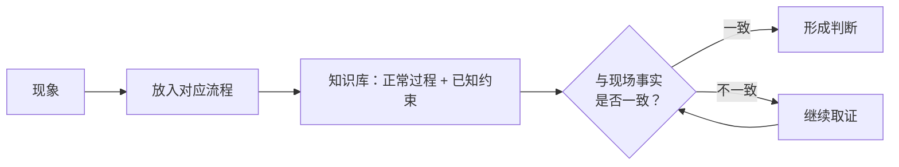

# 有依据的判断：事实验证、专家底座与求证方法

> 本篇对应博文第 03、04 节（F-031 ~ F-045）。核心命题：**整理者相信一条结论，不足以让另一个 Agent 直接使用——结论必须带依据、有底座、配求证方法。**

## 1. 同一件事，三种说法

沿流程整理之后必然撞上资料冲突（F-031、F-032）：

| 资料 | 说的是什么 |
|---|---|
| 设计文档 | 当初**希望**怎样实现 |
| 代码 | 某个版本**实际**怎样实现 |
| 线上运行 | 未必是仓库最新版本 |

博文明确反对简单规定"永远以代码为准"——那不是解决冲突，而是掩盖了"三者本就可能不同"这一事实（F-032）。

### 1.1 先明确"正在确认什么"

处理冲突的入口不是选权威，而是界定问题类型（F-033）：

- 问的是**当前生产行为** → 核对部署版本、实际配置、运行记录；
- 问的是**系统应遵守的接口约定** → 查对应版本的契约；
- **实现违反契约**本身可能正是待修的问题——此时"冲突"不是噪声，而是诊断结论。

### 1.2 结论三要素

每条重要结论都要同时保留（F-034）：

1. **依据**：它从哪里得出；
2. **适用条件**：在什么前提下成立；
3. **待确认事项**：还有什么没核实。

> 整理者相信它，不足以让另一个 Agent 直接拿去使用。

## 2. 作者公式②：专家知识

第二个乘法公式（F-035）：

> **专家知识 = 专家认知 × 事实验证**

操作含义（F-036、F-037）：

- 专家知识只保留**稳定的判断依据**；
- **容易变化的值**（当前配置、部署版本、查到的具体状态）留在事实来源里，不写进规律；
- 代码入口、接口字段、日志字段**并非不能写**——有助于查证就保留在参考资料中，但必须注明适用范围；
- 要避免的是"把某次查到的值写成长期不变的规律"。

## 3. 专家底座：让 Agent 先读对的东西

### 3.1 为什么全库搜索不够

经过核验的知识仍可能分散在很多文件里。Agent 每次从全库搜索开始，容易先命中**旧复盘或零散细节**，而读不到当前机制的完整说明（F-038）。

### 3.2 专家底座的定义与边界

博文的解决方案是放一份较短的**入口文档**优先读取（F-039）：

- 说明系统的**关键过程**；
- 列出**正常行为和重要约束**；
- 指向**详细资料与查证位置**。

这份文档就是"专家底座"。博文特意区分两个概念（F-040）：

| 概念 | 指什么 |
|---|---|
| 专家知识 | **内容**——判断依据本身 |
| 专家底座 | **组织和提供内容的方式**——入口、结构、指引 |

底座的两个边界（F-040）：

- 不需要装下全部资料；
- 但不能只剩一张目录——Agent 读完至少应理解"问题所在模块正常时怎样工作"。

## 4. 底座的使用方式：现象归位，现场取证

博文规定的使用姿势（F-041）：

- Agent 先把现象放到对应流程中；
- 知识库给的是**正常过程和已知约束**，现场调查确认的是**这一次发生了什么**；
- 两者不一致时继续取证，**不能为了让事实符合文档而忽略差异**。

### 4.1 求证方法单独准备

"怎样求证"不属于任何具体模块的工作原理，必须单独成一类知识（F-042）：

- 哪些信息只是**线索**而非结论；
- 怎样检查一个解释**是否存在反例**；
- 什么情况下**仍不能动手修改**。

博文提醒：懂得正常流程，并不保证每次推断都正确。

## 5. 作者公式③：未知问题的解题能力

第三个乘法公式（F-043）：

> **未知问题的解题能力 = 专家知识 × 求证方法 × 当前事实**

三项各管一段：专家知识给参照，求证方法给推理纪律，当前事实给这次的证据；任何一项缺失，未知问题都解不出来。

### 5.1 用引子案例做验收

博文用删除请求回环验收整套设计（F-044）：Agent 能否——

1. 把**返回错误**和**动作结果**分开；
2. 找到**检查实际结果的位置**；
3. 而不是看到错误码就直接处理。

如果必须由使用者反复提醒，说明知识或使用说明还需要补充。

### 5.2 底座不是操作手册

专家底座提供的是**认知参照**，不规定每次都执行同一组命令（F-045）。成熟的操作手册仍然有价值，但只能在它的适用条件已经得到确认时使用——条件未确认就套手册，等于跳过了判断。

## 6. 可迁移模式：依据—底座—求证三件套

- **触发场景**：知识需要被多个 Agent（或后来接手者）直接拿去支持生产判断，而非仅供作者本人回忆。
- **核心步骤**：①按问题类型选信源，不预设"代码永远为准" → ②结论携带依据/适用条件/待确认 → ③短入口文档承载关键过程与查证位置 → ④现象归位、现场取证、差异优先 → ⑤求证规则独立成文。
- **反模式**：
  - *用"永远以代码为准"消灭冲突*——掩盖了契约被违反这类真问题；
  - *结论不写适用条件*——另一个 Agent 会把某次的值当长期规律；
  - *底座只剩目录链接*——Agent 读完仍不懂模块正常行为；
  - *让事实迁就文档*——现场与文档冲突时忽略差异；
  - *把操作手册当底座*——适用条件未确认就强制执行固定命令。

## 7. 小结

事实验证让结论站得住，专家底座让 Agent 读得到，求证方法让推理不越界。三者合起来才是可交付的"专家知识"。下一篇解决维护问题：不同知识老化速度不同，怎样分存、怎样随新问题迭代。
