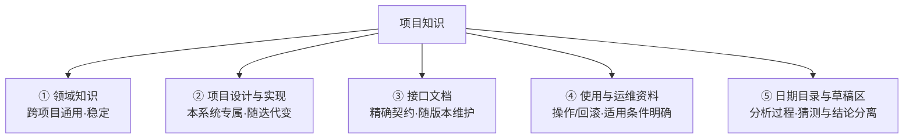

# 按更新速度分存，用新问题迭代：知识分层与闭环复核

> 本篇对应博文第 05、06 节（F-046 ~ F-060）。核心命题：**知识分开保存不是价值排序，而是维护方式的区别——更新速度不同的内容混放，知识库必然老化失实。**

## 1. 专家知识之外，其余资料各有位置

整理专家知识不意味着其余项目资料没用了（F-046）：

- 完整实现说明、接口定义、操作记录仍然要保存；
- 只是**不能把它们当作同一种知识使用**——它们的确立方式、寿命、读者动作完全不同。

## 2. 五类知识分层

博文按"用途 + 变化速度 + 确认来源"把项目知识分为五类（F-047 ~ F-051）：

| 分类 | 内容 | 变化速度 | 使用要点 |
|---|---|---|---|
| ① 领域知识 | 不同项目中也能用的概念和机制 | 最慢 | 适用条件通常较稳定，但落到当前项目时仍需核对（F-047） |
| ② 项目设计与实现 | 本系统自己的组成、流程、约束 | 中 | 不可迁移，但是定位当前问题的必需内容（F-048） |
| ③ 接口文档 | 精确契约 | 随版本 | 字段和错误语义必须与版本一起维护（F-049） |
| ④ 使用与运维资料 | 操作方法、适用条件、回滚步骤；排期与责任分工 | 较快 | 排期分工不能当成长期规则（F-050） |
| ⑤ 日期目录与草稿区 | 分析过程留痕 | 持续追加 | 未确认猜测可保留，但不得与已核实结论混放（F-051） |

### 2.1 分类判据：不是价值高低

博文强调（F-052）：

- 分类看的是**用途、变化速度、由什么来源确认**；
- 不同分类是**维护方式**的区别，不是价值高低的排序；
- 专家知识也可能来自对项目实现的深入理解，不只来自通用原理。

## 3. 故障复盘的正确归位方式

博文特别指出复盘不能整篇搬进某个目录（F-053）：

- **过程记录留在原处**（日期目录/工单系统）；
- **已确认的结论分别更新**到对应资料（领域知识/项目实现/接口文档/运维资料）；
- 再由**索引**建立联系。

否则同一个结论在几份文档里各存一遍，后面无法保证同时更新——重复副本是知识库漂移的主要结构性来源。

## 4. 用新问题检查旧知识

### 4.1 价值判据：下一次问题中的作用

知识库是否有用，不看文档数量，而看它在下一次问题中起了什么作用（F-054）。

### 4.2 记录"从哪里开始走偏"

每次排查结束后，记录 Agent 的走偏点并反向定位缺陷层（F-055）：

| 走偏表现 | 该检查什么 |
|---|---|
| 找错了模块 | 入口是否清楚 |
| 正常流程理解错了 | 核对相关流程文档 |
| 知道流程却得出无证据的结论 | 检查求证要求 |

博文警告：把这些一律归为"知识不够"，很容易又回到**增加文档数量**的老路——问题可能在结构、在验证纪律，而不在数量。

### 4.3 局部更新与回归

更新不必每次重写整份底座（F-056）：

- 局部理解有误 → 修正相关内容；
- 出现原有结构容纳不了的问题 → 再调整结构；
- 改完后**重跑之前的案例**，确认旧问题仍能被正确分析（回归验收）。

### 4.4 独立验收

检查数量可以少，但最好由**未参与编写**的人或 Agent 独立完成（F-057）——编写者照已知答案验收，测不出真实可用性。

## 5. 定期复核与结论留痕

除随问题更新外还需要定期复核（F-058）：

- 依赖版本、关键配置、接口变更之后 → 检查关联结论；
- 日常整理时 → 处理未确认项与日期目录中的新发现。

两条硬性纪律（F-059）：

1. 每条正式结论留下**来源与最近核验时间**，让维护者知道从何查起；
2. 没有新证据的猜测，**不因重复出现就升级为事实**。

## 6. 结语：知识建设是无终点的收敛

博文结尾给出了这套方法论的现实预期（F-060）：

> 刚接手陌生项目，不可能一次写出完整的专家知识。能做到的是：**让每个判断有出处，让不知道的地方清楚可见。**

新问题来了沿已有过程继续核对；处理完以后，下一位使用者少走一段相同的弯路。

## 7. 可迁移模式：分层—归位—回归

- **触发场景**：知识库进入长期维护，内容跨越稳定概念与快速变化的配置/排期，需要防止老化与副本漂移。
- **核心步骤**：①按用途/速度/确认来源分五类 → ②复盘拆结论归位、索引互联 → ③用新问题的走偏点反查缺陷层 → ④局部修正 + 旧案例回归 → ⑤未参与者独立验收 → ⑥结论带来源与核验时间。
- **反模式**：
  - *不同寿命的知识混放*——配置一变，整库可信度连带下降；
  - *复盘整篇复制进知识库*——同一结论多份副本无法同步；
  - *走偏一律加文档*——数量掩盖结构与求证纪律问题；
  - *改完不跑旧案例*——新修复可能破坏旧判断；
  - *猜测重复出现即当事实*——没有新证据就不能升级。
