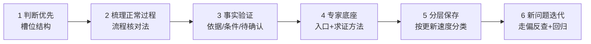

# 给项目建 Agent 知识库：从资料索引到故障判断的完整方法

> 源自微信公众号「Datawhale干货」文章《给项目建Agent知识库，一套完整方法来了！》，作者王大鹏（Datawhale 成员），2026-09-24。
> 本 bundle 经 R→I→E→V→C 五阶段转化：60 条事实全登记，P0 核验通过，**无勘误**。

## 核心问题

把架构文档、接口说明、历史复盘做成索引供 Agent 检索，只解决了"资料从哪里找"。当删除接口返回 HTTP 500 而删除实际已完成时，Agent 凭什么判断问题出在哪个环节？博文给出的答案是：知识库必须围绕**要支持的判断**来组织，而不是围绕资料的存放来组织。

## 方法骨架：三个乘法公式

| 公式（作者自创，系认知支架而非定量模型） | 回答的问题 |
|---|---|
| 专家认知 = 问题结构 × 领域知识 | 判断需要哪些信息、内容从哪来 |
| 专家知识 = 专家认知 × 事实验证 | 结论凭什么站得住 |
| 未知问题的解题能力 = 专家知识 × 求证方法 × 当前事实 | 面对新故障，完整解题需要什么 |

## 六步方法链



## 文档导航

### 概念文档（4 篇）

| 篇目 | 一句话简介 |
|---|---|
| [00 判断优先与槽位结构](concepts/00-judgment-first-slot-structure.md) | HTTP 500 误判案例；预期参照、机制定义、四槽位问题描述 |
| [01 正常过程梳理](concepts/01-normal-process-extraction.md) | 从一条完整业务流程出发，文档定边界、代码核环节；留问不补全 |
| [02 事实验证与专家底座](concepts/02-evidence-and-expert-base.md) | 多源冲突按问题类型选信源；专家底座入口文档；求证方法独立 |
| [03 知识分层与迭代](concepts/03-knowledge-layering-iteration.md) | 五类知识按更新速度分存；复盘拆结论归位；走偏反查与独立验收 |

### 信源参考（2 篇）

| 文档 | 说明 |
|---|---|
| [article-source](references/article-source.md) | 博文事实清单 F-001 ~ F-060（双份登记之一） |
| [verification](references/verification.md) | P0 核验报告：勘误四张清单、已知边界、复核安排 |

## 已知边界

1. 方法论性质：全文无代码、无工具、无配置步骤，**无法照此直接动手搭建**（故不设 examples/）；三个公式为作者认知支架。
2. 博文发布日期仅由搜狐转载页单旁证（2026-09-24），微信原始时间未独立提取。
3. 结论属作者个人工程经验总结，非大样本实证。

## 主题关联

- 同作者姊妹篇《我用 Obsidian 搭了一套 Agent 知识系统，保姆教程来了！》（2026-08-28）：偏工具落地，与本篇"方法论→实操"互补，尚无对应 OKF bundle。
- 组内相关：[ai-agent-fundamentals](../ai-agent-fundamentals/index.md)（Agent 架构基础）、[agent-communication-protocols](../agent-communication-protocols/index.md)（MCP 等协议——知识库与工具的连接通道）。

```{toctree}
:hidden:
:maxdepth: 2

concepts/index
references/index
log
```
