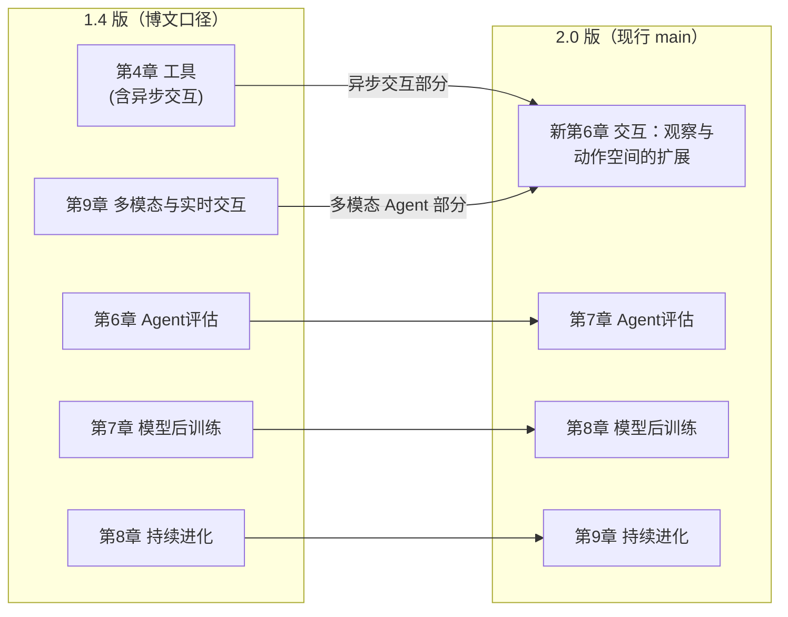

# 章节地图、实验体系与版本迁移

> **勘误焦点**：本文是本包两条 ❌ 勘误的落实处——博文标题"94 实验"与其发布时点官方口径"95"差 1（且博文自己的逐章表合计 98）；第 6 章实验数博文写 11、官方为 12（F-014/F-015/F-025/F-026）。所有数字按下表三口径分列，不做静默照搬。

## 一、10 章地图：三口径对照

| 章 | 博文/1.4 主题（F-014） | 博文实验数 | 时点官方项目数（8c2b7f5，F-026） | 2.0 现行主题（main，F-029） | 2.0 实验数 |
|----|------------------------|:---:|:---:|------------------------------|:---:|
| 1 | Agent 基础知识：核心公式与架构 | 4 | 4 | 🚀 AI Agent 入门（公式；Harness 工程才是竞争力） | 4 |
| 2 | 上下文工程：KV Cache、提示工程、压缩 | 9 | 9 | 🎯 上下文工程（KV Cache、提示工程、**Agent Skills**、压缩） | 10 |
| 3 | 用户记忆和知识库：RAG、结构化索引、知识图谱 | 13 | 13 | 📚 用户记忆和知识库（用户记忆、RAG、结构化索引、知识图谱） | 12 |
| 4 | 工具：MCP 协议、感知/执行/协作三类 | 7 | 7 | 🛠️ 工具（三类+事件驱动异步+**主动工具发现**；正文工具论扩为五类） | 5 |
| 5 | Coding Agent 与代码生成 | 12 | 12 | 💻 Coding Agent 与**通用 Agent** | 16 |
| 6 | Agent 评估：指标、统计显著性、评估驱动选型 | **11（应为 12，E2）** | **12** | 🎙️ **交互：观察与动作空间的扩展**（新章：异步/事件驱动+语音+Computer Use+机器人） | 14 |
| 7 | 模型后训练：SFT 与 RL，工具调用内化 | 16 | 16 | 🎯 Agent 的评估（原第 6 章后移） | 14 |
| 8 | Agent 的持续进化：从运行轨迹获取学习信号 | 8 | 8 | 🧠 模型后训练（原第 7 章后移） | 19 |
| 9 | 多模态与实时交互：语音、Computer Use、机器人 | 10 | 10 | 🔄 Agent 的持续进化（原第 8 章后移） | 9 |
| 10 | 多 Agent 协作：协作框架、涌现的"Agent 社会" | 8 | 8 | 🤝 多 Agent 协作（上下文共享/隔离、Agent 社会） | 6 |
| **合计** | 博文称"94"，**其表自相加实为 98（E1）** | 98 | 头条口径 **95 实验**（项目标签合计 99，差异为"一实验含多项目"口径，F-026） | 2.0 头条 **109 实验**（逐章合计自洽） | 109 |

博文的 10 章主题描述与其发布时点（1.4 版）官方 README **逐章对应、无虚构**（F-025）；两处数字问题集中在第 6 章与总数。第三方旁证显示 2026 年 7-8 月实验数按周增补（88@7-29 → 92@8-6 → 95@7-31 官方 → 博文 94@8-1 → 109@2.0），数字"保鲜期"极短（F-037）。

## 二、1.4 → 2.0 版本迁移（F-028/F-041）

博文发布于 2026-08-01，描述的是 **1.4 版**结构；**2.0 版于 2026 年七夕（2026-08-19）前后发布**（作者 01.me 称为"七夕礼物"），重组规则：



- 新第 6 章 = 原第 4 章"异步交互" + 原第 9 章"多模态 Agent"（语音、Computer Use、机器人）；
- 原第 6/7/8 章依次后移为第 7/8/9 章；实验随章节重新编号；
- 2.0 还新增 DeepSeek Harness、Anthropic 最新研究等实战案例；
- **引用本书时务必标注版次**；旧 PDF 读者建议重新下载 latest 版（官方 README 有明确提示）。

## 三、配套实验体系（勘误 E4：不是"一条命令全都能跑"）

博文称"每个实验都有 README、依赖列表……一条命令装好就能跑"（F-016）。核验显示该说法只对一类实验成立（F-027/F-030）。每个章节目录有 README，实验按状态分三类：

| 状态图标 | 类型 | 能否一条命令跑 |
|---------|------|---------------|
| ✅ | **可独立运行**：本仓库自带完整代码 | 配置好 API Key 后近似"开箱即跑" |
| 📖 | **复现指南**：依赖需自行 `git clone` 的外部仓库（训练框架、评测基准等） | 否——第 6/7/8/10 章映射 22 个外部仓库 + 1 个辅助 cookbook，README 给出固定 SHA 复现锚点 |
| 🚧 | **进行中**：已有实现，但实验范围或验收证据未满足正文要求 | 否 |

附加前置条件（F-030）：

- 调用模型的实验需配置至少一家提供商 API Key（复制 `.env.example` 为 `.env`；书推荐 Kimi、智谱 GLM、Siliconflow、DeepSeek、OpenRouter 等）；
- 部分实验需要 GPU/CUDA（第 8 章训练栈）、浏览器、FFmpeg、Ollama、Playwright；
- 实验执行状态、证据与未完成门禁单独记录在 `docs/EXPERIMENT_STATUS.md`；官方明确"**克隆或安装源码不代表实验完成**"；
- 以第 6 章为例，实验 6-2 要求读者亲自在 τ²-bench/Terminal-Bench/SWE-bench/GAIA/OSWorld 五个基准上抽样执行并记录任务 ID、环境版本、人工步骤与验证结果，而非把 harness 启动一遍就算数。

## 四、运行方式（命令经快照逐字核验，F-017/F-025）

博文给出的两条命令与官方完全一致：

```bash
# 1) 按章节安装可复现环境（使用提交到仓库的 uv.lock）
uv sync --locked --extra ch1     # ch1 可替换为 ch2~ch10

# 2) 从仓库根目录运行实验
uv run python chapter1/context/main.py
```

版本要求变迁（勘误 E5）：博文时点官方为 **Python 3.10+**；2.0 现行要求 **Python 3.11–3.13**（第 8 章部分内置第三方组件需 3.12+，部分浏览器/记忆实验需 3.11+）。无 uv 时官方备选 `python -m pip install -e ".[ch1]"`（不走锁文件）；特殊 extra 需合并到同一条命令，如 `uv sync --locked --extra ch2 --extra vllm`。

## 五、按博文/本书主题的学习顺序建议

1. **建立全局框架**：第 1 章（公式 + Harness + 三维对比表，对应本包 [01](01-core-formula.md)/[02](02-workflow-patterns.md)）
2. **补"眼睛"**：第 2 章上下文工程 → 第 3 章记忆与知识库
3. **补"手脚"**：第 4 章工具（MCP 协议为重点）
4. **综合实战**：第 5 章 Coding Agent（博文称"全景"，2.0 扩为通用 Agent，实验数最多之一）
5. **评估与进化**：第 7 章评估（统计显著性、评估驱动选型）→ 第 8 章后训练（SFT/RL 取舍）→ 第 9 章持续进化
6. **前沿与群体**：第 6 章交互（语音/Computer Use/机器人）→ 第 10 章多 Agent 协作

官方另提供学习建议文档 `docs/zh-CN/LEARNING.md`（核心理念、学习路径、难度分级、实践建议）。
