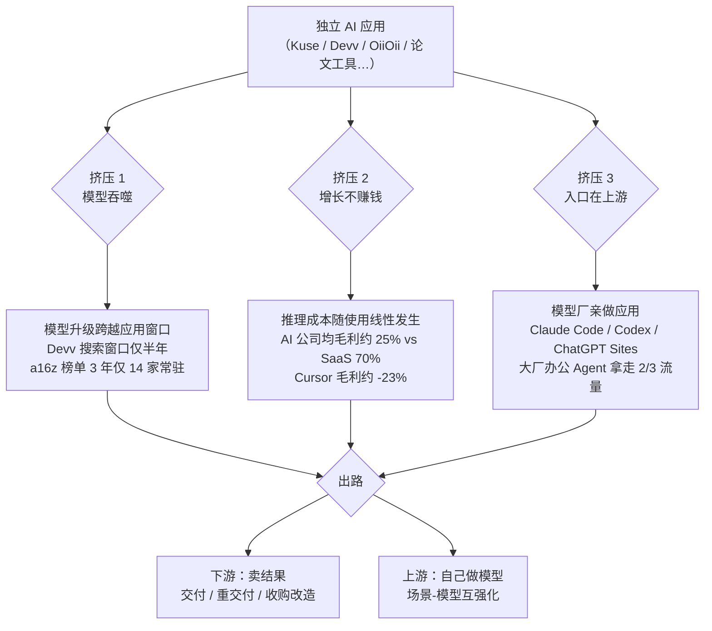

# 概念 00：独立 AI 应用的三难困境

> 对应事实：F-002 ~ F-008
> 核验状态：📝 框架性观点（受访者一手表述 + 全文明证），事实案例已核验

## 核心内容

2026 年 8 月，晚点 LatePost 对一批 AI 应用创业者的调研归纳出一个核心判断：**独立 AI 应用同时面对三股挤压，任何一股都足以致命**。

1. **被模型吞掉**——模型每升级一次，一类应用变得多余（Devv Search、论文写作、AI 工作流均在产品生命周期内被跨越）。
2. **增长不赚钱**——AI 应用本质上在卖 token，推理成本随使用线性发生，"scaling to bankruptcy"（越增长离死亡越近）。
3. **入口在上游**——模型公司掌握能力路线图与 API 调用数据，亲自下场做应用；大厂办公 Agent 三分之二流量集中于 3 款产品。

典型缩影是 AI 知识空间产品 **Kuse**：2026 年初每天新增上万用户，创始人吴显昆却极力压低增长——每个新用户赠送数美元试用额度，用户越多付给模型/云厂商的推理费越高，反复调整定价才把毛利调到"微正"。Kuse 至今未融资："如果增长只是把更多收入交给上游公司，规模还有什么意义？"（F-006）

创业者的应对方向只有两类：往客户业务深处走（卖结果、做交付、收购改造），或往技术上游走（自己做模型）。

## 三难困境全景图

## 关键判断的证据基础

| 判断 | 证据 | 核验 |
|------|------|------|
| 三重挤压同时存在 | F-007（吴显昆框架）+ 全文 7 个公司案例互证 | 📝/✅ |
| 困境具有普遍性 | 上百家 AI 创业公司"死透了"（F-002）；a16z 榜单 3 年仅 14 家留存（F-035 ✅） | ✅ |
| 离开纯软件是群体选择 | F-008（交付/经营/训模型三条迁徙路径） | — |

## 可操作要点

- 评估一个 AI 应用创业想法时，先逐一回答三个问题：① 下一代模型上线后该功能还存在吗？② 付费用户的单位经济模型为正吗？③ 入口（模型厂/大厂）会不会自己做？
- 三问中有两问答不上来，项目属于"赌窗口"，应按窗口生意设计（快回款、轻资产），而非按 SaaS 叙事融资扩张。
- 详见 [01 卖 token 的经济学](01-token-economics.md)、[02 模型吞噬周期](02-model-engulfment.md)、[03 模型即应用](03-model-as-app.md)、[05 两条逃生路线](05-two-escape-routes.md)。