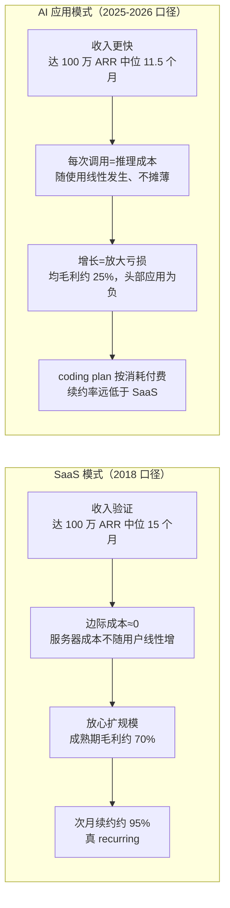
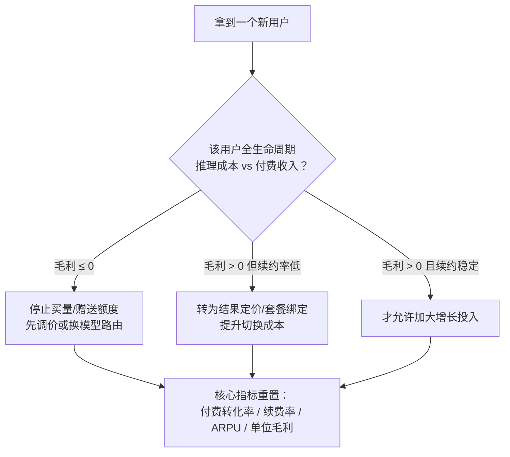

# 概念 01：卖 token 的经济学——ARR 幻觉与负毛利

> 对应事实：F-009 ~ F-023
> 核验状态：F-011/F-014/F-016/F-019 ✅ 已核验；F-017 ⚠️ 约数；F-010/F-012/F-013/F-015/F-018 📝 观点

## 核心内容

AI 应用的财务结构与 SaaS 有本质差异，误把"卖货"当"卖订阅"是行业最大的认知陷阱。

**1. 收入里程碑更快，但 ARR 有幻觉。** Stripe 统计全球头部 100 家 AI 公司达 100 万美元年化收入中位仅 11.5 个月、500 万美元约 24 个月，而 2018 年头部 SaaS 分别为 15 个月、37 个月（F-011 ✅）。但投资人披露了 ARR 注水算法：把一次性收入或某个月年费 ×12，更夸张的取最高一天收入 ×365、最高一周 ×52（F-012 📝）。吴显昆直言："你其实是在卖货，大家是把 GMV 当成 ARR 来说"（F-010 📝）。

**2. 续约率结构不同。** 典型 SaaS 次月续约率约 95%，是真 recurring；AI 应用是 coding plan（按消耗付费），用户用完即走，续约率远低于传统 SaaS（F-013 📝）。

**3. 毛利率倒挂。** Bessemer 研究 20 家高速增长 AI 公司，平均毛利仅约 25%，而传统云软件成熟期通常约 70%（F-014 ✅）。Perplexity 2024 年公布毛利率约 60%，但 The Information 发现其把约 3300 万美元（主要花在免费/试用用户的计算与网络成本）计入研发费用，若计入营业成本毛利率为负（F-016 ✅）。Cursor 截至 2026 年 1 月的季度毛利率约 -23%，含免费用户推理成本约 -31%（F-017 ⚠️）。Fireworks CEO 林琦概括为 **"scaling to bankruptcy"**——越增长离死亡越近（F-019 ✅）。

**4. 成本不随规模摊薄。** SaaS 新增用户的边际服务器成本很低，产品验证后可放心扩规模；AI 应用每次使用都产生推理成本且不随增长下降（F-015 📝）。视频生成赛道更极端：Seedance 2.0 一家独大握定价权，应用公司在付费用户身上毛利也仅约 30%（F-022），补贴大战期行业几乎无正毛利（F-023）。

**5. 活下来的公司先压增长。** Kuse（毛利微正、不融资）与 OiiOii（10 万排队用户时刻意压低增长，4 月起不看日活、改看付费转化/续费率/ARPU，F-020/F-021）给出同一答案：**指标体系从"增长"切换到"单位经济"**。

## SaaS 与 AI 应用财务结构对比

## 单位经济决策流（可实操）

## 创业者自检清单

- [ ] ARR 是否按"最高月 ×12 / 最高日 ×365"计算？若是，改为按过去 3 个月滚动确认收入重算
- [ ] 免费/试用用户的推理成本计入哪个科目？营业成本口径下毛利率是否为负？
- [ ] 付费用户的单用户毛利是否为正？（参照：视频生成应用付费毛利约 30% 已是较好水平）
- [ ] 次月续约率与 SaaS 95% 基准差多少？差距是否有留存机制弥补？
- [ ] 增长指标是否已从 MAU/日活切换到付费转化、续费率、ARPU？（OiiOii 4 月切换，F-021）
- [ ] 上游模型是否握定价权（如 Seedance 2.0）？是否有第二模型源或自研后训练对冲？