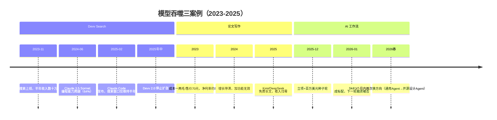
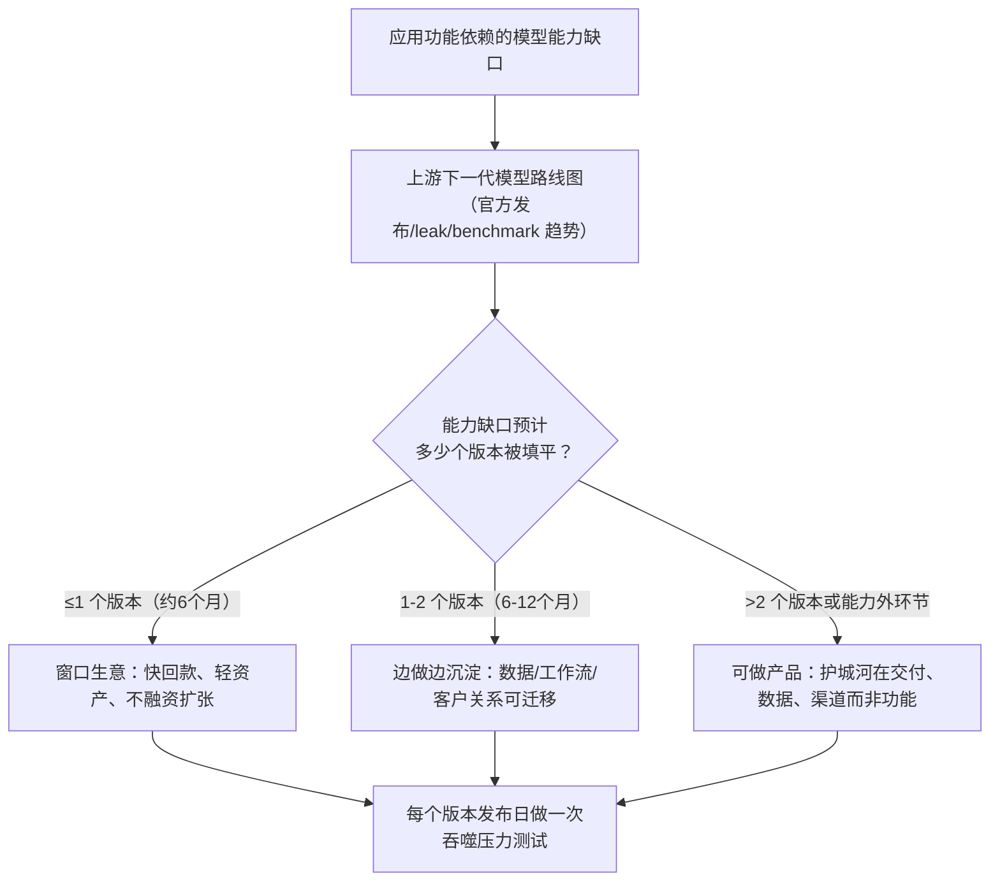

# 概念 02：模型吞噬周期——窗口坍缩与能力翻倍

> 对应事实：F-024 ~ F-037
> 核验状态：F-026/F-027/F-035/F-036 ✅ 已核验；其余为案例事实（—）与观点（📝）

## 核心内容

**模型每升级一次，就有一批应用变得多余。** 2024 年 4 月后，前沿模型能力提升速度从每年约 8 个指数点提高到约 15 个点，接近翻倍（Epoch AI，F-036 ✅）。吞噬不是预言而是反复发生的事实，博文给出三个完整周期案例：

**案例 1：Devv Search——搜索窗口从"一两年"坍缩到半年（F-024~F-028）**
- 2023-11：张佳圆发布代码搜索产品 Devv Search（索引 GitHub/Stack Overflow，提供引用验证），半年收入数十万美元；原路线图是"搜索（1-2 年）→ 代码生成调试 → 自动化开发"。
- 2024-06：Claude 3.5 Sonnet 发布，内部智能体编程测试解决 64% 任务（F-026 ✅）；Cursor 接入验证。
- 2025-02：Claude Code 研究预览发布（F-027 ✅），市场直接跳到自动化开发。
- 结果：搜索阶段只维持半年；转做自然语言生成应用，判断可行窗口仅 2024 年 9-11 月；2025 年年中 Devv 2.0 停止扩张进入维护。

**案例 2：论文写作工具——从 50% 净利率到收入归零（F-029~F-031）**
- 2023 年：生成一篇论文成本一两毛、售价约 70 元；年收入约 1000 万元，峰值单日十几万，净利润率约 50%。
- 2024 年：增长停滞，加 PPT 生成、AI 检测等功能无起色。
- 2025 年：Kimi、DeepSeek 更便宜甚至免费写长文，收入从每天数万降到数百，最终归零；团队转承接杂志社服务与论文辅导。同类：Jasper 转企业营销、Copy.ai 转连接销售流程、"蛙蛙写作"被手机厂商收购。

**案例 3：AI 工作流——一个月被 Skill 跨越（F-032~F-034）**
- 2025-12：创业者确定做 AI 工作流，拿到百万美元种子轮。
- 一个月后：Skill 在 Agent 产品中流行成标配，下一轮融资被否（"Skill 会替代 Workflow"）。
- 转向：企业服务（电商/短剧/营销），峰值月收入数十万美元，续费率 70%~80%；随后 3 个月内又试通用 Agent、转开源设计 Agent，两次换方向。

**宏观印证：** a16z 2023-2025 历次 Top 50 消费 AI 应用榜单中，只有 14 家公司每次都在榜上（F-035 ✅）。

**关键机制（F-037 📝）：** 吞噬不是瞬间发生——三家公司转向时原产品都还没归零。创业者失去的不是眼前用户，而是未来可能；等收入归零再转向，窗口已经关闭。

## 三个吞噬周期时间线

## 窗口计算框架（可实操）

## 创业者自检清单

- [ ] 你的核心功能依赖的模型能力，当前处于"模型做不好→刚做好→原生集成"哪个阶段？
- [ ] 最近两次模型升级分别消灭了哪类应用？你的功能是否在其延长线上？
- [ ] 模型厂的 API 调用数据能否看出你的场景在变热？（变热=被盯上的前兆）
- [ ] 转向触发器是否前置到"收入仍在增长但窗口预期缩短"时，而非收入归零后？
- [ ] 沉淀资产是否可迁移：客户关系、垂直数据、交付能力、后训练管线？