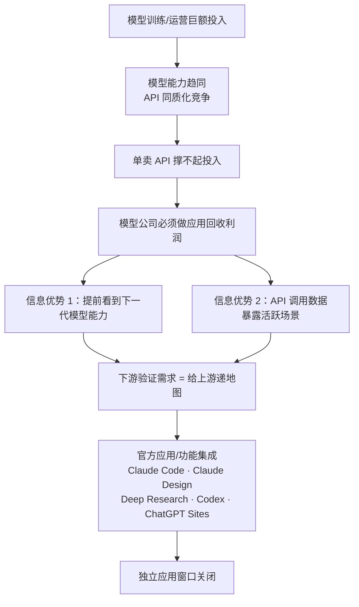
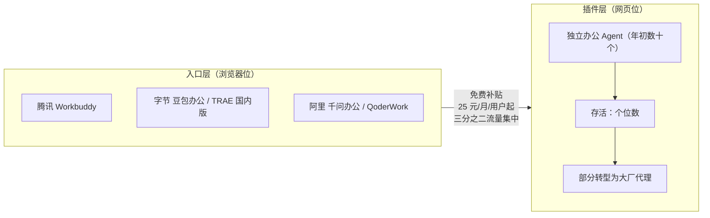

# 概念 03：模型即应用——上游下场的逻辑与入口垄断

> 对应事实：F-038 ~ F-049
> 核验状态：F-041/F-045/F-046 ✅ 已核验；F-040 ⚠️ 表述存疑按观点处理；其余为案例事实

## 核心内容

**"模型即应用"是否成立，是吴显昆认为 AI 应用唯一的关键问题（F-039 📝）。** 2025 年 3 月 Manus 爆火时，"壳有壳的价值"曾否定这一命题（F-040 ⚠️，肖弘表述未逐字定位原文，按观点处理）；2026 年以来 Claude Code、Codex 的快速发展让判断偏向另一端。

**上游为什么必须下场（Brookings 归因，F-041 ✅）：** 训练和运营模型需要巨额投入；模型能力趋同后，单卖模型 API 撑不起投入，做应用成为模型公司回收利润的方式。这不是"不专注"，而是商业模式的必然。

**下场方式与信息优势（F-042/F-043）：**
- Anthropic：Cursor 验证 AI Coding 需求后推出 Claude Code；与 Figma 加深合作的同时高管从 Figma 董事会辞职，推出 Claude Design 进入其核心市场。
- OpenAI：Deep Research、ChatGPT Work、Codex、ChatGPT Sites 分别进入研究、办公文档、编程、应用生成部署市场。
- 模型公司能**提前看到下一代模型能力**，还能从海量 API 调用中判断哪些场景最活跃——下游验证需求的过程，本身就是给上游递地图。

**历史类比（F-044）：** 微软将 Internet Explorer 与 Windows 捆绑、Teams 放进 Office，先后引发美国反垄断诉讼和欧盟调查——平台下场并非新事，但 AI 时代的捆绑速度更快。

**中国市场：大厂集体进入办公 Agent（F-045~F-048）：**
- 2026 年腾讯（Workbuddy）、阿里（千问办公/QoderWork）、字节（豆包办公/TRAE 国内版）集体入场。
- 易观对 17 款 PC 原生办公 Agent 的统计：3-6 月流量增长 2 倍，但**三分之二流向大厂的 3 款产品**（F-046 ✅）。
- 年初看办公 Agent 的投资人发现：几十个项目坚持到现在的只剩个位数，有创业者甚至转型做了 Workbuddy 的代理（F-047）。
- 补贴经济学：Workbuddy 免费版每月送积分按付费价值折算约 25 元；日活按 100 万计，光免费用户每月投入约 2500 万元；拉新再赠账面价值 100 元积分，每新增 100 万用户最高投入 1 亿元（F-048，晚点估算口径）。

**创业者的入口比喻（F-049 📝）：** 未来通用办公 Agent 就像浏览器，创业公司做的插件相当于网页，只能等着被入口产品调用。

## 平台下场逻辑链

## 入口-插件格局（中国办公 Agent，2026H1）

## 可操作要点

- **场景热度自检**：你的核心场景是否出现在模型厂官方 release notes 的延长线上？API 调用量是否大到足以被上游注意？两者皆"是"则按"12 个月内被集成"做预案。
- **不要在入口层创业**：通用办公、通用编程、通用对话等"浏览器位"产品，面对的是有补贴能力和信息优势的平台方；独立公司应做"网页位"且深度绑定行业结果。
- **平台依赖对冲**：多模型路由、私有化部署、客户侧数据资产，是降低"被调用方"风险的三种常见手段。
- **品牌时效注意**：大厂办公 Agent 品牌处于整合期（Workbuddy/千问办公/豆包办公与 QoderWork/TRAE 国内版存在更名映射），引用流量数据时以易观口径为准。