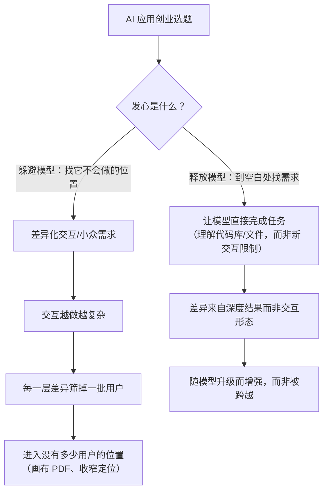
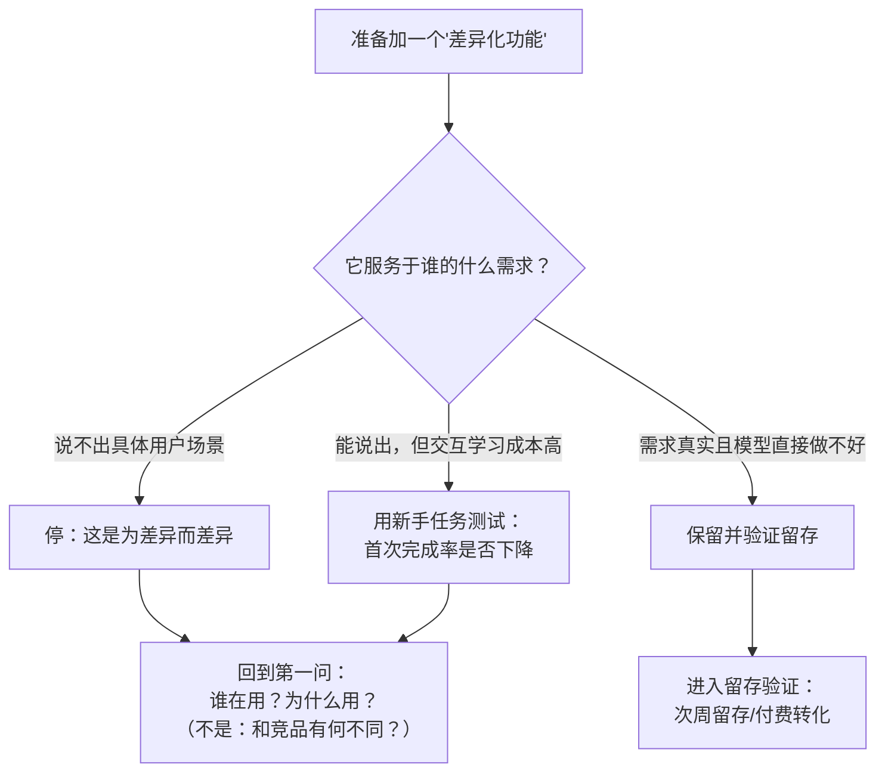

# 概念 04：躲避陷阱——为差异而差异与"发心"问题

> 对应事实：F-050 ~ F-058
> 核验状态：F-058 ⚠️ star 时间窗存疑；其余为案例事实（—）与观点（📝）

## 核心内容

面对模型吞噬，创业者的本能反应是"躲"——找模型公司不会进入的差异化位置。但博文记录了一系列"躲开了模型，也躲开了用户"的失败模式。

**1. 画布潮：差异化交互的拥挤与小众化（F-050~F-053）**
- 吴显昆 2024 年选中画布形态：模型公司主入口都是对话，画布是完全不同的交互；团队先做了与后来 Lovart 相近的设计产品，再把画布带进办公场景。
- 同期涌入：中国的 Lovart、Flowith，海外的 Miro、Subset，百度也发布"自由画布"。
- 反身性陷阱（F-052 📝）：为证明与模型不同，容易把交互做复杂、追小众需求；**每加一层差异，能理解和使用产品的人就少一些**。Kuse 曾花很长时间在画布上打磨 PDF 阅读体验，后承认可能根本没多少人愿意在画布上读 PDF（F-053）。

**2. 发心论：躲避 vs 释放（F-054 📝）**
吴显昆把失误归因于选方向时的"发心"：先想"躲避"大模型，而不是释放大模型能力、到空白处找需求——路只会越走越窄。正向参照是 Cursor 和 Claude Code（F-055）：让模型理解代码库和文件、直接完成任务，而不是用新交互去限制模型。Kuse 随后从画布转向文件夹式交互。

**3. Devv 2.0 的反向教训：收窄定位错过窗口（F-056/F-057 📝）**
为区别于其他自然语言应用生成产品，Devv 2.0 把定位收窄到"帮助用户做 AI 应用"，花约半年开发；产品上线时窗口已经过去。张佳圆反思：盯着竞品设计功能，做出的差异可能根本不是用户需求；产品 0→1 时若留存不好，**先要回答"谁在用、为什么用"，而不是"与同类有多少不同"**。

**4. 开源身位：借热度的赢面与边界（F-058 ⚠️）**
前述工作流创业者看到 Claude Code 做设计类产品后，做了开源版设计 Agent（Open Design）。博文称"一周内将近 5 万 star"——GitHub 公开轨迹不支持"一周 5 万"的时间窗（总量量级可达但增长周期更长，见 verification.md N1-1），应表述为"短时间内 star 快速增长至数万量级"。该项目收入甚至超过之前的工作流产品，团队 90% 以上资源投入。开源是一种有效的身位策略：社区分发、模型厂生态合作、数据飞轮，但热度窗口同样受模型迭代支配。

## 两种发心的分叉

## 0→1 第一问检查法（可实操）

## 创业者自检清单

- [ ] 你的差异化是"交互形态不同"还是"交付结果更深"？前者筛用户，后者建壁垒。
- [ ] 能否一句话说清核心用户是谁、在什么场景下为什么非用你不可？
- [ ] 新功能是盯着竞品做的，还是盯着用户任务做的？
- [ ] 模型升级后，你的差异是消失了（交互补丁被原生能力覆盖）还是增强了（数据/交付/渠道沉淀）？
- [ ] 引用开源项目热度数据时，是否核对了一手平台数据（GitHub star 时间窗），而非转述口径？