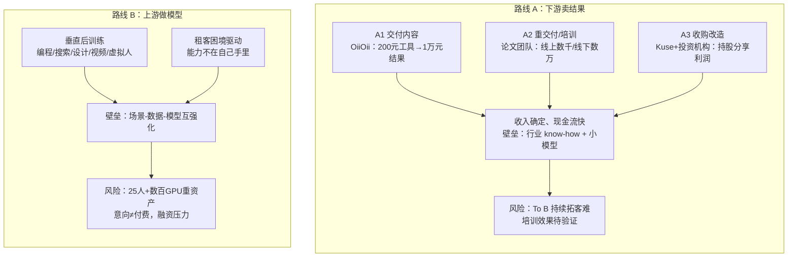
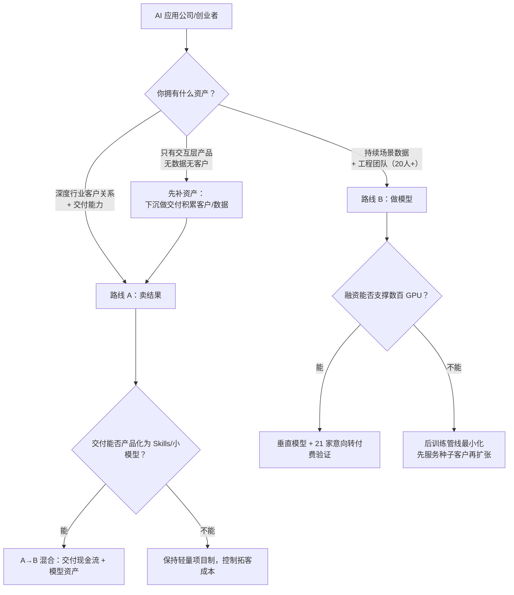

# 概念 05：两条逃生路线——下游卖结果与上游做模型

> 对应事实：F-059 ~ F-080
> 核验状态：F-076【自宣】；其余为案例事实（—）与观点（📝）

## 核心内容

离开"纯软件、卖 token"的应用层后，在探索的创业者大致走两条路（F-059 📝）：**往客户业务深处走**（对结果、交易和利润负责），或**往技术上游走**（自己做模型，把验证过的需求和数据训练进模型）。

### 路线 A：下游卖结果（F-060~F-068）

**模式 A1：交付内容/结果。** OiiOii 进入细分行业，训练小模型解决具体场景问题，直接交付视频内容和工作流。案例：漫画转动画——Seedance 2.0 出 2D 效果不好（对真实/3D 过拟合、2D 过于流畅显假），他们训练后把 2D 表现得像日番。价值对比（F-061 📝）：靠工具做交付物两分钟成本可能就 200 块；把符合需求的视频交给客户，两分钟可能卖 1 万块——**50 倍价差来自"结果"而非"工具"**。过去企业服务常败在交付太重、人力成本太高；AI 生产工具足够好用、需要的人极少，对外证明价值的产品变成内部高效生产系统（F-062 📝）。垂直方案后续积淀成给更多人的 Skills（F-063）。

**模式 A2：重交付/培训。** 论文团队回到 500 多万学生用户：承接论文发表定制需求，做 AI 培训（教学生用 AI 写文案、剪辑、运营，做"一人公司"）；线上陪跑数千元、线下课程一两万元（F-064）。

**模式 A3：收购改造。** Kuse 曾给企业做"数字员工"Junior，但每家公司数据/权限/流程不同，要先诊断咨询部署，客户也未必开放敏感数据，难像标准软件复制（F-065）。吴显昆探索新模式：与投资机构合作，先收购服务公司再用 AI 改造流程，通过持股分享利润——比 FDE（全职驻场开发）更深入业务、利益更一致；已收购一家公司（F-066）。

**风险（F-067 📝）：** 卖交付长期面对 To B 最难的持续拓客；AI 培训还没有数据证明能帮学员挣到钱、可大规模复制；进入经营深处的提效整合也可能失败。但在"模型即产品"主流叙事下，这些方式先活下来的可能性更高（F-068 📝）。

### 路线 B：上游做模型（F-069~F-080）

**群体动向：** Cursor、Krea、Captions、Perplexity、HeyGen、LiblibAI 等应用公司已进入模型层，沿已验证的编程、搜索、设计、图像、视频、虚拟人场景训练垂直模型（F-069）。

**"租客"困境（杨博麟案例，F-070~F-074）：** Cuflow（课件转可交互视频）公测数万人注册、海外 2000 多万曝光，但超一半用户上传的是企业培训材料、漫画、小说、商品详情页——真实需求在别处。2026 年 4 月停更 Cuflow，转训以代码为核心的实时交互视频模型。杨博麟称应用公司某种程度上是"模型评测博主"（F-072 📝）：上游每次更新都要重新测试能力和成本、决定哪些功能重做；有些更新直接抹掉几个月工程（如长文档 OCR/切分流程被长上下文原生能力取代，F-073）。**"AI 应用看似属于自己，最重要的能力却不在自己手里，我们永远只是一个租客。"**（F-074 📝）

**为什么回模型层胜率更高（F-075/F-077 📝）：** 代码生成视频成本低、速度快、可准确编辑审计，天然支持交互协作，适合企业培训、商品展示等信息传递类视频；真正优势不是做模型本身，而是**在场景和模型间持续互相强化**——先找到真正有价值、能持续产生数据的场景，再把场景理解通过后训练和反馈沉淀进模型。转向两三个月已拿到 21 家企业客户合作意向（F-076【自宣】，未审计）。

**代价（F-078/F-079）：** 25 人团队要搭建从监督微调、偏好优化到强化学习的后训练管线，处理奖励函数、容器化、GPU 调度，一次配置出错就烧掉一大笔钱；后续训练需数百张 GPU，正进行新一轮融资；21 家意向客户还没多少真正付费——**做模型没有让商业化问题消失，只是换了风险结构**。

## 两条路线对比

## 逃生路线决策树（可实操）

## 选择前的硬性核查

- [ ] 路线 A：单个交付项目的毛利是否为正？交付团队人均产出是否随 AI 工具提升而提升（而非堆人）？
- [ ] 路线 A：培训类业务是否有学员收入提升的跟踪数据？（无数据则难以规模化与口碑复利）
- [ ] 路线 B：场景是否"能持续产生数据"？一次性项目数据无法形成飞轮。
- [ ] 路线 B：后训练管线的最小可行成本（人力+GPU）是否有 12 个月以上现金储备？
- [ ] 共同前提：意向客户/自宣 ARR 不计入决策依据，以付费合同为准。