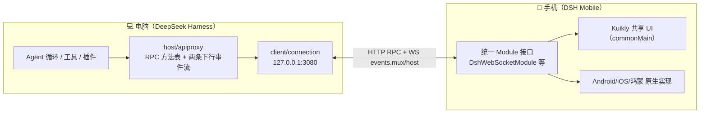

# 产品定位与架构总览

> **事实基础**：本文所有具体声明带 F 编号，完整事实清单见 [references/article-source.md](../references/article-source.md)，P0 核验报告见 [references/verification.md](../references/verification.md)。

## 1. 为什么要给 DSH 做手机客户端

DeepSeek Harness（DSH）跑一个任务经常需要几分钟甚至更久，中间还会停下等人处理审批、补充信息或确认方向（F-002）。一旦人离开电脑，这一轮任务就可能卡在原地。

DSH Mobile 的出发点不是"在手机上写代码"，而是**让手机接住那些短而频繁的交互**（F-004）：通勤、开会或排队时看一眼任务进度、处理一次审批、回答 Agent 的追问，再让电脑继续跑。

关键架构分工：**Agent 循环、工具执行与插件仍在电脑上运行，手机只负责连接、交互与渲染**（F-003/F-004）。

## 2. 为什么不套 WebView

最省事的方案是套一层 WebView 把网页缩进手机，但作者放弃该方案（F-005），因为 DSH Mobile 不只是把网页变小：

- 需要维持 **WebSocket 长连接**，处理锁屏、切后台与网络切换
- 重连后需要**补回遗漏事件**
- 扫码、SSH 隧道与本地缓存都需要**平台能力**
- 三端不仅要长得接近，连接与恢复行为也要一致

结论：做到这些，原生客户端反而更合适。

## 3. 架构三层分工

- **电脑侧**：DSH 承担 Agent 运行时与 Host 协议（[02-dsh-host-protocol](02-dsh-host-protocol.md)）
- **传输侧**：SSH 隧道或扫码 Relay（[03-connection-and-reconnect](03-connection-and-reconnect.md)）
- **手机侧**：Kuikly 共享代码渲染 + 原生桥接（[01-kuikly-cross-platform](01-kuikly-cross-platform.md)）

## 4. 定位边界：远程控制面板，不是 IDE

DSH Mobile 适合**短、轻、高频的交互**（F-031）：

- 查看流式回复与工具状态
- 允许/拒绝命令审批
- Agent 提问时补充信息
- 碎片时间查看后台 jobs、Goal 进度与会话状态

而长 Prompt、大段代码 Diff、需要持续思考的修改仍然适合桌面——**手机屏幕和输入方式没有因为接入 Agent 就突然变大**。这个 App 的定位是远程控制面板，不是把完整 IDE 搬到手机上（F-031）。

## 5. 信任边界与已知限制

- DSH 仍处于 developer preview，协议与包结构都可能发生破坏性变化（F-045）
- 现阶段**不会为推送私自增加官方协议之外的 RPC**，先把连接与重连稳定性处理好（F-034）
- 通知能力需要电脑端配合——单纯给 App 申请通知权限无法知道任务何时需要人处理（F-034）
