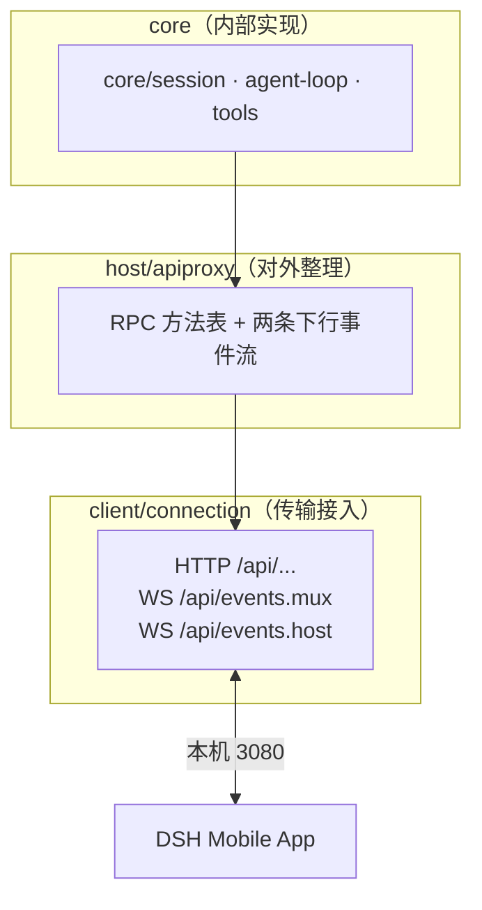

# DSH Host 协议直连：RPC 与两条事件流

> **事实基础**：本文所有具体声明带 F 编号，完整事实清单见 [references/article-source.md](../references/article-source.md)，P0 核验报告见 [references/verification.md](../references/verification.md)。

## 1. 不加中间层，直接接 Host 协议

DSH Mobile **没有在手机和电脑之间再放一套业务服务**——它直接使用官方 Web 前端背后的 Host 协议：浏览器如何调用 DSH，App 就沿用同一套方法和事件（F-016）。这避免为移动端另造接口，也避免理解/翻译 DSH 内部插件结构。

## 2. DSH 的三层结构

DSH 本身是基于 **Cordis** 的插件化 Agent 运行时（F-017）。与移动端连接直接相关的部分可简化成三层：

- **core/session、agent-loop、tools**：负责会话、Agent 循环与工具执行，并产生相应事件（F-017）
- **host/apiproxy**：把内部能力整理成 RPC 方法表和两条下行事件流（F-017）
- **client/connection**：把接口接到本机 3080 端口，对外提供 HTTP `/api/...`、WebSocket `/api/events.mux` 与 `/api/events.host`（F-018）

电脑上的 Agent 继续读写工作区、调用工具、运行插件；App 只连接最外层的 client/connection（F-017）。

> 核验：端口 3080 / 仅回环监听及 events.mux / events.host 两路 WebSocket 由多个独立第三方实测与源码分析确认（verification B2 项）。官方 quickstart 未直接书写端口，本 bundle 以独立实测为准。

## 3. 发消息就是一次 HTTP RPC

DSH 把可调用能力登记在**一张 RPC 方法表**里（F-019/F-020）。发送消息对应 `session.prompt`，请求路径为 `POST /api/session.prompt`（F-019）。会话列表、历史记录、工作区、模型、Goal 和设置也都走同一条 RPC 通道（F-019）。

方法的入参和返回值来自 TypeScript 函数签名，注册表负责把方法名映射到实际实现。DSH Mobile 只实现当前需要的部分（F-019）。

- **方法数**：博文称 dsh-v0.1.1-rc.2 方法表有 52 个方法（F-020）
- **完整方法表**：见 `rpc-map.ts`（F-020）
- **版本敏感性**：DSH 仍在快速迭代，"52"这个数字只对应文中使用的版本；接入时最好锁定已验证过的 tag，不要默认 master 始终兼容（F-020）

> ⚠️ 核验口径：`session.prompt ↔ POST /api/session.prompt` 已由独立第三方确认；但"52 个方法"与 rpc-map.ts 文件路径**仅博文单源**，未找到独立复述来源——引用时以官方仓库 rpc-map.ts 为准（verification B3 项）。

## 4. 两条 WebSocket，各管一类状态

远程连接建立后，Host 通过**两条只下行的 WebSocket** 向 App 推送事件（F-021）：

| 通道 | 职责 | 承载内容 |
|------|------|---------|
| `/api/events.mux` | 当前会话中正在发生的事 | 模型输出、工具调用、审批、提问、消息队列、后台任务 |
| `/api/events.host` | 电脑这一侧的全局变化 | 会话增删、运行状态、工作区变更、Host 级错误 |

两条流分开后，会话正文与全局状态不会挤在同一个通道，App 也可按不同生命周期处理它们：聊天页面主要消费 mux，工作区和会话列表更多依赖 host（F-021）。

## 5. 快照事件与宽类型：两个需要单独处理的细节

### 5.1 快照型事件：完整覆盖而非增量

`session/queue` 与 `session/jobs` 推送的是**完整快照，不是"又增加了一条"的增量事件**（F-022）。它们不进入会话日志，重连时也不能只靠事件回放恢复——所以 App 收到新快照后会**直接覆盖本地状态**（F-022）。

### 5.2 宽类型：保留未知字段 + 降级

`session/projection.value` 与 `host/remote-event.args` 在 carrier 层是宽类型（F-023）。其结构由各自业务包负责，App **不能假设所有帧都严格符合固定 data class**——需要保留未知字段，并在解析失败时降级，而不是让整条事件流一起中断（F-023）。

## 6. 协议层设计对移动端的影响

- RPC 单一通道 + 两类事件流分离 → 手机可以按页面需求选择性订阅（F-021）
- 快照语义 → 移动端缓存以"覆盖"为模型，简单可靠（F-022）
- 宽类型容错 → 为 DSH 的破坏性演进留余地（F-023/F-045）

协议细节参见 [03-connection-and-reconnect](03-connection-and-reconnect.md)（断线后如何与这套协议协同）。
