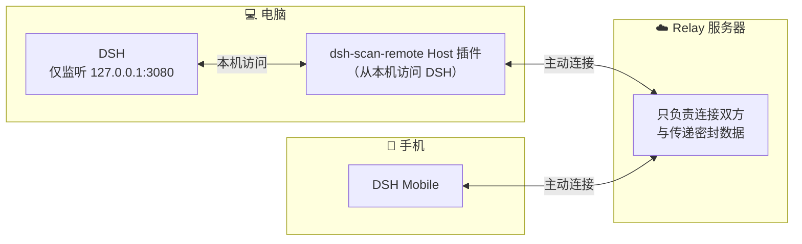
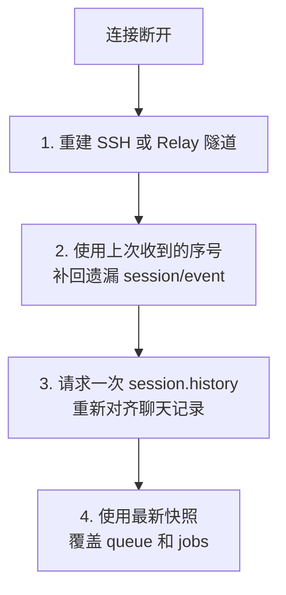

# 两种远程连接方式与断线重连

> **事实基础**：本文所有具体声明带 F 编号，完整事实清单见 [references/article-source.md](../references/article-source.md)，P0 核验报告见 [references/verification.md](../references/verification.md)。

## 1. 安全基线：DSH 默认只听本机

DSH 默认监听 **127.0.0.1:3080**（F-027）。这是**应该保留的默认值**——因为能访问这个端口的客户端，可能通过 Agent 和工具获得很高的本机操作权限（F-027）。

DSH Mobile 没有直接把 3080 开到公网，而是提供 **SSH 隧道**与**扫码 Relay** 两种远程连接方式（F-027/F-028/F-029）。两者的共同点：**电脑上的 DSH 始终只监听本机回环**，远程能力由隧道/插件承载。

## 2. 方式一：SSH 直接打隧道

SSH 模式在手机上建立**本地端口转发**，把 App 侧的一个 loopback 端口映射到电脑的 127.0.0.1:3080（F-028）。HTTP RPC 与两条 WebSocket 都通过这条隧道传输。

- **不改 DSH 认证逻辑**：认证发生在 SSH 层，DSH 仍然只看到来自本机回环的请求（F-028）
- 适合：已经有 SSH 主机与密钥配置的用户，这条路径最直接

## 3. 方式二：扫码 Relay（dsh-scan-remote 插件）

手动填写地址、端口和密钥不适合普通移动端操作，因此作者另外开发了 **dsh-scan-remote** 插件（F-029）。核验确认该仓库（yukiykchen/dsh-scan-remote）与 v0.0.1 tag 真实存在（verification C1 项）。

### 工作流程

1. 插件安装后，DSH Settings 中出现 **Remote Access** 页面（F-029）
2. 电脑生成二维码，手机扫描完成配对（F-029）
3. 电脑端插件与 App **都主动连接 Relay**，通过 **sealed-tunnel-v1** 转发 DSH 流量（F-029）

- 两端完成配对后，App 发出的 HTTP 与 WebSocket 流量经**密封隧道**转发到 Host 插件，再由插件送到本机的 DSH（F-029）
- **Relay 不需要直接访问 3080 端口**，电脑也不需要把 DSH 开放到局域网或公网（F-030）

### 安全设计要点

- 二维码中的**主密钥位于 URL fragment**——正常 HTTP 请求不会把 fragment 发给 Relay（F-030）
- 隧道数据**经过密封后再转发**，Relay 只负责连接双方与传递数据（F-030）

## 4. 断线重连：先补事件，再对历史

移动网络一定会断：锁屏、切后台、进隧道、Wi-Fi 与蜂窝切换都可能让连接失效。DSH Mobile 重连后按固定顺序恢复（F-024）：

重连补事件的依据是 **`session/queue`/`session/jobs` 为完整快照**（[02-dsh-host-protocol](02-dsh-host-protocol.md) §5），重连不能靠事件回放恢复，收到快照直接覆盖即可（F-022/F-024）。

## 5. 世代号：防止旧连接污染新状态

每次连接还带一个**世代号（generation）**（F-025）。连接断开后，旧连接中迟到的 RPC 响应会被丢弃，不能再写进新的会话状态（F-025）。

## 6. 重连 = 恢复观察，不是重新执行

最关键的设计区别：如果 Agent 在断线期间仍在电脑上运行，App 重连后会**重新订阅这一轮任务，而不是把用户的 Prompt 再发一次**（F-026）。

> 重连是恢复观察和控制，不是重新执行任务。

这个区别非常重要——否则一次网络抖动就会导致任务被重复执行。状态机位于共享层，因此**三端采用同样的补齐顺序和失效规则**，平台代码只负责把底层连接事件交给共享层（F-026）。

## 7. 设计与协议的关系

- 快照事件语义（[02](02-dsh-host-protocol.md) §5）与"补事件再对历史"重连策略互相配合
- 共享层状态机让三端行为一致，平台差异只留在连接事件上报
- 世代号 + 丢弃迟到响应，保证状态机不会被过期数据污染（F-025）
