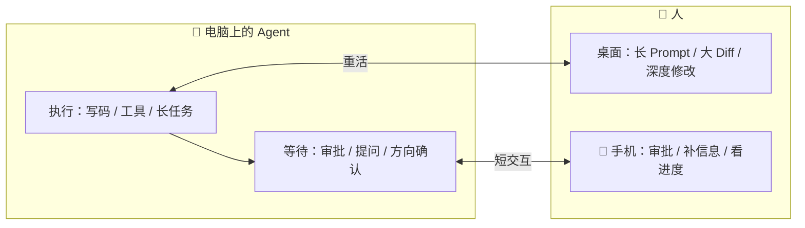

# 移动端 Agent 控制：行业参照与演进

> **事实基础**：本文所有具体声明带 F 编号，完整事实清单见 [references/article-source.md](../references/article-source.md)，P0 核验报告见 [references/verification.md](../references/verification.md)。行业参照为作者列举 + 官方文档核验；本 bundle 判断与路线展望标注"作者观点"。

## 1. 一个正在发生的行业变化

"手机作为 Agent 决策节点"这类产品已越来越常见（F-032/F-033）：

| 产品 | 能力 | 核验 |
|------|------|------|
| Cursor iOS 应用 | 启动云端 Agent，也能通过 **Remote Control** 操作电脑上的 Agent | ✅（官方 changelog 2026-06） |
| ChatGPT 桌面版说明 | **Codex** 已进入 ChatGPT 移动应用，可继续 Mac 主机上正在运行的任务 | 博文单源 |
| Claude Code Remote Control | 支持**从手机接续本机会话** | ✅（官方文档） |
| DSH Mobile（本文） | 扫码/SSH 连接电脑上的 DeepSeek Harness，远程审批/提问/查看 | 作者一手实测 |

这些产品的执行位置和数据路径并不相同，但它们都在处理同一个变化（F-032/F-033 作者总结）：**具体编码工作交给 Agent 后，人更多是在任务节点上给意图、做判断和看结果**——这些动作本来就不要求人一直坐在电脑前。

## 2. 手机 = 决策节点入口

DSH Mobile 的定位（F-031）：

- **适合**：流式回复与工具状态查看、命令审批、补充信息、后台 jobs/Goal 进度、会话状态
- **不适合**：长 Prompt、大段代码 Diff、需要持续思考的修改——手机屏幕与输入方式没有因为接入 Agent 变大

## 3. 路线图：先把连接与重连做好

DSH Mobile 的演进路线（F-034，作者观点）：

1. **补输入能力**：`session.prompt` 已支持图片内容数组，可在此基础上增加图片上传和语音输入
2. **通知能力**：需要电脑端配合——单纯给 App 申请通知权限并不能知道任务何时需要人处理
3. **克制协议扩张**：现阶段不会为了推送而私自增加官方协议之外的 RPC，先把连接与重连稳定性处理好

## 4. 客户端不绑定 DSH：跨 Agent Host 复用构想

这套客户端不必永久绑定 DSH（F-035，作者观点）。对多数 Agent Host 来说，移动端需要的基础能力很接近：

- 列出会话
- 下发消息
- 接收事件
- 处理审批

流式 Markdown、工具卡片、断线状态机与会话模型已经放在共享层。以后接其他 Agent 服务时，**主要新增协议适配器，不需要重新写三端界面**（F-035）。

## 5. 阅读建议

- 想理解传输与协议层 → [02-dsh-host-protocol](02-dsh-host-protocol.md) + [03-connection-and-reconnect](03-connection-and-reconnect.md)
- 想上手体验 → [examples/00-local-scan-connect](../examples/00-local-scan-connect.md)
- 想扩展开发 → [examples/01-extend-dsh-mobile](../examples/01-extend-dsh-mobile.md)
- 与 DeepSeek Harness 源码级机制对照 → 同分组 [deepseek-harness](../deepseek-harness/index.md)（Cordis 插件架构/ACP/MCP 源码教程）
