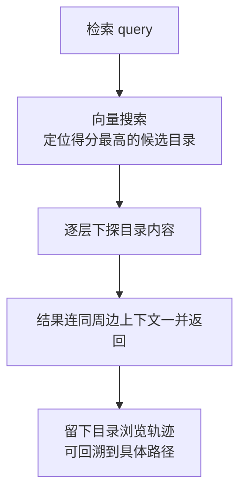

# viking:// 虚拟文件系统与 L0/L1/L2 三层加载

> 本篇对应博文"简介"段（F-004~F-008）；机制描述以官方 README/文档为准。

## 目录即上下文：viking:// 是什么

OpenViking 把 Agent 的全部上下文组织成一个虚拟文件系统，统一挂在 `viking://` 协议下（配置中存储后端键名为 `storage.agfs`，官方部署文档文字亦称 RAGFS——上游两处用词不一，本束统称 **viking:// 虚拟文件系统**）。Agent 不需要查询黑盒数据库，而是用类 Unix 的文件操作浏览自己的上下文（F-005）：

```text
viking://
├── resources/              # 资源：项目文档、仓库、网页等
│   └── my_project/
│       ├── docs/
│       │   ├── api/
│       │   └── tutorials/
│       └── src/
└── user/
    └── {user_id}/
        ├── memories/        # 记忆：用户偏好与 Agent 经验
        │   └── preferences/
        │       ├── writing_style
        │       └── coding_habits
        ├── resources/       # 用户私有资源
        ├── skills/          # 技能：如何完成任务
        │   ├── search_code
        │   └── analyze_data
        └── peers/           # 外部访问者（如 web-visitor-alice）
```

（目录结构据官方 README，F-038）

### 三类上下文的分工

| 类型 | 位置 | 承载内容 | 博文例子 |
|------|------|---------|---------|
| 资源 resources | `viking://resources/` 与 `user/{id}/resources/` | 项目文档、代码仓库、网页等外部知识 | 工作台左侧 resources 节点（F-024） |
| 记忆 memories | `user/{id}/memories/` | 用户偏好、Agent 经验，明文 Markdown 落盘 | `memories/profile.md` 中"职业：Java开发工程师"（F-028） |
| 技能 skills | `user/{id}/skills/` | 完成任务的方法（可由会话编译沉淀） | VikingBot `ov compile` 组织 wiki/知识图谱/报告（F-038） |

每个上下文对象都有 `viking://` URI，可浏览、可检索、可在 Studio 里点击定位——这就是博文所说"召回了什么、存到哪，一目了然"的结构基础（F-031）。

## L0/L1/L2：按需加载的三层内容

内容写入时会被语义处理成三层摘要，Agent 先读摘要判断相关性，再决定是否读全文，从而节省 token（F-006/F-037）：

| 层级 | 载体文件 | 内容 | Agent 何时读 |
|------|---------|------|-------------|
| **L0 Abstract** | `.abstract.md` | 一句话摘要 | 快速相关性判断（目录扫描阶段） |
| **L1 Overview** | `.overview.md` | 核心信息与使用场景、结构要点 | 规划检索路径 |
| **L2 Details** | 原始文件（如 `auth.md`） | 完整原始数据 | 仅在确认相关后读取 |

官方给出的目录形态（F-037）：

```text
viking://resources/my_project/
├── .abstract.md           # L0：快速相关性判断
├── .overview.md           # L1：结构与关键点
└── docs/
    ├── .abstract.md
    ├── .overview.md
    └── api/
        ├── auth.md        # L2：完整内容，按需加载
        └── endpoints.md
```

博文实测中，终端 `/search 职业` 的命中结果都带 `.abstract.md`、`.overview.md`、`profile.md` 文件名与 L0/L1/L2 层级、相似度 score（F-027），正是这套机制的可见表现。

## 目录递归检索：先找目录，再下探内容

博文介绍的特性①"目录递归检索"（F-008）对应官方 README 的 retrieval 机制：



1. **向量搜索定位候选目录**：不是直接在全部 chunk 里找最相似片段，而是先找"哪个目录最相关"
2. **逐层下探**：进入候选目录后再探索其中内容；`find` 直查，`search` 还能结合会话上下文规划检索（F-039）
3. **周边上下文返回**：结果不只是孤立片段，还带所在目录的结构信息
4. **轨迹可回溯**：每次检索留下浏览轨迹，结果不对可以查到是从哪个路径召回的（F-007）

### 学术底座：TrieHI

目录作为检索范围不是工程取巧。火山团队论文 *Directory-Aware Query and Maintenance in Vector Databases*（arXiv:2606.16903，ICDE 收录）形式化定义了目录范围的查询与维护操作，提出 **TrieHI** 索引，在向量排序之前先解析目录范围；OpenViking 已集成该机制（F-045）。姊妹工作 VikingRAG 研究如何随证据缺口暴露相关目录段、复用检索轨迹、仅在必要时升级多轮检索（F-045）。

## 与"黑盒向量库"体验差异（博文实测视角）

| 体验点 | 传统向量库 | OpenViking（博文实测） |
|--------|-----------|-----------------------|
| 看里面有什么 | 只能查，不能"逛" | 中间栏直接浏览 viking:// 目录树（F-024） |
| 为什么召回它 | 只有 score | 可展开到具体文件路径，带 L0/L1 层级（F-027） |
| 记忆存哪 | 向量不可读 | `user/macro/peers/macro/memories/profile.md` 明文预览（F-028） |
| Agent 操作联动 | 无 | Agent 操作了哪个 viking:// 文件，左侧上下文树可点击定位、中间打开（F-024） |

## 边界与注意

- L0/L1 摘要由配置的 **VLM** 生成（博文用 qwen3-vl-plus，F-016）；摘要质量与模型能力相关，离线可用本地 Ollama 等 provider（F-042）
- 明文落盘提升了可观察性，也意味着含敏感信息的记忆以明文存储在挂载卷——自部署时应控制 `/app/.openviking` 挂载目录的主机访问权限
- 检索 score 与层级标注是博文实测版本的 UI 呈现（F-027），字段表现可能随版本调整

## 延伸阅读

- [02 记忆生命周期与多 Agent 集成](02-memory-lifecycle-integrations.md)
- [实战 01 跨会话记忆实测](../examples/01-cross-session-memory-walkthrough.md)
