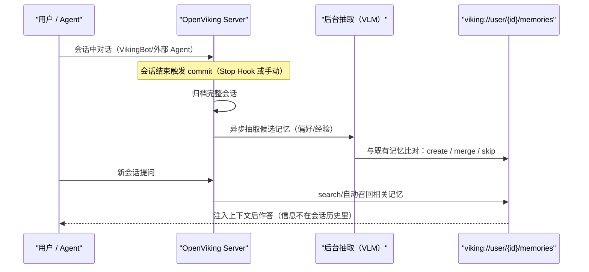

# 会话记忆生命周期与多 Agent 集成矩阵

> 对应博文"使用"与"AI Agent 支持"段（F-009/F-010/F-025~F-030）；工具与集成清单以官方文档为准。

## 记忆如何跨会话存活

### 生命周期：commit → 后台抽取 → 去重合并 → 自动召回

关键机制（F-009/F-038/F-041）：

1. **提交会话（commit）**：归档对话并启动后台抽取；记忆策略控制保留什么
2. **三态去重**：候选记忆与既有记忆比对后执行 create（新建）/ merge（合并）/ skip（跳过）
3. **自动召回**：新会话开始或提问时，Hooks 自动加载 profile 与项目记忆、为当前请求召回上下文
4. **明文可审**：记忆以 Markdown 文件落盘（如 profile.md），可直接在 Studio 上下文树查看——博文实测"职业：Java开发工程师"即明文存放（F-028）

VikingBot 是 OpenViking 自带的 Agent：容器版默认启用，pip 版通过 `pip install "openviking[bot]"` + `openviking-server --with-bot` 启用，`ov chat` 进入对话（F-034/F-035）。

### ⚠️ 博文工具名与官方工具清单的对应

博文记录 VikingBot 写记忆调用 `openviking_memory_commit`、检索调用 `openviking_search`（F-025/F-026）；官方 2026-09 文档的 MCP 工具集为 15 个标准工具，**无这两个名称**。对应关系（F-039，详见 [核验报告](../references/verification.md)）：

| 博文所见 | 官方对应 |
|---------|---------|
| openviking_memory_commit | 会话 commit 机制（后台抽取）+ `remember`（主动把当前上下文固化为长期记忆） |
| openviking_search | `search`（结合会话上下文的深检索，`mode="context"` 直接组装注入上下文）/ `find`（不带会话上下文的快速语义检索） |

判定为 VikingBot 早期/界面化名称或作者转述。**接 MCP 开发时以官方 15 工具为准**；博文演示的"写记忆→新会话召回"机制本身经核验成立。

## MCP：15 个工具一个端点

MCP 端点内置于服务端：`http://<server>:1933/mcp`，与 REST API **同进程、同端口（1933）**，无需额外进程（F-039）。

- 鉴权：`X-Api-Key` 或 `Authorization: Bearer`；绑定 localhost 的本地开发模式可免鉴权
- 通用 mcpServers 配置适用于 Trae、Cursor、Manus 等标准 MCP 客户端

| 工具 | 用途 |
|------|------|
| `find` | 快速语义检索（不带会话上下文），支持 target_uri/level/context_type 过滤 |
| `search` | 深度语义检索；`mode="context"` 组装注入级上下文（替代旧 recall 工具），支持配额、去重、改写等参数 |
| `read` | 读取 viking:// URI 完整内容 |
| `list` / `tree` | 浏览目录结构（tree 支持递归） |
| `remember` | 主动把当前上下文锁定为长期记忆 |
| `write` / `edit` | 创建 / 编辑上下文中的文件 |
| `add_resource` | 导入外部文件或 URL 作为知识源（支持自动刷新） |
| `grep` / `glob` | 正则文本搜索 / 文件名模式匹配 |
| `forget` | 清理冗余或过时记忆 |
| `list_watches` / `cancel_watch` | 查看/取消资源监听 |
| `health` | 健康检查 |

## Hooks：无感的自动读写

专用集成（Claude Code/Codex/Cursor/TRAE 等）在 MCP 之上叠加生命周期 Hooks，以 TRAE 集成为例（F-041）：

| Hook 事件 | 动作 |
|-----------|------|
| SessionStart | 加载用户 profile 与当前项目记忆 |
| UserPromptSubmit | 为当前请求召回并注入上下文 |
| PreToolUse | 把误访问本地 `viking://` 路径的操作重定向回 MCP 工具 |
| Stop | 捕获并立即提交当轮对话（含短会话）用于记忆抽取 |

统一安装脚本：`examples/memory-plugin-shared/install.sh --harness <名称>`，国内有 TOS 镜像；前置 **macOS/Linux + Node.js 18+**，安装后需完全退出并重启客户端（F-041）。这与博文"跑一条安装脚本→重启就能用"的三步说法一致（F-030）。

## 集成矩阵（谁能接、怎么接）

| Agent / 客户端 | 官方集成方式 |
|----------------|-------------|
| Claude Code | Hooks + MCP |
| Codex（ChatGPT） | Hooks + MCP |
| Cursor | Hooks + MCP |
| TRAE / TRAE CN / TraeCode CLI 2.0 | Hooks + MCP |
| OpenClaw | Context engine（上下文引擎替换式接入） |
| Hermes | Built-in（内置） |
| OpenCode | Plugin + MCP |
| DeerFlow | Plugin + MCP |
| DSH | Plugin + MCP |
| pi | Native extension |
| Doubao Work（豆包工作） | Connector |
| LangChain | Tools + store |
| 任意 MCP 客户端（Manus 等） | 标准 MCP 配置（已验证平台含 Claude Code/Trae/Cursor/Codex/OpenCode/Manus/Claude Desktop） |

（F-040/F-010/F-029；Claude.ai/Claude Desktop 走原生 OAuth 2.1，不能直接传 API Key，F-040）

> **对博文口径的两处细化**（博文口径 F-029；官方裁决 F-040，非勘误）：① 博文称 TRAE/Cursor 走"通用 MCP"，官方实际提供专用 Hooks+MCP 集成（自动召回/捕获），通用 MCP 仍可用；② 博文称"SDK（Python、LangChain 等）"，官方 SDK 语言为 **Python/Go/TypeScript**（另有 HTTP API），LangChain 属框架集成。

### SDK / CLI / HTTP 接入面

- **SDK**：Python、Go、TypeScript；Python 示例 `ov.SyncHTTPClient(url, api_key).initialize()`（F-040/F-047）
- **ov CLI**：`ov status`、`ov add-resource <url>`（异步任务，`ov task status <ID>` 轮询）、`ov ls/tree/find/grep viking://...`；连接配置在 `~/.openviking/ovcli.conf`（F-047）
- **HTTP API**：`/api/v1/fs/ls` 等 REST 接口，Header 传 `X-API-Key`（F-047）
- **VikingBot 终端**：博文实测的 `/search` 为 VikingBot 会话内斜杠命令（F-027，博文单源），与 ov CLI 的 `ov find` 是不同入口

## 多 Agent 共用一份记忆

博文特性③"多 Agent 共用"（F-010）的实际含义：记忆按服务端用户隔离存储，Claude Code、Codex、Cursor 等通过各自的插件/Hooks + MCP 连到**同一个 OpenViking Server 与同一用户身份**，即可跨项目、跨客户端共享偏好与经验；配合桌面端 Helper（beta）还能把本地记忆/技能同步到服务端（F-043）。

## 效果：官方自述基准

> ⚠️ 以下为**厂商自述基准**（0.3.22 自测，脚本在 ./benchmark），非第三方独立评测。

- LoCoMo 长对话记忆：OpenClaw 24.20%→82.08%、Hermes 33.38%→82.86%、Claude Code 57.21%→80.32%；输入 token 降 34.3%~91.0%、延迟降 58.45%~66.10%
- tau2-bench：Retail +6.87pp（70.94%→77.81%）、Airline +11.87pp（54.38%→66.25%）
- 评测配置：VLM = Doubao 2.0 Pro，embedding = doubao-embedding-vision-251215（F-044）

## 延伸阅读

- [00 OpenViking 是什么](00-context-database-overview.md)
- [01 viking:// 与三层加载](01-viking-vfs-context-layers.md)
- [实战 02 接入 Coding Agent 与 CLI](../examples/02-agent-integration-mcp-cli.md)
