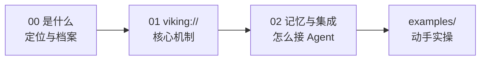

# 概念学习路径

本知识包包含 3 篇概念文档，从产品定位到核心机制再到记忆与集成。

## 学习路径

| 顺序 | 文档 | 核心内容 | 预计阅读 |
|------|------|----------|----------|
| 1 | [00 OpenViking 是什么](00-context-database-overview.md) | 项目档案、四类上下文痛点、与向量库差异、许可与商业形态、厂商自述基准 | 8 min |
| 2 | [01 viking:// 与三层加载](01-viking-vfs-context-layers.md) | 虚拟文件系统布局、resources/memories/skills、L0/L1/L2、目录递归检索与 TrieHI | 8 min |
| 3 | [02 记忆生命周期与集成矩阵](02-memory-lifecycle-integrations.md) | commit→抽取→召回闭环、15 个 MCP 工具、Hooks、12 类 Agent 集成、SDK | 9 min |

## 路径图



阅读完概念层后，进入 [examples/](../examples/index.md) 按博文路径动手部署。

```{toctree}
:hidden:

00-context-database-overview
01-viking-vfs-context-layers
02-memory-lifecycle-integrations
```
