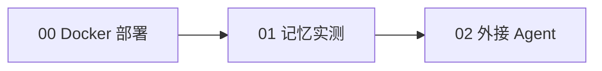

# 实战路径

本知识包包含 3 篇实战文档，部署与配置命令来自博文实测并经官方文档核验（2026-09-16），可直接照做。

## 前置条件

- 一台 Linux 服务器（或本地 Docker 环境）
- 一个 embedding 模型与一个 VLM 的 API Key（博文用阿里云百炼 text-embedding-v4 + qwen3-vl-plus，也可用火山/OpenAI/Kimi/GLM/Ollama）
- 接 Coding Agent 时需 macOS/Linux + Node.js 18+

## 实战路径

| 顺序 | 文档 | 核心内容 | 预计 |
|------|------|----------|------|
| 1 | [00 Docker 部署服务端](00-docker-server-deployment.md) | ov.conf 四块配置、镜像/挂载/root_api_key、health/ready、Studio 双密钥 | 12 min |
| 2 | [01 跨会话记忆三步验证](01-cross-session-memory-walkthrough.md) | 写记忆→新会话召回→/search→明文 profile.md 定位 | 8 min |
| 3 | [02 接入 Coding Agent 与 CLI](02-agent-integration-mcp-cli.md) | Hooks 安装脚本、手动 MCP、15 工具、ov CLI、Python SDK、生产部署 | 10 min |

## 路径图



建议路径：先完成 00 让 `/health` 与 Studio 可用，再做 01 亲眼看到记忆落盘，最后按自己的客户端选做 02。

```{toctree}
:hidden:

00-docker-server-deployment
01-cross-session-memory-walkthrough
02-agent-integration-mcp-cli
```
