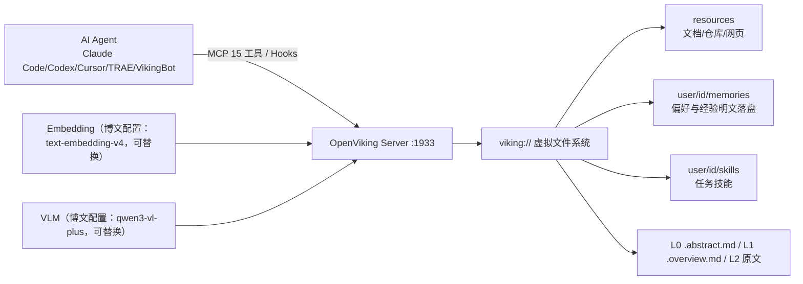

# OpenViking

> **来源**：微信公众号「macrozheng」（作者：梦想de星空），2026-09-09，原创
> **原文**：[《字节又开源了一个顶级 Agent 项目！》](https://mp.weixin.qq.com/s/OFS4DzgTEcEgzNHyvRVD0g)
> **开源仓库**：https://github.com/volcengine/OpenViking （火山引擎/字节跳动，主许可证 AGPLv3）
> **P0 核验**：10 项关键声明全部 ✅ 通过，0 ❌；2 项口径差异（/health 响应字段、VikingBot 工具名），详见 [verification.md](references/verification.md)

> **⏰ 时效性提示**：本包事实于 2026-09-16 对照 GitHub API、官方仓库 README 与 docs.openviking.ai 核验（软件版本 0.3.22 时代，star 36,276 为 2026-09-09/10 快照）。工具名、集成矩阵与模型档位迭代活跃，以官方文档为准；stale_after: 2026-12-31。

## 一句话定位

OpenViking 是火山引擎开源的**面向 AI Agent 的上下文数据库（Context Database）**：把记忆（memories）、资源（resources）、技能（skills）统一摆进 `viking://` 虚拟文件系统，Agent 用 `ls`/`tree`/`find` 浏览上下文；内容按 L0 摘要/L1 概览/L2 详情三层按需加载；会话结束后异步沉淀长期记忆，新会话自动召回；同一份记忆经插件/Hooks、MCP、SDK 接给 Claude Code、Codex、Cursor、TRAE 等外部 Agent 跨项目共用（F-004/F-006/F-009/F-010）。

## 60 秒快速开始（Docker）

```bash
mkdir -p /mydata/openviking && cd /mydata/openviking
# 1) 放入 ov.conf（含 root_api_key、embedding、vlm，模板见实战 00）
# 2) 起容器（HTTP + Web Studio /studio + VikingBot 同启）
docker run --name openviking \
  -p 1933:1933 \
  -v /mydata/openviking:/app/.openviking \
  -d ghcr.io/volcengine/openviking:latest
# 3) 验证
curl http://localhost:1933/health    # {"status":"ok"}
# 4) 浏览器打开 http://<服务器IP>:1933/studio 完成双密钥配置
```

接 Coding Agent（示例）：

```bash
bash <(curl -fsSL https://raw.githubusercontent.com/volcengine/OpenViking/main/examples/memory-plugin-shared/install.sh) \
  --harness claude-code
# 国内网络加 --dist tos 走火山 TOS 镜像；装完重启客户端
```

## 核心机制



写入的内容经 embedding 向量化、VLM 生成摘要；检索时向量搜索先定位目录、再逐层下探，结果带路径与周边上下文（目录递归检索）；会话 commit 后 VLM 异步抽取记忆并做 create/merge/skip（F-008/F-017/F-037/F-038）。

## 知识结构

```
openviking/
├── index.md                              ← 本页
├── concepts/
│   ├── index.md
│   ├── 00-context-database-overview.md   ← 项目档案、痛点、与向量库差异、许可/商业形态
│   ├── 01-viking-vfs-context-layers.md   ← viking:// 布局、L0/L1/L2、目录递归检索、TrieHI
│   └── 02-memory-lifecycle-integrations.md ← 记忆生命周期、15 个 MCP 工具、Hooks、集成矩阵
├── examples/
│   ├── index.md
│   ├── 00-docker-server-deployment.md    ← ov.conf 四块/百炼模型/双密钥/health/Studio
│   ├── 01-cross-session-memory-walkthrough.md ← 写记忆→新会话召回→/search→明文定位
│   └── 02-agent-integration-mcp-cli.md   ← 安装脚本/手动 MCP/ov CLI/SDK/生产部署
├── references/
│   ├── index.md
│   ├── article-source.md                 ← F-001~F-048 事实登记（双份）
│   └── verification.md                   ← P0 核验报告（10✅/2⚠️/0❌）
└── log.md
```

## 分层导航

### 概念层（3 篇）

1. [OpenViking 是什么：Agent 上下文数据库](concepts/00-context-database-overview.md) — 项目档案（36K star、AGPLv3、0.3.22）、四类痛点、与传统向量库六维对比、许可与商业形态、学术谱系、厂商自述基准
2. [viking:// 虚拟文件系统与三层加载](concepts/01-viking-vfs-context-layers.md) — resources/memories/skills 布局、L0/L1/L2 摘要文件、目录递归检索流程、TrieHI 论文底座
3. [会话记忆生命周期与多 Agent 集成](concepts/02-memory-lifecycle-integrations.md) — commit→抽取→召回闭环、15 个 MCP 工具、四个 Hooks、12 类客户端集成矩阵

### 实战层（3 篇，命令经官方文档核验）

1. [Linux 服务器 Docker 部署](examples/00-docker-server-deployment.md) — 完整 ov.conf（阿里云百炼 text-embedding-v4 + qwen3-vl-plus）、镜像/挂载/root_api_key、/health 与 /ready、Studio 管理员/用户双密钥
2. [VikingBot 跨会话记忆三步验证](examples/01-cross-session-memory-walkthrough.md) — 记住职业→新会话召回→终端 /search→user/macro/peers/.../profile.md 明文定位
3. [接入 Coding Agent、MCP 与 CLI](examples/02-agent-integration-mcp-cli.md) — memory-plugin 安装脚本（Hooks）、手动 MCP JSON、ov CLI、Python SDK、systemd/Compose/Helm

### 信源层（2 篇）

- [事实登记](references/article-source.md) — F-001~F-048（博文 32：含 2 条作者观点；核验补充 16），信源距离分级
- [核验报告](references/verification.md) — 10 项 P0 全 ✅、2 项口径差异、勘误四张清单、11 个信源、时效边界

## 信任与生命周期

- **事实基数**：48 条（F-001~F-048；博文 32 + 核验补充 16）
- **P0 核验**：10 ✅ / 0 ❌；2 项口径差异均为术语/响应字段层面（不影响操作）
- **信源距离**：裁决依据为官方 GitHub/README、docs.openviking.ai、GitHub API、阿里云百炼文档（① 官方发布）；博文为第三方技术博主一手部署实测（③）
- **厂商自述数据**：README 的 LoCoMo/tau2 基准为火山自测，正文全部显式标注，未并入博文结论
- **status**：verified
- **stale_after**：2026-12-31

## 已知边界与注意事项

1. **工具名口径**：博文的 `openviking_memory_commit`/`openviking_search` 不见于官方 2026-09 的 15 个 MCP 工具清单，官方对应 remember/commit 机制与 search/find；开发对接以官方为准（F-039）
2. **/health 字段**：官方文档示例仅返回 `{"status":"ok"}`，博文所见 healthy/version/auth_mode 或为实测版本扩展字段；组件就绪用 /ready（F-036）
3. **明文记忆**：记忆以 Markdown 明文存储在挂载卷，需保护宿主机挂载目录；对外暴露必须改强密钥并配置认证/ACL
4. **模型费用**：博文配置走阿里云百炼（qwen3-vl-plus 北京区 ≤32k 输入 ¥1/输出 ¥10 每百万 token，2026-09 原价），摘要/抽取持续消耗 token；可换本地 Ollama 等 provider
5. **AGPLv3**：主项目 Copyleft 许可，修改本体并对外提供网络服务时触发开源义务；ov_cli/examples 为 Apache-2.0（F-043）
6. **平台限制**：官方 Hooks 安装脚本前置 macOS/Linux + Node.js 18+（F-041）；桌面 Helper 为 0.0.19 beta（F-043）
7. **基准口径**：LoCoMo/tau2 提效数据为厂商自述基准（自测、单信源），非第三方独立评测（F-044）

## 主题关联

- 与 [ai-agent-fundamentals](../ai-agent-fundamentals/index.md) 的"记忆"架构模式对照：OpenViking 是可独立部署的记忆系统工程实现
- 与 [veadk-python](../veadk-python/index.md) 的双层记忆/RAG 对照：同属火山 Agent 生态，一个是 SDK 内建能力、一个是独立上下文服务
- 与 [planning-with-files](../../planning-with-files/index.md)（文件系统外存方法论，ai 域直挂束）呼应：两者都把"文件即上下文"作为 Agent 记忆工程的核心范式

```{toctree}
:hidden:
:maxdepth: 2

concepts/index
examples/index
references/index
log
```
