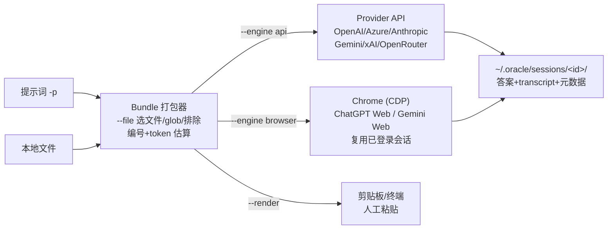

# Oracle 是什么：给 Coding Agent 用的第二大脑 CLI

> 事实均可回溯至 [信源登记](../references/article-source.md) 的 F 编号；核验结论见 [核验报告](../references/verification.md)。

## 一句话定位

Oracle 是 Peter Steinberger（GitHub: steipete）开源的 **CLI + MCP server**，官方口号 "Bring a second brain, not a second briefing"——把一句提示词与你选定的本地文件打包成上下文 bundle，通过 **API 或已登录的浏览器会话**交给另一个（通常更强的）模型评审，并把结果存为可重连的会话（F-010/F-022）。

它同时为人和 Coding Agent 服务：官方文档对定位的原话是"built to be called _by_ coding agents as much as by humans"——Agent 收集上下文，把 bundle 交给更强的 Pro 模型，拿回第二意见（F-003/F-034）。博文《太炸裂了！……CodeX 神仙用法》（公众号「Leon学AI」，2026-08-30）介绍的正是它的 Browser Mode + Codex skill 组合（F-001）。

## 项目档案（2026-09-16 快照）

| 项 | 值 | 依据 |
|----|----|------|
| 仓库 | https://github.com/steipete/oracle | F-009 |
| npm 包 | `@steipete/oracle`，核验时 0.20.2（约 2026-09-15 发布，已 60 个版本） | F-022 |
| 官网/文档 | https://askoracle.sh ；仓库 docs/ 目录 | F-022/F-040 |
| 作者 | Peter Steinberger（steipete） | F-009/F-023 |
| 许可证 | MIT | F-023 |
| 创建时间 | 第三方索引称为 2025-11（⚠️ 单源，未逐 commit 核验） | F-023 |
| 运行前提 | **Node.js 24+** | F-024 |
| 安装 | `brew install steipete/tap/oracle`（macOS/Linux）或 `npm install -g @steipete/oracle`；免安装 `npx -y @steipete/oracle --help` | F-012/F-013/F-025 |
| 状态目录 | `~/.oracle/`：config.json、sessions/、cookies.json、browser-profile/ | F-029/F-030 |

> 版本与 star 数均为时点值。该项目月度级发版，本文命令以核验日 main 分支为准，使用前先跑 `oracle --help --verbose` 对照（F-036）。

## 三条执行路径

Oracle 不是"又一个聊天客户端"，而是一个上下文打包器 + 三种投递后端（F-026）：

| 路径 | 触发 | 机制 | 成本/账号 | 典型场景 |
|------|------|------|-----------|---------|
| **API** | `--engine api` 或检出 OPENAI_API_KEY | 直连 Provider Responses/Chat API | 按 token 真实计费 | 自动化、多模型面板、CI |
| **Browser** | `--engine browser`；无密钥时的默认项 | 经 CDP 驱动 Chrome，操作 chatgpt.com（或用 cookie 直连 Gemini Web） | 消耗订阅账号网页会话，不走 API 账单（F-041） | 已付费 ChatGPT/Gemini 订阅、长 Pro 推理 |
| **Render** | `--render` | 只把 bundle 渲染/复制出来，不联系任何模型 | 零账号零密钥 | 人工粘贴、先审后发 |

API 模式支持六家：OpenAI、Azure OpenAI、Anthropic、Google Gemini、xAI、OpenRouter 及兼容端点（F-027）；Browser 模式除 ChatGPT 外还支持 Gemini Web（F-028）。博文只讲了 ChatGPT 网页端一条路径——它是最能体现"把已付费订阅接进工作流"的一条，但不是全部能力（F-019/F-041）。

## 会话模型：每次咨询都是可重放的资产

- 每次运行落盘到 `~/.oracle/sessions/<id>/`：日志、打出的 bundle、`transcript.md`（含提问、终稿答案、对话 URL）、生成物 artifacts、浏览器进程/标签页元数据（F-029）
- `oracle status --hours 72` 列出近期运行；`oracle session <id>` 重连接住超时的长回答；`oracle restart <id>` 用相同设置重跑；`--followup <id>` 在同一会话继续追问（F-029）
- **长 Pro 任务超时是正常现象**：官方 Golden path 明确要求 detach 后 reattach，而不是重新提交一遍（F-033）——这与 Codex 等 Agent 内"失败就重试"的直觉相反

## 与博文叙事的对应关系

博文的四步串联——"Codex 连接电脑读项目 → 整理相关上下文 → 网页版 ChatGPT 复杂推理 → Codex 拿方案回本地执行"（F-003）——在工程上分别对应：

1. Coding Agent 在本地仓库里选定文件（Codex 不可替代的本地执行能力，F-005）
2. Oracle 的 bundle 打包器（`--file` glob + 排除 + dry-run 预览，F-032）
3. Browser 引擎把 bundle 投递到订阅会话中的 Pro/Thinking 模型
4. 会话答案回流，Agent 据此继续改代码、跑测试（接入方式见 [实战 01](../examples/01-codex-skill-integration.md)）

博文作者"GPT 当大脑，Codex 当双手"的比喻（📌 F-004）是对这一分工的通俗概括；更准确的官方表述是"second-model review"——第二意见是**建议性（advisory）的**，仓库 SKILL.md 明确要求"对照代码库与测试验证后再采纳"。

## 下一篇

- [01 · "第二模型评审"工作流模式](01-second-model-review-pattern.md) — 为什么要把推理外包、额度经济学的事实与观点边界、适用/不适用场景
- [02 · Browser Mode 工作机制](02-browser-mode-mechanism.md) — CDP 自动化、持久化 profile、附件投递、fail-closed 与平台矩阵
