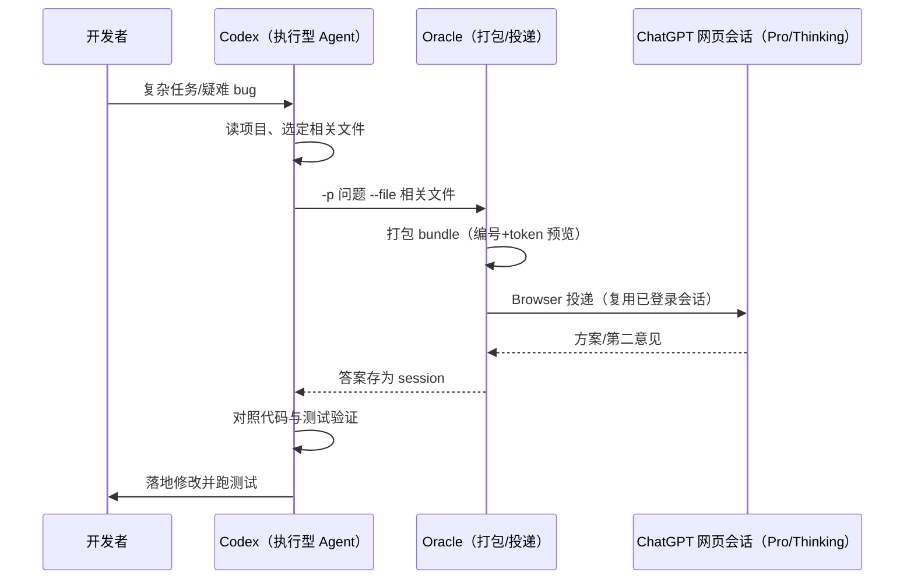

# 第二模型评审：把重推理外包给订阅会话

> 事实均可回溯至 [信源登记](../references/article-source.md) 的 F 编号。本文含对博文作者观点的转述，均以 📌 标注。

## 模式的结构

"第二模型评审（second-model review）"指：执行型 Agent 不独自承担全部推理，而是在关键节点把**经过裁剪的真实仓库上下文**外包给另一个模型，拿回建议后自行验证并执行。Oracle 把这个模式产品化成一条固定流水线（F-003/F-018）：

三个角色各司其职（博文的归纳，📌 F-020）：**GPT 负责想，Codex 负责干，Oracle 负责连**。这与官方文档的模式清单一致——agents.md 给出的三类成熟用法是（F-034）：

| 模式 | 触发时机 | 做法 |
|------|---------|------|
| Stuck → Oracle | 同一 bug 卡 3 轮以上 | 把失败测试加相关文件送给 Pro 模型，"常常一轮就看出问题" |
| Plan → Oracle → execute | 方案成型后 | 先让另一模型挑战方案，再实现 |
| Refactor → cross-check | 非平凡重构后 | 把 diff 加规格送给**没写这段代码的另一家**模型，快速发现漂移 |

## 为什么这个模式成立：上下文与能力的不对称

模式依赖两个工程事实（非博文原创，官方机制层面成立）：

1. **执行与推理由不同定价体系承载**：Codex/Coding Agent 在本地环境的能力（读项目、搜文件、改代码、执行 Shell、跑测试，F-005）与其订阅额度绑定；ChatGPT 网页会话承载的重推理由另一份已付费订阅承载。Browser 引擎在两者之间搬运 bundle，**不调用按量 API**（F-041）。
2. **上下文质量决定外包质量**：Oracle 不是屏幕分享，而是"最小且包含真相的文件集"——Golden path 要求先选文件、`--dry-run --files-report` 预览 token、再发送（F-033）。SKILL.md 明确：Oracle 对项目零预知，栈、构建命令、目录边界、复现步骤、报错原文、约束与期望输出都要在 prompt 里显式给。

## "额度更耐用"：事实与观点必须分层

博文最吸引点击的主张是"同样一份 Codex 配额能跑更多任务"（📌 F-008）。入库时拆成三层：

| 层次 | 内容 | 性质 |
|------|------|------|
| 事实层 | Browser 路径走订阅账号网页会话、不产生 API 按量费用；会话仍做 token 估算记账（F-041） | ✅ 官方机制 |
| 事实层 | 博文自行澄清："不是把 Plus 额度变成 Codex Pro 额度，两边不是额度互换"（F-019） | ✅ 博文自我限定，与机制一致 |
| 观点层 | "配额从不够用变成跑不完"的体感（F-008）；"重推理最吃额度"的经验判断（F-006） | 📌 作者定性体验，**无实测数据、无对照组** |

⚠️ 三个不能越界的推论：

- 不能说"Oracle 送的 ChatGPT 不花钱"——花的是已订阅成本，且官方三页文档**未声明 Plus/Pro 档位门槛**，Pro/Thinking 选择器对账号开放情况以 OpenAI 规则为准（F-036/F-041）
- 不能说"Codex 额度被技术手段放大"——被分流的是**工作量**（重推理环节改由另一会话承担），不是额度互转
- 不能把博文体验当收益承诺——文中没有任务数/耗时/token 的任何数字

## 适用与不适用

**适合**（博文画像 F-020 与官方模式 F-033/F-034 的交集）：

- 同时持有 ChatGPT 付费订阅与 Coding Agent（Codex/Claude Code/Cursor），且 Agent 额度常耗尽在前置分析上
- 疑难 bug、架构方案评审、重构后交叉验证这类"一次重推理、多轮本地执行"的任务
- 希望第二意见来自**不同厂商**模型以降低同源盲点（API 模式可切 Anthropic/Gemini/xAI/OpenRouter，F-027）
- 需要可审计：每次咨询的 prompt、文件集、答案、对话 URL 都在 session 目录留痕（F-029）

**不适合 / 需谨慎**：

- **把建议当结论直接合并**：SKILL.md 要求把回答当 advisory，对照代码与测试验证；模型看不到未打包的文件
- 高频全自动循环：API 模式真实计费，官方建议 pin 模型、设超时、加用户显式同意；浏览器 UI 自动化依赖 ChatGPT DOM，模型选择器改版会导致选择器失效（官方自认"Model picker drift"风险，F-036）
- 涉密代码：默认就应排除 `.env`/密钥，浏览器路径还要考虑把代码上传到网页服务的合规性（F-038）
- 追求流式体验：浏览器路径不能流式吐 token，只有心跳状态日志
- 想要模型记住历史：Oracle 是 one-shot，跨次记忆靠相同 bundle 重放或 `--followup` 续同一对话，不是自动记忆（F-029）

## 在 Agent 工具谱系中的位置

- 与 [openai-codex](../openai-codex/index.md)：Codex 是被增强的执行端；Oracle 以 skill 形式挂入其 `~/.codex/skills/`（F-016）
- 与 [orca](../orca/index.md)（多 Agent 编排框架）：Orca 解决多 Agent 的编排拓扑；Oracle 不做编排，只做"一次上下文打包+第二模型往返"，可作为编排中的一个咨询节点
- 与 [ai-agent-fundamentals](../ai-agent-fundamentals/index.md)：本模式是"核心循环 + 外部工具调用"的轻量特例——工具不是函数调用，而是一次带真实文件的跨模型评审
- 方法论上与本组多篇博文教程（wigolo 的研究取证、claude-vision-skill 的能力外挂）同属"用订阅/本地能力补齐主 Agent 短板"的工具链思路

## 下一篇

- [02 · Browser Mode 工作机制](02-browser-mode-mechanism.md) — 浏览器自动化如何复用登录态、附件怎么投递、Pro 档位为何 fail-closed
