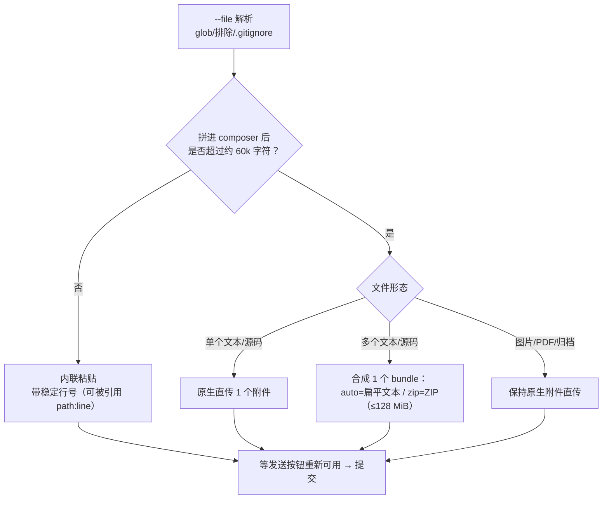

# Browser Mode 工作机制

> 事实均可回溯至 [信源登记](../references/article-source.md) 的 F 编号。本文描述对应 2026-09-16 所见 main 分支 browser-mode.md（57 KB）；ChatGPT Web UI 改版会直接影响自动化选择器，以官方文档为准。

## 三条浏览器执行路径

`--engine browser` 内部并非一种实现（F-026/F-028）：

| 路径 | 适用 | 登录态来源 | 是否接管浏览器 |
|------|------|-----------|---------------|
| **ChatGPT launcher** | 默认；GPT-* 模型 | Oracle 自启 Chrome（临时 profile，或 manual-login 的持久化 profile） | 拥有进程生命周期，跑完按策略关标签页 |
| **ChatGPT attach-running** | 你已有开着远程调试的 Chrome | `--browser-attach-running` 挂到 127.0.0.1:9222（可 --remote-chrome 改地址） | 只开一个 Oracle 自有标签页，跑完只关它，不动你的 profile |
| **Gemini web** | Gemini 模型 | 直接读已登录 Chrome 的 cookie 访问 gemini.google.com | 非 ChatGPT 自动化链路 |

自动化栈是 `chrome-launcher` + `chrome-remote-interface`（Chrome DevTools Protocol）：导航到 chatgpt.com、在统一 Intelligence picker 里切模型与推理强度、把系统+用户文本粘贴进 composer、等待完成、用页面自带的"复制本轮"按钮抓回 Markdown（F-036）。

## 登录态：为什么推荐 manual-login

博文给的首登命令是 `--browser-manual-login --browser-keep-browser -p "HI"`（F-014），对应的官方设计是（F-030/F-031）：

1. Oracle 以 **headful（有界面）方式启动一个独立的持久化自动化 profile**：`~/.oracle/browser-profile`（可用 `ORACLE_BROWSER_PROFILE_DIR` / 配置项覆盖）
2. 你在这个窗口里亲手登录一次 chatgpt.com；Oracle 轮询会话接口直到认证生效
3. 后续运行复用同一 profile，**无需重复登录**（除非会话过期）——这就是博文说的"第一次登录后复用这套浏览器会话"（F-015）
4. `--browser-keep-browser` 只控制"跑完是否留着窗口"：首登/调试时加上便于观察；省略则关窗但**磁盘 profile 保留**

为什么不直接复制你日常 Chrome 的 cookie？官方把 live-profile cookie 拷贝列为**不推荐**：ChatGPT 会话 token 会轮换，拷进自动化浏览器可能让你正常浏览器的会话失效；需要显式 `--browser-cookie-sync`  opt-in 才做。Windows 上 Chrome 的 app-bound cookie 解密受阻，更是直接推荐 manual-login 的原因之一（F-025）。其他登录态注入方式还有 inline cookies（`~/.oracle/cookies.json`）与 attach-running。

## 上下文如何进入聊天框：60k 阈值与打包

`--file` 接受文件、目录、glob，可重复或逗号分隔，支持 `!` 排除；默认忽略 `node_modules`/`dist`/`.git` 等并尊重 `.gitignore`，单文件默认上限 1 MB（F-032）。投递策略：

发送前官方 Golden path 强制本地预演：`oracle --dry-run summary --files-report -p "..." --file "..."` 先看解析到哪些文件、token 估算多少，再真发（F-033）。

## 模型选择与"fail-closed"

浏览器自动化最大的可信度风险是：你以为在问 Pro，结果选择器没点中，静默用便宜档位提交了。Oracle 的对策是**严格验证 + fail-closed**（F-036）：

- `--model` 指定目标（如 gpt-5.5-pro / gpt-5.6-sol 等别名会映射到 ChatGPT 选择器条目），`--browser-thinking-time` 指定 light/standard/extended/extra-high/pro/heavy
- Pro 档请求若无法从 UI 证据确认"确实选中了 Pro"，**直接中止运行**而不是降档提交；未知未来标签（如 gpt-5.6-luna）会被拒绝而非悄悄回退
- 选择证据只代表抓取那一刻的 UI 状态，不证明服务端真的按 Pro 算力执行——文档对此措辞克制

版本敏感性实例：npm 0.15.2 曾把 gpt-5.6 标签错误 normalize 成 gpt-5.2，需升级或显式回退旧模型。博文（2026-08-30）通篇只说"网页版 ChatGPT"未指定模型；核验时官方文档的模型口径已是 GPT-5.5 Pro / GPT-5.6 Sol / GPT-6 Astra 一代——**读者照博文走时模型选择应以当下 ChatGPT 选择器与 `oracle --help --verbose` 为准**（F-036）。

## 长任务、多 Agent 并发与远程形态

- **长 Pro 运行**：浏览器路径不能流式输出，靠心跳报活；超时标为 incomplete capture 并保留 reattach 元数据，用 `oracle session <id>` 回收答案，或开 `--browser-auto-reattach-*` 自动轮询；永远不要盲点重跑（F-029/F-033）
- **多 Agent 共用一个登录 profile**：Codex、Claude Code 同时调 Oracle 时，启动共享 profile 会被串行化，聊天标签位有软上限——默认 **3 个并发标签，第 4 个排队**（`--browser-max-concurrent-tabs`），profile 锁保证不会多个 Agent 往同一 composer 打字；官方建议的最稳形态是一台开着远程调试的 Chrome 加 `--remote-chrome`（F-037）
- **远程/无头**：`oracle serve` 在一台登录好 Chrome 的机器上起 HTTP/SSE 服务（带 token），其他机器用 `--remote-host/--remote-token` 调用；适合无头 Linux/CI 调用桌面端登录态。附件经 CDP base64 传输，单文件 20 MB 上限（F-039）
- 另支持 Deep Research（`--browser-research deep`，browser-only）、同会话多轮追问（`--browser-follow-up`）、Project Sources 管理等垂直能力

## 平台矩阵

| 能力 | macOS | Linux | Windows |
|------|:---:|:---:|:---:|
| npm/npx 安装（Node 24+） | ✅ | ✅ | ✅ |
| Homebrew 安装 | ✅ | ✅ | ❌（用 npm） |
| Browser Mode（manual-login） | ✅（最稳） | ✅（功能可用） | ✅（app-bound cookie 场景推荐 manual-login；另有 bridge 模式） |
| 窗口隐藏 --browser-hide-window | ✅ AppleScript | 参数被忽略 | 参数被忽略 |
| --copy-profile（拷活 profile） | ✅ 需 rsync | ✅ 需 rsync | ❌ |
| 远程 Chrome / oracle serve | ✅ | ✅ | ✅（含 Windows VM 作浏览器宿主） |

博文两条安装命令都没写平台限定（F-012/F-013）：macOS/Linux 用户二选一即可；**Windows 用户应走 npm/npx 路径**，不要照抄 brew（F-024/F-025）。

## 安全边界速览

- 默认不附 secrets；`.env`、密钥、token 文件要主动用 `!` 排除（F-038）
- 浏览器路径把代码内容发送到 ChatGPT 网页服务——公司代码先确认合规；API 路径则是真实按量计费，官方建议 pin `--model`、设 `--timeout`、定期审计 session 日志
- 完整安装、登录与 Codex 接线步骤见 [实战 00](../examples/00-install-and-browser-login.md) 与 [实战 01](../examples/01-codex-skill-integration.md)
