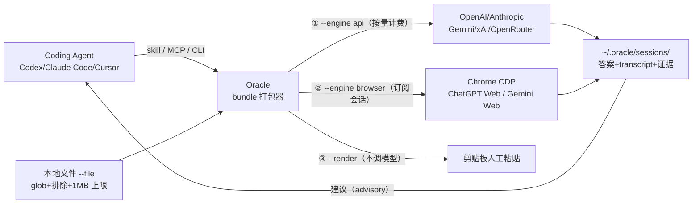

# Oracle

> **来源**：微信公众号「Leon学AI」，2026-08-30 21:45，原创（IP 属地广东，无独立作者署名）
> **原文**：[《太炸裂了！这是哪个大佬发现的 CodeX这个神仙用法，居然能将gpt-plus发挥到极致！》](https://mp.weixin.qq.com/s/_J1BzyqyoNWuj_998DLo1g)
> **开源仓库**：https://github.com/steipete/oracle （Peter Steinberger，MIT 许可；npm 包 `@steipete/oracle`）
> **P0 核验**：10 项关键声明全部 ✅ 通过，0 ❌、0 硬勘误；博文 5 项信息缺口由官方文档补充，详见 [verification.md](references/verification.md)

> **⏰ 时效性提示**：本包事实于 2026-09-16 对照 GitHub main 分支文档（install/browser-mode/agents）与 npm 官方包页（0.20.2 版本快照）核验。Oracle 月度级发版、ChatGPT Web 选择器随官网改版，模型名（核验时已见 GPT-5.5 Pro / GPT-5.6 Sol / GPT-6 Astra 口径）与参数以本机 `oracle --help --verbose` 为准；订阅档位使用规则以 OpenAI 官方为准。stale_after: 2026-12-31。

## 一句话定位

Oracle 是 Peter Steinberger 开源的 **CLI + MCP server**：把一句提示词与选定的本地文件打包成带行号的上下文 bundle，通过 **API 或已登录的浏览器会话**交给另一个（通常更强的）模型做"第二意见"评审，结果存为可重连、可续聊的会话（F-010/F-022/F-029）。博文展示的招牌玩法是让 **Codex 干本地执行的活、ChatGPT 网页会话干重推理的活、Oracle 负责把两者连起来**（📌 博文比喻 F-004/F-020）。

## 60 秒快速开始

```bash
# 前置：Node.js 24+、已装 Chrome
npm install -g @steipete/oracle            # macOS/Linux 亦可 brew install steipete/tap/oracle

# 首次：弹出独立 Chrome，手动登录一次 chatgpt.com（登录态持久化复用）
oracle --engine browser --browser-manual-login --browser-keep-browser -p "HI"

# 正式：先预演文件集与 token，再发送
oracle --dry-run summary --files-report -p "审查竞态条件" --file "src/**/*.ts" --file "!**/*.test.ts"
oracle --engine browser -p "审查竞态条件" --file "src/**/*.ts" --file "!**/*.test.ts"

# 接进 Codex（官方 skill）
git clone https://github.com/steipete/oracle.git
mkdir -p ~/.codex/skills && cp -R oracle/skills/oracle ~/.codex/skills/oracle
# 再在项目 AGENTS.md 写入触发场景（卡住/难 bug/架构评审/方案交叉验证）
```

## 核心机制



## 知识结构

```
oracle/
├── index.md                              ← 本页
├── concepts/
│   ├── index.md
│   ├── 00-oracle-second-brain-cli.md       ← 项目档案、三路径、会话模型
│   ├── 01-second-model-review-pattern.md   ← 推理/执行分流模式、额度主张分层、适用边界
│   └── 02-browser-mode-mechanism.md        ← CDP/manual-login/附件投递/fail-closed/平台矩阵
├── examples/
│   ├── index.md
│   ├── 00-install-and-browser-login.md     ← 安装、Node 24+、首次登录、dry-run
│   └── 01-codex-skill-integration.md       ← Codex skill、AGENTS.md 接线、MCP 备选
├── references/
│   ├── index.md
│   ├── article-source.md                   ← F-001~F-041 事实登记（双份）
│   └── verification.md                     ← P0 核验报告（10✅/0❌）
└── log.md
```

## 分层导航

### 概念层（3 篇）

1. [Oracle 是什么：给 Coding Agent 用的第二大脑 CLI](concepts/00-oracle-second-brain-cli.md) — 项目档案（0.20.2 快照/MIT）、API/Browser/Render 三路径、会话模型、与博文四步叙事的对应
2. ["第二模型评审"工作流模式](concepts/01-second-model-review-pattern.md) — 时序图、三类官方用法、"额度更耐用"的事实/观点三层切分、适用与不适用清单、工具谱系定位
3. [Browser Mode 工作机制](concepts/02-browser-mode-mechanism.md) — CDP 三路径、manual-login 持久化 profile、60k 内联阈值、Pro fail-closed、并发标签位、远程形态、平台矩阵

### 实战层（2 篇，命令经官方文档核验）

1. [安装并跑通 Browser Mode 首次登录](examples/00-install-and-browser-login.md) — Node 24+ 前置、brew/npm/npx、首登复用、dry-run 预演、会话重连、常见坑
2. [把 Oracle 接进 Codex](examples/01-codex-skill-integration.md) — skill 复制、AGENTS.md 30 秒接线、Stuck/Plan/Refactor 三模式、oracle-mcp 备选、安全卫生、多 Agent 并发

### 信源层（2 篇）

- [事实登记](references/article-source.md) — F-001~F-041（博文 21：含 7 条作者观点；官方补充 20），信源距离分级、原文段落存档
- [核验报告](references/verification.md) — 10 项 P0 全 ✅、勘误四张清单 0 硬错误、6 项缺口补充、观点分层、8 个信源、时效边界

## 信任与生命周期

- **事实基数**：41 条（F-001~F-041；博文 21 + 官方补充 20）
- **P0 核验**：10 ✅ / 0 ❌（项目身份、两条安装命令、登录命令三参数、Codex skill 路径、AGENTS.md 接线、会话复用、发布信息）
- **勘误四张清单**：0 项硬错误（无错误日期/版本、无成效数字、无规模口径、无伪造引语）
- **信源距离**：裁决依据为官方 GitHub main 分支文档与 npm 官方包页（① 官方发布）；博文为第三方公众号推荐（③/④，非一手实测）；everydev 索引仅作弱事实单源旁证
- **观点隔离**："额度更耐用/跑不完"为博文作者定性体验（无数据、无对照），按 📌 作者观点呈现；博文自澄清"不是额度互换"
- **status**：verified
- **stale_after**：2026-12-31

## 已知边界与注意事项

1. **Node 24+ 是硬前提**，博文未提；**Homebrew 包仅 macOS/Linux，Windows 走 npm/npx**（F-024/F-025）
2. **订阅档位门槛未明**：官方文档未声明 Plus/Pro 账号对 Browser Mode 与 Pro/Thinking 模型的开放规则，博文标题"把 gpt-plus 发挥到极致"是博文口径，以 OpenAI 官方规则为准（F-041）
3. **"额度"不是互换**：Browser 路径把重推理工作量搬到已付费网页会话（不走按量 API），但不产生任何官方额度换算；博文的"更耐用"是体感非承诺（F-008/F-019）
4. **模型口径快速过期**：博文未指定模型；核验时官方文档已迭代到 GPT-5.5 Pro/5.6 Sol/6 Astra 选择器口径，且 0.15.2 曾有标签归一化缺陷——以 `--help` 与当下选择器为准（F-036）
5. **回答是建议不是补丁**：模型只看得到被打包的文件，Codex 必须对照代码与测试验证后再落地（F-033/F-034）
6. **安全与合规**：默认排除 secrets；浏览器路径会把代码内容发送至 ChatGPT 网页服务，私有仓库先确认合规；API 模式真实计费需 pin 模型/设超时/审计会话（F-038）
7. **长任务勿重跑**：Pro 回答超时先 `oracle session <id>` 重连，重复提交可能触发账号侧限流（F-029/F-033）

## 主题关联

- 与 [openai-codex](../openai-codex/index.md)：Codex 是本玩法的执行端，Oracle 以官方 skill 挂入其 `~/.codex/skills/`
- 与 [orca](../orca/index.md)：Orca 做多 Agent 编排拓扑；Oracle 只做"一次上下文打包+第二模型往返"，可作编排中的咨询节点
- 与 [wigolo](../wigolo/index.md)、[claude-vision-skill](../claude-vision-skill/index.md)：同属"用订阅/本地能力补齐主 Agent 短板"的博文转化工具教程
- 与 [ai-agent-fundamentals](../ai-agent-fundamentals/index.md)：本模式是 Agent 核心循环调用"外部评审工具"的轻量特例

```{toctree}
:hidden:
:maxdepth: 2

concepts/index
examples/index
references/index
log
```
