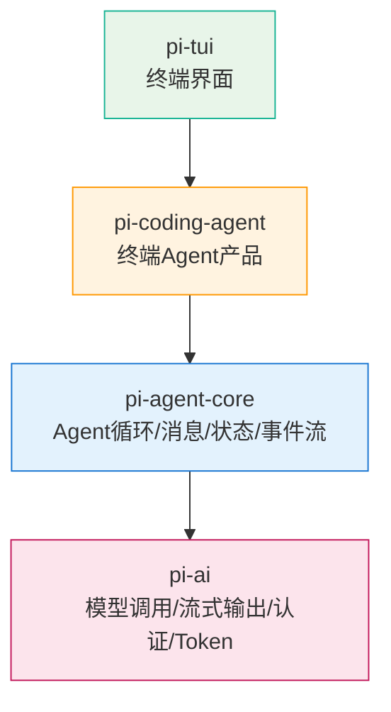

# Pi Agent Harness — 概述与四层架构

> **类型**：Concept | **F引用**：F-001~F-010 | **生成时间**：2026-09-09

---

## 概述

Pi 是一个开源项目家族，其核心定位是**一套很轻、很透明、可以自己改造的 Agent Harness**。

> **作者观点**（F-001~F-003）：
> - Pi 不是一个大模型，也不只是一个命令行编程工具（F-001）
> - 它更像底盘、方向盘、仪表盘和变速箱——大模型是发动机，Pi 提供的是承载和操控层（F-003）
> - 这是理解 Pi 的第一把钥匙（F-003）

---

## 四层架构

Pi 由四个核心包组成一个 TypeScript monorepo（F-004~F-008）：

| 包名 | 职责 | 对应层级 |
|------|------|---------|
| `pi-ai` | 统一不同模型厂商的调用方式；负责流式输出、工具调用、认证、Token 和成本统计；支持同一会话中切换模型 | AI 接入层 |
| `pi-agent-core` | 真正的 Agent 循环；负责消息、状态、工具执行和事件流 | Agent 核心层 |
| `pi-coding-agent` | 普通用户直接运行的终端 Agent，即输入 `pi` 后看到的产品 | 应用层 |
| `pi-tui` | 终端界面组件；负责把流式文字、工具调用和状态变化快速显示出来 | TUI 层 |



---

## 三种使用方式

同一个项目，"我在用 Pi" 可能有三种完全不同的含义（F-009~F-010）：

| 使用方式 | 说明 |
|---------|------|
| ① 现成编程 Agent | 直接运行 `pi` 命令，作为终端编程助手使用 |
| ② 用 SDK/RPC 做自己的 Agent | 通过 Node.js/TypeScript SDK 创建 `AgentSession`，或启动 `pi --mode rpc` 通过 stdin/stdout 交换 JSONL 消息 |
| ③ 只拿其中一层 | 仅引入 `pi-agent-core` 或 `pi-tui`，嵌进自己的产品 |

> **作者归纳**（F-010）：Pi 既是一个可以直接使用的工具，也是一盒可以拆开的 Agent 零件。这正是它和很多同类产品最大的不同。

---

## 与同组知识包的关系

| 知识包 | 关系说明 |
|--------|---------|
| [pi-cli](../pi-cli/index.md) | pi-cli 知识包侧重源码级 monorepo 结构解读（9包：ai/tui/agent/client/server/evals等），本文侧重高层定位、能力综述与竞品对比 |

```{toctree}
:hidden:
:maxdepth: 2

```
