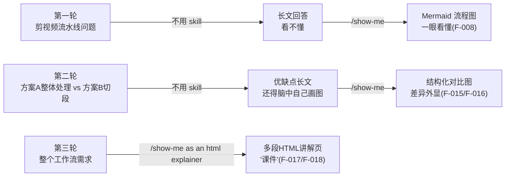

# 可视化词汇表：show-me 的 9 类视觉表达与两大用法

> 本篇机制层内容全部依据 HumanLayer 官方博客"What's inside"节（F-034/F-035/F-036）；"作者实测"小节对应博文三轮实测（F-008/F-015/F-018~F-020）。

## 官方 9 类可视化词汇

| # | 形态 | 适用形状的问题 | 官方示例要点 |
|---|------|----------------|--------------|
| 1 | **组件树**（component trees） | 前端结构 | 保留关键 state hooks 与模块边界，其余省略，如 `<SessionPage> → useSessionEvents() → <SessionToolbar> → <RunSkillButton>` |
| 2 | **调用栈**（call stacks） | 编排/控制流等后端问题 | 自上而下一条调用链：`handleCreateSession → validateRequest → SessionStore.insert → publish(session.created) → AgentWorker.run → loadContext → callModel → persistResult` |
| 3 | **图**（diagrams，Mermaid） | 状态、时序关系 | 聊天界面支持内联 Mermaid 时效果最好；官方最喜欢状态图与序列图（"Sometimes they're still slop, but it's usually better than reading words"） |
| 4 | **文件布局**（file layouts） | "这东西该放哪"、重构范围圈定 | 浅层文件树，每个条目一行职责注释（如 `sessions/ # owns session state and lifecycle`） |
| 5 | **伪代码**（pseudocode） | 算法类逻辑 | 比自然语言紧凑，保留分支与回退路径（如 anchor/restore、failure path） |
| 6 | **类型与签名**（types and signatures） | 代码存在之前的形状 | `interface Item`、`resolveTarget(items, cursor) -> ItemId | null`——架构文档太外、Agent 又容易写错的那层 |
| 7 | **diff 语法**（diff syntax） | 改动量小、大部分内容不变时 | 四种 +/- 形态：组件变化、调用树变化、文件布局变化、状态/控制流变化 |
| 8 | **HTML 原型**（html mockups） | 界面原型 | 官方称 HTML 在他们的很多原型工作中已取代 Figma |
| 9 | **HTML 讲解页**（html diagrams/explainer） | 一张图讲不清、需要成页讲解 | HumanLayer 产品内 Agent 可在回复中直接内嵌 HTML；其他环境可把 HTML 在浏览器打开（F-036） |

### diff 语法四形态（第 7 类展开）

```text
# 组件变化
   <SessionPage>
    <SessionToolbar>
+   <RunSkillButton />

# 调用树变化
   handleCreateSession
+   enforceQuota
    SessionStore.insert

# 文件布局变化
   src/
+  └── commands/show-me.ts
-  └── transport.ts
+  └── transport/{client,stream}.ts

# 状态/控制流变化（形状是伪代码而非真实代码）
   on(save)
-  write content
+  if content is unchanged → return cached result
+  write new content; invalidate cache
```

## 官方推荐的两大使用时机（F-035）

1. **程序设计（program design）前置**：在 Agent 动手写代码之前，先讨论代码的形状——types、signatures、call stacks。官方认为这是当下被很多人跳过、但不可或缺的阶段。
2. **大 diff 事后浏览**：改动完成后用视觉结构展开大型 diff，帮助确定 code review 时应该往哪里深挖。

官方给出的自然语言触发话术（无需记命令）：

```text
this is too much content. show me.
```

## 作者三轮实测映射（博文，F-008/F-014~F-020）

> 以下为作者在 WorkBuddy 中的一手实测过程与输出描述，输出细节（五步命名、具体时间戳）是**作者环境的生成结果**，非官方文档承诺。



### 实测一：流程问答 → Mermaid 图

同一问题（转写/高光/删废话/字幕/B-roll/配乐/渲染的先后，F-006），不调用 Skill 得到"技术白皮书"式回答；调用 /show-me 后得到流程图（F-008）。对应官方第 3 类（diagrams）。

### 实测二：方案取舍 → 对比结构

两条候选路线（F-014）：

| 维度 | 方案 A：整体理解后统一剪 | 方案 B：切段分别处理再拼接 |
|------|--------------------------|----------------------------|
| 处理顺序 | 先看懂 20 分钟全片、挑高光删废话，再统一开始剪 | 先把视频切成很多段，每段分别处理，最后拼起来 |
| 作者关注点 | 字幕怎么办、B-roll 怎么办、上下文是否更完整 | 同左 |

不用 Skill 时得到的是"A 有啥优点、B 有啥问题、上下文怎么保留"的长篇分析；调用 /show-me 后差异被画进同一张结构图（F-015）。作者由此得出观察（**作者观点**，F-016）：十条优缺点里信息一条没少，但人真正缺的是"这两个东西到底差在哪"——视觉表达把取舍结构直接搭了出来。

### 实测三：HTML explainer → 成页讲解

使用 `/show-me as an html explainer`（官方同款调用，F-017/F-028）后，WorkBuddy 产出多段 HTML 讲解页（F-018）：

1. **顶部一条线**：先把整个系统压成最简单的一条主干；
2. **五步展开**："听、懂、剪、配、出"——先转写，再让大模型通读全文挑高光，根据保留内容重建新的 60 秒时间轴，字幕、B-roll、配乐挂到新时间轴，最后统一渲染（F-019）；
3. **难点专图**：专门画出字幕时间戳映射问题——原片一句话在 9 分 12 秒，前面废话被剪掉 5 分多钟、成片只有约 60 秒，字幕不能还在第 9 分 12 秒出现（F-020）。

> 第三轮对应官方第 9 类（html diagrams/explainer）。官方同时说明：HTML explainer 形态受到 Matt Pocock `/teach` skill 的启发（F-036）。

## 一个反向提醒

官方也承认 Mermaid 图"sometimes they're still slop"（有时照样是糊弄）。视觉表达的价值在于**便宜、文本化、可审查**（Mermaid/ASCII/表格可 diff、可复制、可再拿去问别的模型或人），而不是把错误包装得更可信——图本身仍需 review。
