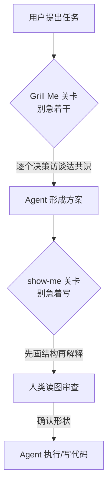

# 做减法的 Skill：show-me 白板模式 vs Grill Me 质询模式

> 本篇为模式/观点层。标注 **【作者观点】** 的内容来自博文作者"胖啊"（F-021~F-025），属个人判断而非官方结论；技能事实部分均带 F 编号核验出处。

## 论点：一部分好 Skill 在教 AI"做减法"

博文的核心论点（**【作者观点】**，F-021）：

> Agent 越来越能干、知道得太多，但人脑没有因为 AI 升级而"多长出八个前额叶"。接下来真正好用的 Skill，未必全部是在给 AI 增加新能力——有一部分 Skill，反而是在教 AI 做减法。

show-me 本身就是论据：模型早已具备画 Mermaid、写 HTML 的能力，缺的不是能力而是**默认表达策略的约束**（F-010/F-011，参见 [00 篇](00-show-me-what-and-why.md)）。一份"几行规则"的 Skill 不扩张能力边界，而是收缩输出形态，把表达从"写尽"切换到"画出结构"。

## 对比：一块白板 vs 一轮质询

博文把 show-me 与作者此前分享过的 Grill Me 并列对比（**【作者观点】**，F-022）：

| 维度 | show-me（白板模式） | Grill Me（质询模式） |
|------|---------------------|----------------------|
| 塞在什么位置 | AI 与**人类**之间 | AI 与**执行**之间 |
| 拦截的是什么 | 大段文字输出（"别急着写"） | 未澄清就动手（"别急着干"） |
| 机制 | 要求视觉结构先行：图/表/HTML 替代小作文 | 要求访谈先行：围绕计划逐个决策追问直到共识 |
| 产出形态 | Mermaid、组件树、调用栈、diff、HTML 讲解页（F-034） | 一轮带推荐答案的问题链，问完才允许写代码 |
| 出处 | HumanLayer，2026-08-12（F-031） | **Matt Pocock** 发布的 `/grill-me`（非 HumanLayer 出品，F-037） |

> ⚠️ **出处防误读**：博文以"我之前分享的 Grill Me"提及，未声明同门。经核验，`/grill-me` 是 Matt Pocock 发布并走红的 Skill，正文仅三句话："Interview me relentlessly about every aspect of this plan until we reach a shared understanding. Walk down each branch of the design tree resolving dependencies between decisions one by one. If a question can be answered by exploring the codebase, explore the codebase instead. For each question, provide your recommended answer."（F-037）。两者是不同作者的独立 Skill，共同点是都在 Agent 工作流中插入一个"停顿/换形态"的关卡。

## 适用与不适用（博文使用建议）

**【作者观点】** 以下均为博文作者基于个人实测的建议（F-023/F-024/F-025），非官方规则：

### 适用：信息一多、文字难以搭出结构的任务

- 接手一个陌生项目；
- 接触一个陌生的复杂领域；
- AI 刚改完一大堆东西，想快速知道它到底动了哪（与官方"大 diff 事后浏览"用法一致，F-035）；
- AI 甩来三屏文字，盯了十秒一个字都不想读——不用重想 Prompt，直接 `/show-me`。

作者的总结性判断（F-025）：**Agent 干的活越复杂，这个 Skill 的作用越明显。**

### 不适用：为小事画图是仪式负担

- 改个标题、写个小函数、问个命令——没必要什么都画一遍；
- 作者的比喻（F-024）："那就有点……像是为了吃碗泡面，先画一张泡面系统架构图了。"

这一禁忌与第三方观察相互印证：视觉输出应"便宜、文本化、可审查"，且只在代码/方案确有拓扑（请求生命周期、权限边界、后台任务、重试逻辑、服务依赖）时使用；为 typo、单行改动画图只会增加仪式感而非清晰度。

## 模式的可迁移性

从这两个 Skill 可以抽出一条 Skill 设计启发（基于 F-010/F-021/F-022 的归纳）：

1. **能力已在模型内，缺的是默认策略**——当模型"会做但不总是做"时，几行触发规则比新工具更有效；
2. **关卡插在信息流的断点上**——执行前（grill-me）或输出前（show-me），都是把人类认知负担前移到最便宜的时刻；
3. **减法 Skill 的成功判据是缩短人到结构的距离**，而非增加输出物数量。

## 局限与边界

- 图可能"画得很自信但内容是错的"——视觉表达让错误更具说服力，必须保持可审查（文本化 Mermaid/diff 优先于截图）；
- 博文实测基于 WorkBuddy 单一环境（F-038），HTML 内嵌渲染是 HumanLayer 自家产品能力，其他 Agent 需在浏览器打开 HTML（F-036）；
- "做减法"论点是作者对 Skill 生态趋势的个人判断，非行业共识数据。
