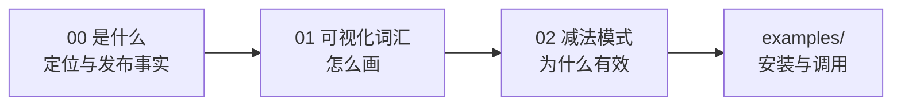

# 概念学习路径

本知识包包含 3 篇概念文档，从"是什么"到"怎么画"再到"为什么这是一种 Skill 设计模式"。

## 学习路径

| 顺序 | 文档 | 核心内容 |
|------|------|----------|
| 1 | [00 show-me 是什么](00-show-me-what-and-why.md) | HumanLayer 发布事实、"小作文墙"问题、不增加新能力的 Skill 形态、视觉皮层设计论据 |
| 2 | [01 可视化词汇表](01-visual-vocabulary.md) | 官方 9 类视觉表达、diff 四形态、程序设计/大 diff 两大用法、作者三轮实测映射 |
| 3 | [02 做减法的 Skill](02-subtraction-skills-pattern.md) | 白板模式 vs Grill Me 质询模式、适用/不适用边界、模式可迁移性（作者观点分层） |

## 路径图



阅读完概念层后，进入 [examples/](../examples/index.md) 完成安装与调用自测。

```{toctree}
:hidden:

00-show-me-what-and-why
01-visual-vocabulary
02-subtraction-skills-pattern
```
