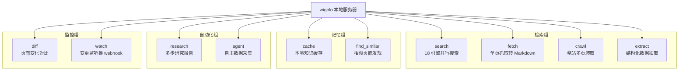
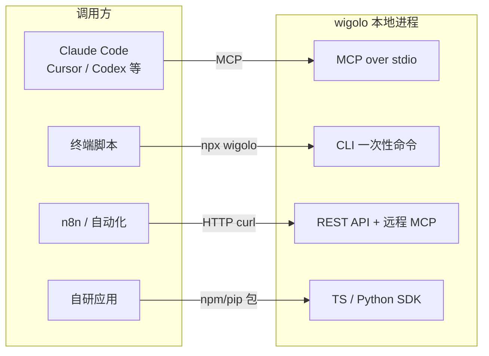

# 00 · wigolo 是什么：本地优先的 Agent 网页能力工具

> 事实锚点：F-003、F-004、F-008、F-034、F-035、F-036、F-051

## 一句话定位

wigolo 是一个**跑在用户自己机器上**的 Web 情报服务器，为 AI Agent 提供搜索、抓取、爬取、抽取、缓存、研究等网页能力：**不要 API Key、不依赖云服务、不按次计费**（F-003、F-034）。

官方原文定位："Local-first web intelligence for AI agents — no keys, no cloud, no metered bill"（F-034）。

它解决的痛点很直接：Firecrawl 这类云端抓取 API 要注册账号、拿 Key、免费额度用完按量收费（博文口径：一个月约一千页），Agent 查网页的次数一多，账单就不可控（F-002、F-029）。wigolo 把整套能力搬到本地：浏览器引擎、embedding/重排模型、缓存、配置全部在本机，核心功能零外部账号。

## 项目档案

| 项 | 内容 |
|----|------|
| 仓库 | https://github.com/KnockOutEZ/wigolo |
| 语言/运行时 | TypeScript，Node.js 20/22/24 LTS |
| 版本 | public beta **0.2.0**（F-036） |
| 测试规模 | 约 7,600 个自动化测试覆盖文档化接口（F-036） |
| 许可证 | **AGPL-3.0-only**，Copyright 2026 Towhid Khan（F-035） |
| 维护者 | Towhid Khan（@yourtowhid）个人维护，README 鸣谢赞助商 TestMu AI（F-035） |
| 数据目录 | `~/.wigolo/`（Windows 为 `%USERPROFILE%\.wigolo`）（F-006、F-049） |
| 磁盘占用 | 约 1.5GB：本地模型约 250MB + 浏览器引擎约 0.5–1GB（F-045） |

## 十工具地图

wigolo 对外暴露 **10 个工具**（F-008），按职责分四组：

| 工具 | 干什么 | 是否需要 LLM Key |
|------|--------|------------------|
| search | 一次并行查 18 个公开搜索引擎，融合排序 + 本地模型重排；query 支持数组扇出 | 否 |
| fetch | 抓单个页面，输出干净 Markdown + 元数据；反爬页面自动升级无头浏览器 | 否 |
| crawl | 多页爬取，BFS/DFS/sitemap 模式，守 robots.txt、按域限速 | 否 |
| extract | 表格/JSON-LD/文章/商品等结构化抽取，支持自定义 JSON Schema | 否 |
| cache | 查过的内容入本地缓存，关键词 + 语义混合检索 | 否 |
| find_similar | 给网址或概念找相似页面，关键词 + 语义 + 实时网页三路融合 | 否 |
| research | 问题分解 → 子查询扇出 → 抓取 → 带引用报告 | **是**（无 key 退化为证据简报） |
| agent | 自主规划 → 搜索/抓取/抽取 → 综合，带步骤日志与时间预算 | **是**（同上） |
| diff | 对比页面与上次访问的差异 | 否 |
| watch | 定时复查页面，变更推 webhook | 否 |

> keyless 边界（F-037）：**六个核心工具完全不要 Key**；research / agent / `search --format answer` 三个"写报告"能力需要 LLM——不配置时不报错，而是返回结构化证据简报，把原始材料交给上层 Agent 自己组织。

## 四种接入表面

wigolo 不只面向 MCP 客户端，同一套工具有四种调用方式（F-004、F-005、F-041、F-042）：

- **MCP Server**：`npx wigolo init --agents=claude-code,cursor` 一键接线 9 个客户端（F-023、F-034）
- **CLI**：每个工具都能一次性命令调用，如 `npx wigolo search "..." --limit=2`（F-043）
- **REST**：`wigolo serve` 起本地服务（默认 127.0.0.1:3333），`POST /v1/{tool}`，n8n 直接 curl（F-028、F-041）
- **SDK**：npm `wigolo-sdk`（零依赖）、PyPI `wigolo`（纯标准库），另有 LangChain/CrewAI/LlamaIndex/Vercel AI SDK 集成包（F-042）

## 与云服务的选型对比

官方维护了一张与 Firecrawl / Tavily / Exa / Agent 内置 WebSearch 的对比矩阵（口径：**Feature standing as of July 2026**，由 Exa 完整渲染，F-050）。结合博文观点（F-032）整理：

| 维度 | wigolo（本地） | Firecrawl 等云端 API | Agent 内置搜索 |
|------|----------------|----------------------|----------------|
| API Key / 账号 | 核心功能不需要 | 必须注册拿 Key | 随平台账号 |
| 计费 | 零按次费用 | 免费额度后按量收费 | 含在订阅内，次数受限 |
| 数据位置 | 全在本机 `~/.wigolo/` | 请求经厂商服务器 | 经平台服务器 |
| 爬取/整站能力 | 十工具含 crawl/diff/watch | Firecrawl 强于爬取 | 通常只有搜索 |
| 证据粒度 | 字节级 source_span + 评分拆解 | 各厂商不一 | 通常仅引用链接 |
| 失效模式 | 单引擎挂了融合兜底，诚实上报 | 额度用尽即停 | 平台黑盒 |

官方实测（F-031、F-050）：同一场 Claude 会话中四工具回答同一问题，**答案与头号信源一致**；wigolo 是唯一返回字节级定位证据、评分拆解和逐引擎遥测的，并主动标出 2 条弱结果。

> 博文的诚实提醒（F-030）：beta 阶段个别复杂抓取场景（强反爬站）完成度不如成熟付费工具；公共搜索引擎偶有抽风，但 18 引擎融合下单引擎失效影响有限。

## AGPL 许可证对使用者意味着什么

官方 FAQ 的通俗解释（F-051）：

- **把 wigolo 当工具用**——个人用、公司内用、接进你跑的任意 Agent——**零义务**
- 只有当你**修改 wigolo 本体，并把修改版作为网络服务提供给他人**时，才需要开源你的修改
- 仅调用 wigolo 的产品不受约束

伦理立场同样写明：默认遵守 robots.txt、按域名限速、页面预算面向研究而非批量收割，官方明确 "not a cloaking toolkit"（不教反爬伪装）（F-051）。

## 边界与时效

- 版本 0.2.0 public beta，接口面由约 7,600 测试守护，但 beta 意味着打磨与 API 形态仍可能调整（F-036）
- 对比表口径为 2026-07，竞品定价/额度政策变化快，引用时注意时效
- 下一篇：[01 证据契约与诚实输出](01-evidence-contract.md) 拆解"结果可审计"是怎么做到的
